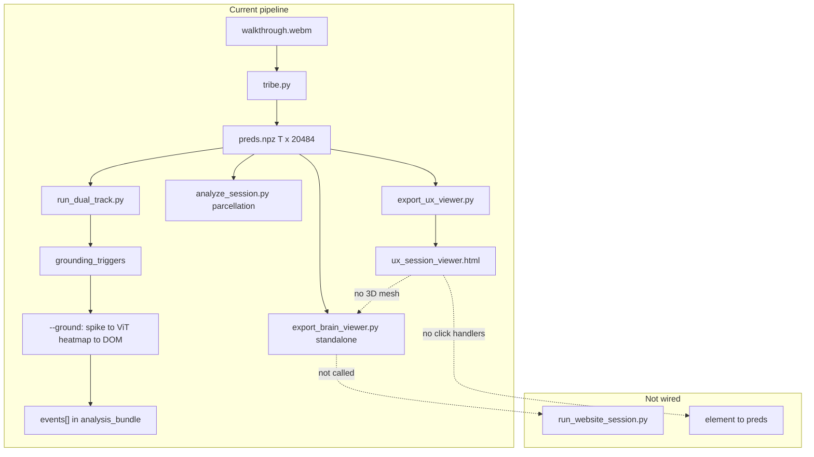
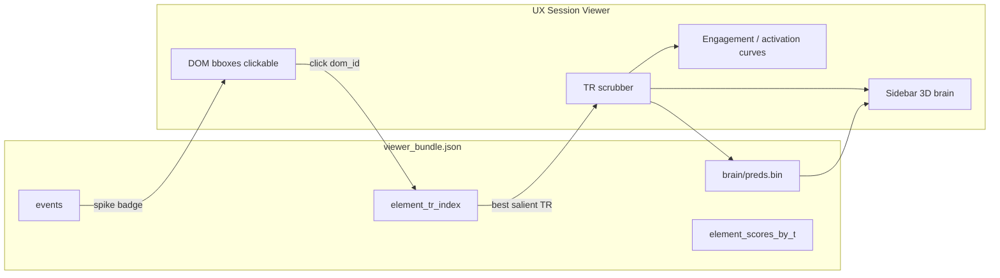

# Engagement Atlas Fix + 3D Brain UX Integration

## Does the TRIBE pipeline work that way today?

**No — not end-to-end in the UX viewer, and not with per-element TRIBE attribution.**

What exists today:



| Capability                                          | Status                                                                                                                                                                         |
| --------------------------------------------------- | ------------------------------------------------------------------------------------------------------------------------------------------------------------------------------ |
| TRIBE produces per-TR whole-cortex `preds[t, :]`    | Yes — [`preds.npz`](scout_data/sessions/)                                                                                                                                      |
| Parcellation → parcels/networks for Layer 2 rules   | Yes, but **mislabeled** (bug below)                                                                                                                                            |
| 3D vertex-colored brain per TR                      | Yes in [`viewer/brain_viewer.html`](viewer/brain_viewer.html) + [`scripts/export_brain_viewer.py`](scripts/export_brain_viewer.py) — **not** in website pipeline or UX sidebar |
| DOM element → per-element TRIBE preds               | **No** — scientifically unavailable; TRIBE sees the full frame                                                                                                                 |
| DOM element → correlated brain state at salient TRs | **Partial data** (`element_scores_by_t`, `events[]`) but **no UI wiring**                                                                                                      |
| User click on bbox → anything                       | **No** — [`viewer/ux_session_viewer.html`](viewer/ux_session_viewer.html) bbox SVG has no click handlers                                                                       |

**Direction of existing grounding:** brain spike at `t` → ViT attention → winning DOM element ([`scout_core/dom_intersect.py`](scout_core/dom_intersect.py)). Your chosen semantics invert the UX flow: **element click → find salient TRs → show `preds[t]` on 3D brain** (correlated, not causal).

---

## Part A — Fix Schaefer / Yeo-7 naming (Phases 1–5)

### Root cause (two separate issues)

1. **Layer 2 threshold engine (real bug):** [`scripts/analyze_session.py`](scripts/analyze_session.py) uses `yeo_network_id` 1–28 (Schaefer subnetworks) but names columns via [`network_names_for_ids()`](scout_core/constants.py) as if IDs 1–7 were Yeo-7. Rules in [`configs/calibrated_rules.yaml`](configs/calibrated_rules.yaml) targeting `SalVentAttn` / `Default` read wrong columns (e.g. id 4 = `Cont_PFCmp` labeled `SalVentAttn`).

2. **Track 1 “empty labels” (not a mapping bug):** [`load_network_indices()`](scout_core/dual_track.py) prefix-matching works (2,383 VAN / 4,439 DMN on latest session). Labels are `null` because scores (−1.17…+0.53) never cross ±1.5 in [`configs/dual_track.yaml`](configs/dual_track.yaml).

### Phase 1 — Shared coarse-Yeo-7 helper

Add to [`scout_core/parcellation.py`](scout_core/parcellation.py) (or extract from [`scout_core/dual_track.py`](scout_core/dual_track.py) `_network_name_mask`):

- `coarse_yeo7_from_subnetwork(name: str) -> str` — e.g. `SalVentAttn_ParOper` → `SalVentAttn`, `Default_PFC` → `Default`, bare `Vis` → `Vis`
- `subnetwork_ids_by_coarse_yeo7(table) -> dict[str, list[int]]`

### Phase 2 — Collapse Layer 2 network time series to Yeo-7

In [`scripts/analyze_session.py`](scripts/analyze_session.py):

1. Keep subnetwork-level `parcel_timeseries` as today.
2. After subnetwork `network_timeseries`, add `collapse_subnetwork_ts_to_yeo7()` in [`scout_core/aggregate.py`](scout_core/aggregate.py) — pool subnetwork columns by coarse name (mean reducer).
3. Z-score collapsed 7-network series: aggregate subnetwork norms from [`scout_norms/*/network_norms.parquet`](scout_norms/synthetic_bootstrap_v1/) (weighted mean of subnetwork μ/σ per coarse group, or re-bootstrap at Yeo-7 — prefer aggregation for minimal norm churn).
4. Pass **7** `network_names` (canonical [`YEO7_NAMES`](scout_core/constants.py)) into `ThresholdContext`.

### Phase 3 — Harden threshold lookup

Update [`scout_core/threshold_engine.py`](scout_core/threshold_engine.py) `_network_column_index()` to resolve coarse names by exact match on collapsed names (prefix fallback for safety).

### Phase 4 — Engagement label UX

- **Viewer:** In [`viewer/ux_session_viewer.html`](viewer/ux_session_viewer.html), plot `engagement_track.scores` continuously; show “neutral” for `null` labels instead of appearing missing.
- **Optional config:** Document or add `threshold_high/low: 1.0` in [`configs/dual_track.yaml`](configs/dual_track.yaml) for website demos (separate from Layer 2 fix).

### Phase 5 — Tests + re-run

New tests in [`tests/test_scout_core.py`](tests/test_scout_core.py) or new `tests/test_yeo7_collapse.py`:

- All 28 subnetwork names map to correct coarse Yeo-7
- Synthetic spike on `SalVentAttn_*` subnetwork columns → threshold hit on `SalVentAttn`
- Regression: [`tests/test_dual_track.py`](tests/test_dual_track.py) `TestNetworkIndices` unchanged

Re-run on session `418599bebcf140a1bde09e6e657c5329`:

```powershell
python scripts/run_dual_track.py --session-id 418599bebcf140a1bde09e6e657c5329
python scripts/analyze_session.py --session-id 418599bebcf140a1bde09e6e657c5329 --norm-id synthetic_bootstrap_v1 --website --ground
```

---

## Part B — 3D brain + element-click UX (Phases 6–9)

### Phase 6 — Wire brain export into website pipeline

- Call [`export_brain_viewer.export_session_viewer()`](scripts/export_brain_viewer.py) from [`scripts/export_ux_viewer.py`](scripts/export_ux_viewer.py) (or add `export_brain` stage to [`scripts/run_website_session.py`](scripts/run_website_session.py)).
- Copy or symlink `coords.bin`, `faces.bin`, `preds.bin`, `brain_manifest.json` into `ux_viewer/brain/` (~1.2 MB for 15 TRs — acceptable).
- Add `brain_viewer` block to `viewer_bundle.json`:

```json
{
  "brain_viewer": {
    "manifest": "brain/manifest.json",
    "preds_layout": "row_major_timestep_vertex",
    "n_timesteps": 15,
    "n_vertices": 20484
  }
}
```

**Prerequisite:** Fix TR/video alignment (7 manifest snapshots vs 15 preds) in capture or export mapping — [`scout_core/session_align.py`](scout_core/session_align.py) clamped mapping makes element↔TR correlation unreliable at tail TRs. Tighten linear-scroll capture so `len(dom_snapshots) ≈ preds T` before shipping click UX.

### Phase 7 — Embed mini 3D brain in UX sidebar

Extract reusable module from [`viewer/brain_viewer.html`](viewer/brain_viewer.html):

- New shared script: `viewer/brain_surface.js` (Three.js mesh load, hot colormap, `setTimestep(t)`, peak-vertex HUD).
- UX sidebar panel: **“Cortical activation”** — compact canvas (~320×240), synced to main TR scrubber.
- Display modes (Phase 7 = mode 1 only):
  1. **Vertex activation** — raw `preds[t, v]` (matches existing brain viewer)
  2. _(Later)_ **Network highlight** — mask vertices by coarse Yeo-7 from parcellation CSV

Provenance copy under panel: _“Model-predicted cortical surface activity (TRIBE v2). Not clinical imaging.”_

### Phase 8 — Element list + click interaction

In [`viewer/ux_session_viewer.html`](viewer/ux_session_viewer.html):

1. Enable pointer events on bbox groups; `click` / `keyboard` select `dom_id`.
2. Element panel: clickable rows from `element_scores_by_t[currentT]` + section `top_elements`.
3. On select:
   - Highlight bbox + row
   - Compute **salient TRs** for element: all TRs in `element_scores_by_t` where `dom_id` appears, ranked by `attention_density`; include TRs where element is in viewport from `dom_snapshots` as fallback
   - Set brain viewer + scrubber to **best TR**; show mini timeline chips for other salient TRs
4. Sidebar card shows at selected TR:
   - ViT `attention_density` (spatial credit proxy)
   - Global tracks: `engagement_track.scores[t]`, `activation_track.raw_scores[t]`, dominant emotion Z
   - Link to `events[]` if element was a grounding winner at that TR

**Honest labeling (your choice):** _“Brain state when this element was most visually salient (model attention). Not a direct measure of response to this UI control.”_

### Phase 9 — Export enrichments for click UX

Extend [`scripts/export_ux_viewer.py`](scripts/export_ux_viewer.py):

- Include `events[]` from `analysis_bundle.json` in `viewer_bundle.json` (currently sometimes missing after re-export).
- Build `element_tr_index`: `{ "dom_id": { "salient_trs": [{"t": 14, "density": 0.0044}, ...], "grounded_spikes": [14] } }` for fast client lookup.
- Expand `element_scores_by_t` beyond section sample TRs where possible (union grounding TRs + current section samples — already partially done in heatmap extract).

---

## Part C — Optional later (Phase 10)

- **Parcellation overlay on 3D brain:** Export compact `vertex_yeo7.bin` (uint8 per vertex) from [`configs/vertex_regions.csv`](configs/vertex_regions.csv) for network tint mode.
- **Atlas CSV hardening:** Add `yeo7_network_name` column at build time in [`scripts/neuroEmoCode/build_schaefer_vertex_regions.py`](scripts/neuroEmoCode/build_schaefer_vertex_regions.py).
- **Unified streaming viewer:** [`docs/implementation-plans/neural-ux-scout-architecture-plan.md`](docs/implementation-plans/neural-ux-scout-architecture-plan.md) `viz_web/` — out of scope for this pass.

---

## Architecture after implementation



---

## Key files to touch

| File                                                               | Change                                          |
| ------------------------------------------------------------------ | ----------------------------------------------- |
| [`scout_core/parcellation.py`](scout_core/parcellation.py)         | `coarse_yeo7_from_subnetwork`, collapse helpers |
| [`scout_core/aggregate.py`](scout_core/aggregate.py)               | `collapse_subnetwork_ts_to_yeo7`                |
| [`scripts/analyze_session.py`](scripts/analyze_session.py)         | Use collapsed 7-network series for thresholds   |
| [`scout_core/threshold_engine.py`](scout_core/threshold_engine.py) | Robust network column lookup                    |
| [`viewer/ux_session_viewer.html`](viewer/ux_session_viewer.html)   | 3D panel, click handlers, correlated TR UX      |
| [`viewer/brain_surface.js`](viewer/brain_surface.js)               | New — extracted Three.js brain module           |
| [`scripts/export_ux_viewer.py`](scripts/export_ux_viewer.py)       | Brain binaries + `element_tr_index` + `events`  |
| [`scripts/run_website_session.py`](scripts/run_website_session.py) | Ensure brain export in `export_viewer` stage    |
| [`configs/dual_track.yaml`](configs/dual_track.yaml)               | Optional threshold tuning note                  |

---

## Success criteria

- Layer 2: `threshold_hits > 0` on sessions with real SalVentAttn/Default activity; bundle `network_names` = 7 correct Yeo-7 labels.
- Track 1: engagement Z visible on curve even when categorical labels are neutral.
- UX viewer: sidebar shows 3D brain synced to scrubber; clicking `#cta` (or any element) jumps to its highest-attention TR and updates brain + track readouts.
- Copy clearly distinguishes ViT spatial credit vs whole-brain TRIBE preds vs grounded spikes.
