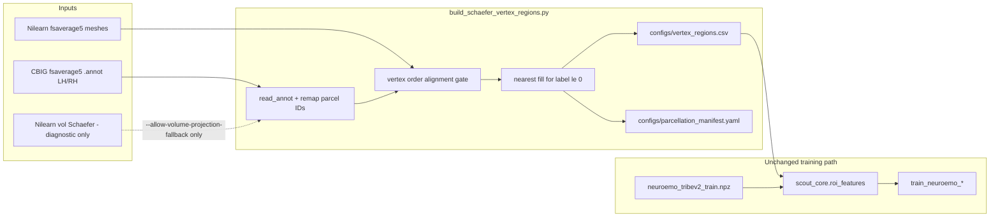

# Surface-Native Schaefer Atlas Switch

## Benefits and cons

### Benefits (why switch)

| Benefit                                     | Why it matters for this repo                                                                                                                                                                                                                                                                       |
| ------------------------------------------- | -------------------------------------------------------------------------------------------------------------------------------------------------------------------------------------------------------------------------------------------------------------------------------------------------- |
| **True surface parcellation**               | CBIG Schaefer on `fsaverage5` was computed in surface space (downsampled from `fsaverage6`), not via MNI volume → surface ([CBIG FreeSurfer5.3 README](https://github.com/ThomasYeoLab/CBIG/tree/master/stable_projects/brain_parcellation/Schaefer2018_LocalGlobal/Parcellations/FreeSurfer5.3)). |
| **Removes projection artifacts**            | Current manifest records `MNI152_volume_projected_to_fsaverage5` and **2487** `filled_unassigned_vertices` in [`configs/parcellation_manifest.yaml`](configs/parcellation_manifest.yaml)—a known representation ceiling from your postfix analysis.                                                |
| **Sharper parcel boundaries**               | Volume-to-surface mapping can blur labels across sulcal banks ([geometric effects of vol-to-surf](https://link.springer.com/article/10.1007/s00429-022-02536-4)); surface labels respect cortical topology.                                                                                        |
| **No change to downstream tensor contract** | [`scout_core/roi_features.py`](scout_core/roi_features.py) still produces `(N, 400 * reducers)` from the same `vertex_index → parcel_id` CSV; training NPZ and 10-TR windowing stay unchanged.                                                                                                     |
| **Stronger provenance**                     | Manifest can record annot paths, SHA256s, label-source kind, and an explicit vertex-order proof block—aligned with [`vertex_equivalence_proof_eb9fafb6.plan.md`](.cursor/plans/vertex_equivalence_proof_eb9fafb6.plan.md).                                                                         |
| **Plausible accuracy lift**                 | Postfix gains were mostly de-confounding; surface-native labels attack the remaining atlas-quality ceiling without changing model family.                                                                                                                                                          |

### Cons (acknowledged; plan mitigates each)

| Con                                      | Mitigation in this plan                                                                                                                                                          |
| ---------------------------------------- | -------------------------------------------------------------------------------------------------------------------------------------------------------------------------------- |
| **CBIG is not drop-in today**            | Builder only discovers `*.label.gii`; CBIG ships `*.annot`. Add first-class `.annot` ingestion.                                                                                  |
| **Vertex index alignment risk**          | Annot order is FreeSurfer fsaverage5 order; BOLD uses Nilearn `fetch_surf_fsaverage("fsaverage5")`. Add a **mandatory alignment gate** before writing artifacts (fail closed).   |
| **FreeSurfer 5.3 label convention**      | Labels were built for FS 5.3 naming; we read `.annot` via nibabel—**no FreeSurfer install required** for the default pipeline. Record `cbig_release: FreeSurfer5.3` in manifest. |
| **Two external files must be present**   | Download only the LH/RH `.annot` pair (see Prerequisites); store under `scout_data/atlases/` (gitignored). No full CBIG clone or `fsaverage` mesh tree.                          |
| **All trained models must be retrained** | Same `atlas_id` string, but `parcel_id_by_vertex` changes → old joblib artifacts invalid. Plan includes explicit regen + comparison matrix rerun.                                |
| **Medial wall / background vertices**    | Keep `_fill_unassigned_nearest` but expect **far fewer** fills than 2487; record count in manifest and fail if above threshold.                                                  |
| **No Nilearn Schaefer surface fetch**    | Nilearn provides surface Destrieux, not Schaefer; CBIG `.annot` remains the authoritative source.                                                                                |

---

## Target end state



**Invariant:** vertex `i` in prepared BOLD (`X[:, i]`) must equal row `i` in `vertex_regions.csv` for all `i in 0..20483`.

---

## Prerequisites — downloads (minimal)

### Required (download exactly these 2 files)

For the current NeuroEmo default (`400` parcels, `7` Yeo networks), place:

```text
scout_data/atlases/cbig_schaefer2018/FreeSurfer5.3/fsaverage5/label/
  lh.Schaefer2018_400Parcels_7Networks_order.annot
  rh.Schaefer2018_400Parcels_7Networks_order.annot
```

Direct raw URLs (public GitHub; agent or user can `curl` / `Invoke-WebRequest`):

- `https://raw.githubusercontent.com/ThomasYeoLab/CBIG/master/stable_projects/brain_parcellation/Schaefer2018_LocalGlobal/Parcellations/FreeSurfer5.3/fsaverage5/label/lh.Schaefer2018_400Parcels_7Networks_order.annot`
- `https://raw.githubusercontent.com/ThomasYeoLab/CBIG/master/stable_projects/brain_parcellation/Schaefer2018_LocalGlobal/Parcellations/FreeSurfer5.3/fsaverage5/label/rh.Schaefer2018_400Parcels_7Networks_order.annot`

Source folder (for reference): [CBIG FreeSurfer5.3/fsaverage5/label](https://github.com/ThomasYeoLab/CBIG/tree/master/stable_projects/brain_parcellation/Schaefer2018_LocalGlobal/Parcellations/FreeSurfer5.3/fsaverage5/label).

If you change `--n-rois` or `--yeo-networks`, swap in the matching `*_<N>Parcels_<7|17>Networks_order.annot` pair only—still two files.

### Not required to download

| Item                                                                                   | Why unnecessary                                                                                                                  |
| -------------------------------------------------------------------------------------- | -------------------------------------------------------------------------------------------------------------------------------- |
| Full [CBIG](https://github.com/ThomasYeoLab/CBIG) repo or entire `FreeSurfer5.3/` tree | Only the two `.annot` files are consumed.                                                                                        |
| `fsaverage` / `fsaverage6` Schaefer folders                                            | Different resolution; pipeline targets `fsaverage5` only.                                                                        |
| FreeSurfer software install (`SUBJECTS_DIR`, `freeview`, `mri_surf2surf`)              | Default path uses `nibabel.freesurfer.read_annot`; no FS binaries.                                                               |
| `.gcs` parcellation files, LUT `.txt`, `Medial_wall.label`                             | Used for other CBIG workflows, not this builder.                                                                                 |
| Nilearn fsaverage5 meshes                                                              | Already fetched at runtime via `nilearn.datasets.fetch_surf_fsaverage(mesh="fsaverage5")` (alignment gate + existing BOLD prep). |
| Volumetric Schaefer NIfTI                                                              | Only used if `--allow-volume-projection-fallback` (diagnostic).                                                                  |

### Generated locally (not downloaded)

- [`scout_data/neuroemo/vertex_equivalence_report.json`](scout_data/neuroemo/vertex_equivalence_report.json) — run [`scripts/verify_tribe_vertex_equivalence.py`](scripts/verify_tribe_vertex_equivalence.py) once before atlas regen.
- [`configs/vertex_regions.csv`](configs/vertex_regions.csv) + [`configs/parcellation_manifest.yaml`](configs/parcellation_manifest.yaml) — output of the builder, not inputs.

### Who fetches the `.annot` files?

Composer/agent can download the two public raw URLs into the path above without manual steps, unless network is blocked. User action is only needed if download fails (then save the two files manually to the same paths).

---

## Phase 1 — Vendor path + one-page doc

**Goal:** Document the two-file requirement only; no clone/sparse-checkout instructions unless download fails.

1. **Add** [`docs/atlas-setup/cbig-schaefer2018-fsaverage5.md`](docs/atlas-setup/cbig-schaefer2018-fsaverage5.md) containing only:
   - The table above (required vs not required)
   - Copy-paste download commands for Windows (PowerShell) and Unix (`curl -L -o ...`)
   - Builder command from Phase 5

2. **Update** [`docs/implementation-plans/improved-roi-extraction-pipeline-plan.md`](docs/implementation-plans/improved-roi-extraction-pipeline-plan.md): volumetric projection is deprecated; surface path needs the two `.annot` files only.

---

## Phase 2 — Core `.annot` loader in builder

**Primary file:** [`scripts/build_schaefer_vertex_regions.py`](scripts/build_schaefer_vertex_regions.py)

### 2a. Add `_load_freesurfer_annot(path) -> (labels, label_by_id)`

- Use `nibabel.freesurfer.io.read_annot(path)` (add explicit dependency note in script docstring; already transitively available via nibabel).
- Assert `labels.shape[0] == 10242`.
- Build `label_by_id: dict[int, str]` from annot color table (`ctab` / `names`).
- Parse Schaefer names with existing `_network_name()` / `_normalise_label()`.

### 2b. Deterministic `parcel_id` remapping

FreeSurfer annot keys are **not** guaranteed to be contiguous `1..400`. Add:

```python
def _remap_to_contiguous_parcel_ids(
    lh_labels, rh_labels, label_by_id, *, n_rois: int
) -> tuple[np.ndarray, np.ndarray, dict[int, str], list[str]]:
```

- Collect unique positive label keys across both hemispheres.
- Sort by canonical Schaefer name order (use `ordered_labels` from manifest `labels` list pattern: network then index).
- Map raw annot key → `1..n_rois`.
- **RH/LH:** Schaefer 400 uses 200 parcels per hemisphere; ensure global IDs `1..400` are unique across the full brain (do not collide LH/RH raw keys).
- Reject if `len(unique_parcels) != n_rois`.

### 2c. Extend `_resolve_surface_label_paths`

Search order (first match wins):

1. Explicit CLI: `--annot-lh` / `--annot-rh` (new; preferred)
2. Explicit CLI: existing `--labels-gii-lh` / `--labels-gii-rh`
3. Auto-discovery under `--data-dir`:
   - `**/*.annot` matching regex:  
     `(?i)Schaefer2018_{n}Parcels_{yeo}Networks_order\.annot` with `lh` / `rh` prefix
   - Existing `*.label.gii` token search (keep for HCP-style GIFTI if ever added)

CBIG naming example: `lh.Schaefer2018_400Parcels_7Networks_order.annot`.

### 2d. Unify surface paths in `build_schaefer_vertex_regions`

Priority:

1. **Surface annot** (new primary)
2. **Surface label GIFTI** (existing)
3. **Volume projection** only if `--allow-volume-projection-fallback` (new flag; **off by default**)

Update `source_metadata`:

```yaml
source_space: fsaverage5_surface_annot_cbig
label_source_kind: surface_annot_cbig
projection: ""
filled_unassigned_vertices: <int>
annot_lh: <path>
annot_rh: <path>
cbig_release: FreeSurfer5.3
```

Record `artifact_sha256.labels_annot_lh` / `labels_annot_rh` in manifest (alongside optional GIFTI hashes).

---

## Phase 3 — Vertex-order alignment gate (fail closed)

**New module:** [`scout_core/schaefer_surface_labels.py`](scout_core/schaefer_surface_labels.py) (keeps builder thin)

Responsibilities:

1. `load_nilearn_fsaverage5_coords() -> {lh, rh} coords (10242, 3)`
2. `load_annot_labels(lh_path, rh_path) -> raw label vectors`
3. `verify_annot_vertex_order(lh_labels, rh_labels, *, lh_coords, rh_coords, projected_lh=None, projected_rh=None) -> dict`

**Verification strategy (layered):**

| Layer | Check                                               | Pass criterion                                                                                                                                                                                                                                                     |
| ----- | --------------------------------------------------- | ------------------------------------------------------------------------------------------------------------------------------------------------------------------------------------------------------------------------------------------------------------------ |
| A     | Count                                               | 10242 LH + 10242 RH                                                                                                                                                                                                                                                |
| B     | **Projection agreement** (strongest practical test) | Build one-time volumetric projection labels via existing `_project_hemi` + same fill logic; compute % exact `parcel_id` match on vertices with both assigned. Require **≥ 85%** on cortical vertices (tune from first real run; store threshold in code constant). |
| C     | **Coord permutation** (if B fails)                  | For each annot vertex index, find nearest Nilearn mesh vertex by coords (`atol=1e-2` per [nilearn#3415](https://github.com/nilearn/nilearn/issues/3415)); require bijective mapping; apply permutation to labels before CSV write.                                 |
| D     | **Bijection**                                       | Permutation is 1:1 per hemisphere                                                                                                                                                                                                                                  |

If B passes: `vertex_order_proof: annot_matches_nilearn_projection`.
If C required and passes: `vertex_order_proof: annot_reordered_by_coordinate_map` + save permutation hashes in manifest.
If both fail: **raise** with actionable error (do not write CSV).

**New CLI:** [`scripts/verify_schaefer_annot_alignment.py`](scripts/verify_schaefer_annot_alignment.py)

- Runs gate only; writes JSON report to `scout_data/neuroemo/schaefer_annot_alignment_report.json`
- Called automatically at end of builder; can be run standalone before full regen

Embed summary in manifest:

```yaml
vertex_order_proof:
  status: annot_matches_nilearn_projection
  lh_agreement_pct: 92.4
  rh_agreement_pct: 91.8
  reorder_applied: false
  report_path: scout_data/neuroemo/schaefer_annot_alignment_report.json
  report_sha256: ...
```

---

## Phase 4 — Stricter validation and training gates

### 4a. [`scout_core/parcellation.py`](scout_core/parcellation.py)

- Add `SURFACE_NATIVE_LABEL_KINDS = {"surface_annot_cbig", "surface_label_gifti"}`.
- In `validate_manifest_matches_table`:
  - If `source.label_source_kind == volume_projection_fallback` → **warn** when `allow_legacy_atlas=True`, else **raise** (new parameter, default strict for training loads).
  - If `filled_unassigned_vertices > 500` (configurable) with surface-native kind → **raise** (regression guard).
  - Require `vertex_order_proof.status` in allowed set when `require_surface_native=True`.

### 4b. [`scout_core/roi_features.py`](scout_core/roi_features.py)

- Pass `allow_legacy_atlas` through `load_roi_feature_spec` (default `False` for training scripts).
- Include `label_source_kind` and `vertex_order_proof` in `RoiFeatureSpec.validation_summary` for metrics JSON.

### 4c. Training scripts (no feature logic changes)

- [`scripts/train_neuroemo_emotion_model.py`](scripts/train_neuroemo_emotion_model.py): when loading ROI spec, use strict manifest validation (already loads manifest via `load_roi_feature_spec`).
- Same for [`scripts/train_neuroemo_mlp_model.py`](scripts/train_neuroemo_mlp_model.py) and [`scripts/train_neuroemo_specialist_models.py`](scripts/train_neuroemo_specialist_models.py).
- Model artifacts already store atlas metadata; they will automatically record new `source` block after regen.

**No changes** to [`scripts/prepare_neuroemo_tribev2.py`](scripts/prepare_neuroemo_tribev2.py) BOLD projection—only parcellation artifacts change.

---

## Phase 5 — Regeneration and experiment rerun

**Prerequisites:**

1. Two `.annot` files on disk (see **Prerequisites — downloads**).
2. Vertex equivalence report exists ([`scripts/verify_tribe_vertex_equivalence.py`](scripts/verify_tribe_vertex_equivalence.py))—builder already requires it.

**Commands:**

```bash
# 1. Alignment check (optional standalone)
python scripts/verify_schaefer_annot_alignment.py \
  --annot-lh scout_data/atlases/cbig_schaefer2018/FreeSurfer5.3/fsaverage5/label/lh.Schaefer2018_400Parcels_7Networks_order.annot \
  --annot-rh scout_data/atlases/cbig_schaefer2018/FreeSurfer5.3/fsaverage5/label/rh.Schaefer2018_400Parcels_7Networks_order.annot

# 2. Regenerate atlas artifacts (default: surface annot only)
python scripts/build_schaefer_vertex_regions.py --n-rois 400 --yeo-networks 7 \
  --data-dir scout_data/atlases/cbig_schaefer2018

# 3. Rerun postfix comparison matrix (same hyperparams as 2026-05-25_postfix_matrix)
python scripts/train_neuroemo_emotion_model.py --model-type logistic_saga \
  --temporal-window-trs 10 --temporal-contiguity contiguous \
  --roi-reducers mean,std,mean_abs --exclude-labels neutral
```

**Acceptance criteria for the switch:**

| Check                                         | Expected                                                                               |
| --------------------------------------------- | -------------------------------------------------------------------------------------- |
| `label_source_kind`                           | `surface_annot_cbig`                                                                   |
| `filled_unassigned_vertices`                  | Much less than 2487 (target: under ~200; tune after first run)                         |
| `vertex_order_proof.status`                   | `annot_matches_nilearn_projection` or `annot_reordered_by_coordinate_map`              |
| Training loads without `--allow-legacy-atlas` | Pass                                                                                   |
| 5-class `logistic_saga`                       | Compare to 0.445 baseline; judge by macro F1 + per-class confusion, not accuracy alone |

Archive old CSV/manifest under `scout_data/neuroemo/atlas_archive/projected_2026-05-25/` before overwrite for A/B debugging.

---

## Phase 6 — Tests

**New:** [`tests/test_build_schaefer_surface_annot.py`](tests/test_build_schaefer_surface_annot.py)

- Synthetic annot fixture (small mock via monkeypatch `read_annot`) covering:
  - remapping to contiguous IDs
  - LH-then-RH concatenation
  - reject wrong vertex count
- Mock alignment gate: pass/fail paths
- Manifest fields include `surface_annot_cbig` and `vertex_order_proof`

**Extend:** [`tests/test_neuroemo_training.py`](tests/test_neuroemo_training.py)

- `validate_manifest_matches_table` rejects `volume_projection_fallback` when strict
- accepts `surface_annot_cbig` with valid proof block

**Optional CI note:** CBIG files too large for CI—tests use mocks; one manual/integration checklist in docs.

---

## Phase 7 — Documentation and session notes

- Update [`coding-sessions/2026-05-25-neuroemo-training-modeling-upgrade.md`](coding-sessions/2026-05-25-neuroemo-training-modeling-upgrade.md) § Schaefer: surface-native is now default.
- Add short section to [`.cursor/plans/fix-neuroemo-training_029d2a6f.plan.md`](.cursor/plans/fix-neuroemo-training_029d2a6f.plan.md) marking surface-native item complete.
- Note in plan: **retrain all saved models**; inference not yet restored—when added, must load new manifest SHA.

---

## CLI surface (final)

| Flag                                 | Purpose                                             |
| ------------------------------------ | --------------------------------------------------- |
| `--annot-lh`, `--annot-rh`           | Explicit CBIG paths                                 |
| `--data-dir`                         | Auto-discover CBIG `fsaverage5/label/*.annot`       |
| `--allow-volume-projection-fallback` | Diagnostic only; logs loud warning                  |
| `--skip-vertex-order-proof`          | **Forbidden in production**; test-only escape hatch |
| `--vertex-equivalence-report`        | Unchanged; still required                           |

---

## Risk register (flawless integration checklist)

Before merging:

- [ ] Exactly two `.annot` files present at the vendor path (no missing LH/RH)
- [ ] Alignment report passes on real CBIG files
- [ ] `configs/vertex_regions.csv` SHA updated in manifest; training rejects stale CSV
- [ ] `filled_unassigned_vertices` recorded and within threshold
- [ ] No code path silently calls `fetch_atlas_schaefer_2018` without flag
- [ ] Postfix matrix rerun logged in new coding-session note
- [ ] Old models documented as incompatible with new `parcel_id_by_vertex`

---

## Suggested implementation order

1. `scout_core/schaefer_surface_labels.py` + unit tests for remapping
2. `verify_schaefer_annot_alignment.py` + alignment gate
3. Extend `build_schaefer_vertex_regions.py` (annot primary, fallback behind flag)
4. `parcellation.py` / `roi_features.py` strict validation
5. Regenerate artifacts + rerun training matrix
6. Documentation

Estimated touch points: **4 new files**, **~6 modified files**, **0 training-feature shape changes**.
