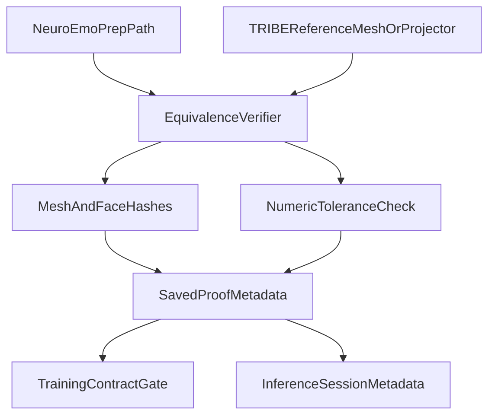

# Prove TRIBE Vertex Equivalence

## Current Finding

The repo currently enforces a shared convention, not a proof:

- [`scripts/prepare_neuroemo_tribev2.py`](C:/Users/splas/OneDrive/Desktop/Projects%20for%20learning/TribeV2/scripts/prepare_neuroemo_tribev2.py) projects with Nilearn `fsaverage5` and writes `vertex_order="lh_then_rh_fsaverage5"`.
- [`scout_core/parcellation.py`](C:/Users/splas/OneDrive/Desktop/Projects%20for%20learning/TribeV2/scout_core/parcellation.py) normalizes aliases like `facebook/tribev2_lh_then_rh` into the same canonical string and validates contiguous indices / hemisphere counts.
- [`tests/test_neuroemo_training.py`](C:/Users/splas/OneDrive/Desktop/Projects%20for%20learning/TribeV2/tests/test_neuroemo_training.py) checks metadata compatibility, not numeric or mesh-identity equivalence.
- [`coding-sessions/2026-05-22-neuroemo-tribev2-dataset-prep.md`](C:/Users/splas/OneDrive/Desktop/Projects%20for%20learning/TribeV2/coding-sessions/2026-05-22-neuroemo-tribev2-dataset-prep.md) explicitly says exact vertex-index identity is still to verify.

## Goal

Upgrade the project from:

- "same `fsaverage5` / `lh_then_rh` contract"

to:

- "verified TRIBE mesh identity and verified projection equivalence, recorded in artifacts and enforced by tests"

## Plan

1. Add a dedicated equivalence verifier script around the existing prep path.
   - Create a small proof-oriented utility under [`scripts/prepare_neuroemo_tribev2.py`](C:/Users/splas/OneDrive/Desktop/Projects%20for%20learning/TribeV2/scripts/prepare_neuroemo_tribev2.py) or a sibling script such as `scripts/verify_tribe_vertex_equivalence.py`.
   - The verifier should compare:
     - the exact left/right surface meshes used by the NeuroEmo prep path,
     - the exact mesh assets TRIBE uses for `fsaverage5` output or plotting,
     - and, if accessible, the same 4D sample projected through both paths.
   - Persist a structured proof report with at least: `coords_sha256`, `faces_sha256`, asset paths, library/version info, comparison mode, tolerance, and pass/fail status.

2. Strengthen the NeuroEmo prep artifacts so they carry proof metadata, not just declared order strings.
   - Extend the metadata written by [`scripts/prepare_neuroemo_tribev2.py`](C:/Users/splas/OneDrive/Desktop/Projects%20for%20learning/TribeV2/scripts/prepare_neuroemo_tribev2.py) to include a `vertex_equivalence` block.
   - Record whether the dataset was prepared under:
     - `mesh_identity_verified`,
     - `projection_equivalence_verified`,
     - or only `contract_only` fallback.
   - Include the proof report path / hash in each subject NPZ and combined training NPZ.

3. Upgrade the atlas manifest from convention-only metadata to proof-bearing provenance.
   - Extend [`configs/parcellation_manifest.yaml`](C:/Users/splas/OneDrive/Desktop/Projects%20for%20learning/TribeV2/configs/parcellation_manifest.yaml) generation in [`scripts/build_schaefer_vertex_regions.py`](C:/Users/splas/OneDrive/Desktop/Projects%20for%20learning/TribeV2/scripts/build_schaefer_vertex_regions.py).
   - Add fields for left/right mesh coordinate hashes and face hashes, plus a provenance section that says whether the manifest is anchored to verified TRIBE mesh identity versus only Nilearn `fsaverage5` convention.
   - Stop treating `facebook/tribev2_lh_then_rh` as sufficient proof by itself; it should become a label backed by evidence.

4. Tighten parcellation and training gates so unverified data can be rejected intentionally.
   - In [`scout_core/parcellation.py`](C:/Users/splas/OneDrive/Desktop/Projects%20for%20learning/TribeV2/scout_core/parcellation.py), extend `validate_manifest_matches_table()` so it can validate proof metadata, not just `mesh`, `n_vertices`, and alias-normalized `tribe_vertex_order`.
   - In [`scripts/train_neuroemo_emotion_model.py`](C:/Users/splas/OneDrive/Desktop/Projects%20for%20learning/TribeV2/scripts/train_neuroemo_emotion_model.py), require proof metadata by default for new training runs, with an explicit override flag if legacy NPZs must still load.
   - Keep backward compatibility by surfacing a clear warning / opt-out path rather than silently accepting old artifacts forever.

5. Add session-side TRIBE metadata so downstream comparisons use the same contract.
   - Update [`tribe.py`](C:/Users/splas/OneDrive/Desktop/Projects%20for%20learning/TribeV2/tribe.py) and [`activation_store.py`](C:/Users/splas/OneDrive/Desktop/Projects%20for%20learning/TribeV2/activation_store.py) so persisted `preds.npz` / session metadata include the same mesh-identity fields where possible.
   - This does not need to re-project BOLD data, but it should make every saved TRIBE session explicit about which mesh identity it assumed.

6. Add tests that prove the claim numerically or geometrically.
   - Extend [`tests/test_neuroemo_training.py`](C:/Users/splas/OneDrive/Desktop/Projects%20for%20learning/TribeV2/tests/test_neuroemo_training.py) or add a dedicated verifier test file.
   - Add three test layers:
     - unit tests for mesh hash extraction and metadata validation,
     - contract tests showing training rejects missing/mismatched proof metadata,
     - an integration-style test fixture for equivalence comparison logic on known meshes / cached sample outputs.
   - The key missing regression today is: no test demonstrates that TRIBE vertex `j` and prep vertex `j` are the same surface point.

7. Update the docs to reflect the new status accurately.
   - Update [`coding-sessions/2026-05-25-neuroemo-training-modeling-upgrade.md`](C:/Users/splas/OneDrive/Desktop/Projects%20for%20learning/TribeV2/coding-sessions/2026-05-25-neuroemo-training-modeling-upgrade.md) so it distinguishes "validated contract" from "equivalence proven" until the verifier lands.
   - After implementation, update [`coding-sessions/2026-05-22-neuroemo-tribev2-dataset-prep.md`](C:/Users/splas/OneDrive/Desktop/Projects%20for%20learning/TribeV2/coding-sessions/2026-05-22-neuroemo-tribev2-dataset-prep.md) and [`docs/implementation-plans/improved-roi-extraction-pipeline-plan.md`](C:/Users/splas/OneDrive/Desktop/Projects%20for%20learning/TribeV2/docs/implementation-plans/improved-roi-extraction-pipeline-plan.md) to record the new proof contract and failure modes.

## Suggested Execution Order

1. Implement mesh-hash extraction and a proof report using the current Nilearn prep path and whatever TRIBE mesh assets are directly accessible.
2. If TRIBE exposes a projector or identical surface assets, add numeric comparison on one shared sample.
3. Record proof metadata in manifests and NPZs.
4. Make training / parcellation validation enforce the new metadata.
5. Add tests and then update docs to match the new reality.

## Success Criteria

- A generated proof artifact can answer: "Which exact meshes were compared, how were they hashed, and did they match?"
- New NeuroEmo training NPZs embed proof metadata rather than only a `vertex_order` string.
- Training fails loudly when proof metadata is absent or mismatched, unless an explicit legacy override is provided.
- Saved TRIBE sessions carry enough mesh provenance to compare against NeuroEmo-prepared datasets.
- The docs can honestly say vertex equivalence is verified, not merely assumed.
