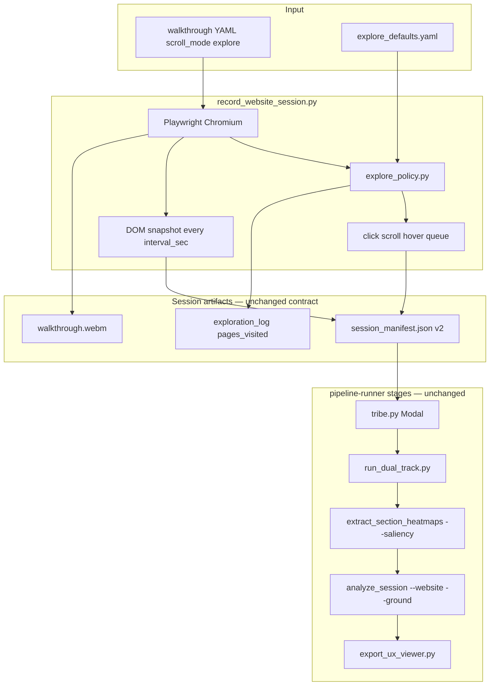

# Playwright Exploration Mode — Implementation Plan

**Ledger session:** `CS-20260610-PLAYWRIGHT-EXPLORATION`  
**Issue:** `ISSUE-001-scripted-capture-limits-real-sites`  
**Feature:** `FEATURE-001-explore-scroll-mode`  
**Verification agent:** `.cursor/agents/pipeline-runner.md`

---

## Problem statement

The website pipeline is production-quality **downstream** (TRIBE → dual-track → saliency → analyze → viewer) but **upstream capture is demo-centric**:

```text
Today:
  scripted YAML  → author must pre-write every action; misses unknown routes
  linear scroll  → passive vertical scroll only; no clicks, no multi-page

Needed:
  explore mode   → discover nav/CTAs/sections within budgets; same manifest contract
```

`pipeline-runner` documents three showcase scripts — all `scroll_mode: linear` or short `scripted` steps on **known fixtures**. That workflow cannot generalize to arbitrary marketing sites, SaaS dashboards, or multi-page flows without hours of per-site YAML authoring.

---

## Design principles (from pipeline-runner + ledger)

1. **Video remains stimulus** — explore mode only changes how Playwright labels the page; TRIBE still reads `walkthrough.webm`.
2. **Manifest v2 compatible** — `dom_snapshots[]`, `interaction_events[]`, `tr_mapping`, `capture{width,height}` unchanged in meaning.
3. **Alignment invariants preserved** — 1 TR = `interval_sec`; sample before action on same TR clock (same rule as May 25 scripted hardening).
4. **Bounded autonomy** — hard caps on TRs, clicks, pages; same-origin default; deny-list dangerous selectors.
5. **Fixtures first, production URLs second** — prove on Threadmind (8780) before external allowlisted URLs.
6. **No NeuroEmo / no MVPA agentic loop** — this is capture policy only, not P4 demographic barriers.

---

## Target architecture



---

## `scroll_mode: explore` — behavior spec

### TR clock loop (mirrors scripted merge semantics)

Each iteration at `t_idx`:

1. **Sample** — `_capture_snapshot(page, t_idx, event_time)` → append to `dom_snapshots`
2. **Decide** — `explore_policy.next_action(snapshot, page_state, budget)` → `scroll_down | click | hover | wait | stop`
3. **Execute** — perform action; append to `interaction_events` + `exploration_log` when actionable
4. **Advance** — `t_idx += 1`; stop when `t_idx >= max_tr` or policy returns `stop`

Sampling runs **before** the action at that TR (consistent with scripted mode: sample events sort before step events at same timestamp).

### Heuristic action policy (Phase 1 — no LLM)

`scout_core/explore_policy.py`:

| Signal | Weight | Source |
|--------|--------|--------|
| CTA text cues | High | `get started`, `subscribe`, `pricing`, `demo`, `sign up` |
| Tag/role | High | `BUTTON`, `role=button`, `[data-cta]` |
| Nav links | Medium | `nav a`, `header a`, same-origin `href` |
| Position | Medium | above-fold bias (reuse visual saliency position logic) |
| Already visited | Penalty | selector+url in `visited_actions` set |
| External link | Block | `href` not same-origin |
| Deny patterns | Block | `logout`, `delete`, `mailto:`, `tel:`, payment hosts |

**Action priority each TR:**

1. If high-score unvisited **same-origin link** in viewport → `click` (navigate)
2. Else if high-score **button/CTA** → `click` or `hover`
3. Else if below-fold content exists → `scroll_down` by `scroll_px_per_tr`
4. Else if click budget exhausted → `scroll_down` until page end
5. Else → `stop`

### Safety budgets (defaults in `configs/explore_defaults.yaml`)

```yaml
explore:
  max_tr: 24                    # ~24 s at interval_sec 1.0
  max_clicks: 12
  max_pages: 6                  # distinct same-origin paths
  same_origin_only: true
  allow_subdomains: false
  scroll_px_per_tr: 540
  scroll_settle_ms: 500
  initial_settle_ms: 1500
  deny_selectors:
    - 'a[href*="logout"]'
    - 'button[type="submit"][formaction*="checkout"]'
  deny_href_patterns:
    - '^mailto:'
    - '^tel:'
    - '^javascript:void'
```

### Manifest extensions (backward compatible)

```json
{
  "capture_mode": "explore",
  "pages_visited": ["http://127.0.0.1:8780/", "http://127.0.0.1:8780/pricing.html"],
  "exploration_log": [
    {"t_idx": 2, "action": "click", "selector": "#nav-pricing", "url": "...", "reason": "nav_link_score=0.82"}
  ]
}
```

Existing consumers ignore unknown keys. `export_ux_viewer.py` may optionally surface `exploration_log` in Phase 1.5.

---

## Example walkthrough YAML

`configs/walkthrough_scripts/explore_threadmind.yaml`:

```yaml
name: explore_threadmind
initial_url: "http://127.0.0.1:8780/index.html"
viewport:
  width: 1280
  height: 720

scroll_mode: explore
interval_sec: 1.0

site_goal: |
  Threadmind is an AI chatbot product site. Exploration should surface hero value prop,
  pricing, how-it-works, and primary subscribe CTAs.

explore:
  max_tr: 20
  max_clicks: 10
  guidance: heuristic   # goal | gemini in FEATURE-002
```

**pipeline-runner prerequisite:** serve Threadmind on port **8780** before capture:

```powershell
python -m http.server 8780 --directory chatbot_product_site
```

---

## Implementation phases

### Phase 1 — Policy module (≈1 day)

**Files:** `scout_core/explore_policy.py`, `configs/explore_defaults.yaml`, `tests/test_explore_policy.py`

- [ ] `ExploreBudget` dataclass — tracks `t_idx`, clicks, pages, visited selectors
- [ ] `score_actionable_elements(elements, page_url, budget, cfg)` → ranked candidates
- [ ] `is_same_origin(href, initial_url, cfg)` guard
- [ ] `next_action(...)` → `ExploreAction` enum + metadata
- [ ] Unit tests: CTA outranks body link; external href blocked; budget stop

**Exit:** `pytest tests/test_explore_policy.py` green

---

### Phase 2 — Capture integration (≈1–1.5 days)

**Files:** `scout_core/walkthrough.py`, `scripts/record_website_session.py`

- [ ] `_record_explore_async(...)` parallel structure to scripted/linear
- [ ] TR clock loop with sample-then-act ordering
- [ ] Populate `interaction_events`, `exploration_log`, `pages_visited`
- [ ] `build_manifest_v2` extended with optional `capture_mode`, logs (or post-process in caller)
- [ ] Branch in `record_website_session_async` when `scroll_mode == "explore"`
- [ ] Merge `explore_defaults.yaml` under script `explore:` key

**Exit:** Manual capture on Threadmind produces manifest with ≥2 paths or nav sections visited

---

### Phase 3 — Pipeline verification (≈0.5 day)

Use **pipeline-runner** checklist verbatim:

#### Layer 0 — unit tests

```powershell
.venv\Scripts\activate
python -m pytest tests/test_explore_policy.py tests/test_record_website_session.py -v --tb=short
```

#### Layer 1 — capture only

```powershell
# Terminal A
python -m http.server 8780 --directory chatbot_product_site

# Terminal B
python scripts/record_website_session.py --script configs/walkthrough_scripts/explore_threadmind.yaml
```

**Verify (manual + automated where possible):**

| Check | Expected |
|-------|----------|
| `capture_mode` | `"explore"` |
| `len(pages_visited)` | ≥ 2 OR `len(exploration_log)` ≥ 3 |
| `interaction_events` | non-empty click/hover entries |
| `dom_snapshots[].scrollY` | not constant across all TRs |
| `dom_snapshots[].url` | may change on multi-page fixture |

#### Layer 2 — CPU path (no Modal required for capture validation)

```powershell
python scripts/run_website_session.py --session-id <ID> --stage dual_track
python scripts/extract_section_heatmaps.py --session-id <ID> --saliency --refresh-sections
python scripts/analyze_session.py --session-id <ID> --norm-id synthetic_bootstrap_v1 --website --ground
python scripts/export_ux_viewer.py --session-id <ID>
```

#### Layer 3 — full Modal (when GPU available)

```powershell
modal run tribe.py::record_session --session-id <ID>
python scripts/extract_section_heatmaps.py --session-id <ID> --saliency --refresh-sections
# re-analyze + export
```

**Compare vs linear:** Re-run `threadmind_showcase.yaml` (linear) on same site; explore session should have **more distinct `section_report[].section_id`** entries or higher `interaction_events` count.

**Exit:** Layer 1 automated tests pass; Layer 2 analyze completes; checklist items from pipeline-runner §Verification marked done

---

### Phase 4 — Docs + agent updates (≈0.25 day)

- [ ] `docs/runbooks/website-session.md` — explore section, port 8780, budgets
- [ ] `.cursor/agents/pipeline-runner.md` — add `explore_threadmind.yaml` row, explore diagnostics
- [ ] Resolve `FEATURE-001`, `ISSUE-001` in ledger; sign session on completion

---

### Phase 5 — FEATURE-002 goal-guided (deferred)

- [ ] `explore.guidance: goal` uses `site_goal` + `element_goals.classify_role()` to re-rank policy candidates
- [ ] Optional `gemini` mode: single structured prompt per TR (cost-controlled; off by default)
- [ ] Not required for initial merge

---

## Files to create / modify

| File | Action |
|------|--------|
| `scout_core/explore_policy.py` | **Create** — policy core |
| `scout_core/walkthrough.py` | **Modify** — `explore` branch + manifest fields |
| `configs/explore_defaults.yaml` | **Create** — default budgets |
| `configs/walkthrough_scripts/explore_threadmind.yaml` | **Create** — showcase script |
| `scripts/record_website_session.py` | **Modify** — help text for explore mode |
| `scout_core/schemas.py` | **Modify** (optional) — document manifest extensions |
| `scripts/export_ux_viewer.py` | **Modify** (optional) — pass `exploration_log` to bundle |
| `tests/test_explore_policy.py` | **Create** |
| `tests/test_explore_capture.py` | **Create** — mock-page or fixture integration |
| `docs/runbooks/website-session.md` | **Modify** |
| `.cursor/agents/pipeline-runner.md` | **Modify** |

**Unchanged:** `tribe.py`, `dual_track.py`, `analyze_session.py` core paths (explore manifests feed existing pipeline).

---

## Risks and mitigations

| Risk | Mitigation |
|------|------------|
| Infinite navigation loops | `max_pages`, `visited_actions` dedupe |
| Click opens external site | `same_origin_only`; block `_blank` external |
| Modal/form submits | Deny `submit` on unknown forms; click buttons with known safe text only in v1 |
| TR/video length drift | Reuse `pad_manifest_snapshots_to_video_duration` after capture |
| Flaky Playwright in CI | Policy unit tests required; live capture test `@pytest.mark.playwright` optional skip |
| Explore session too long for Modal cost | Default `max_tr: 24`; document cost in runbook |

---

## Out of scope (v1)

- True human-in-the-loop manual exploration UI
- Cross-origin crawling / sitemap ingestion
- Login flows / CAPTCHA / authenticated areas
- P4 demographic multiplex / MVPA-driven action selection
- Replacing `scripted` or `linear` modes on existing fixtures

---

## Review checklist for user

Before implementation, confirm:

1. **Default budgets** — `max_tr: 24`, `max_clicks: 12`, `max_pages: 6` acceptable?
2. **Same-origin only** — OK for v1, or need explicit external allowlist?
3. **First proof site** — Threadmind on 8780, or also Aurora on 8765?
4. **Phase 5 timing** — defer goal/Gemini-guided exploration until heuristic explore ships?
5. **Viewer** — show `exploration_log` in UX viewer sidebar in v1, or manifest-only?

---

## Success metric

> A non-author can run `explore_threadmind.yaml` through `pipeline-runner` Layer 1–2 and get a session where the manifest proves the browser **clicked real nav/CTAs** and **visited more than one logical section** — without writing YAML `steps[]` — and downstream `section_report` reflects that broader coverage compared to linear scroll alone.
