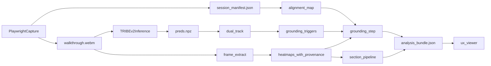

# Playwright Pipeline Fix Plan

## Goal
Make the website pipeline trustworthy end-to-end by fixing four core failure modes uncovered in testing:

- DOM snapshots are captured after scripted steps instead of during the walkthrough.
- feature-isolation spike selection is hard-coded to `anger`, so valid non-anger triggers never ground.
- `--modal` heatmap runs can silently reuse old placeholder `.npy` files.
- downstream bundle/viewer artifacts hide timeline mismatch and heatmap provenance.

## Scope
Primary files to change:

- [scout_core/walkthrough.py](scout_core/walkthrough.py)
- [scripts/record_website_session.py](scripts/record_website_session.py)
- [scout_core/session_align.py](scout_core/session_align.py)
- [scripts/analyze_session.py](scripts/analyze_session.py)
- [configs/isolation_thresholds.yaml](configs/isolation_thresholds.yaml)
- [scripts/extract_section_heatmaps.py](scripts/extract_section_heatmaps.py)
- [scout_core/section_pipeline.py](scout_core/section_pipeline.py)
- [scout_core/schemas.py](scout_core/schemas.py)
- [scripts/export_ux_viewer.py](scripts/export_ux_viewer.py)
- [viewer/ux_session_viewer.html](viewer/ux_session_viewer.html)
- [scout_core/llm_narrative.py](scout_core/llm_narrative.py)
- tests under [tests/](tests/)

## Root Causes
### 1. Capture timeline is wrong
Current recorder behavior executes all steps before snapshot sampling:

```python
await page.goto(initial_url, wait_until="networkidle", timeout=120_000)
for step in steps:
    await _run_step(page, step)

for t in range(n_timesteps):
    ...
    payload = await page.evaluate(EXTRACT_DOM_JS)
```

This must change so `dom_snapshots[t]` describe the page state during the recorded video at that same timestep.

### 2. Grounding policy drops non-anger emotion spikes
Current selection only reads `vals.get("anger")` inside [scripts/analyze_session.py](scripts/analyze_session.py), even though [scout_core/dual_track.py](scout_core/dual_track.py) emits triggers for any emotion channel.

### 3. Placeholder heatmaps can block real heatmaps
Current extraction logic skips any existing `heatmaps/t_<N>.npy`, regardless of whether it came from `--uniform-heatmap` or a real Modal run.

### 4. Downstream artifacts hide provenance and mismatch
[scout_core/section_pipeline.py](scout_core/section_pipeline.py), [scripts/analyze_session.py](scripts/analyze_session.py), and [scripts/export_ux_viewer.py](scripts/export_ux_viewer.py) consume `.npy` heatmaps directly without preserving whether they are placeholder or real, and the viewer timeline is based on manifest snapshot count even when analysis timesteps differ.

## Target Architecture


## Implementation Plan
### Phase 1: Fix capture correctness first
#### A. Rework walkthrough capture timing
Update [scout_core/walkthrough.py](scout_core/walkthrough.py) so DOM sampling happens during the walkthrough instead of after all scripted actions complete.

Implementation direction:

- Introduce a monotonic capture clock starting immediately before first navigation / first observable action.
- Replace the current “run all steps, then sample” structure with one of these equivalent implementations:
  - a timed scheduler that executes due steps while sampling snapshots every `interval_sec`, or
  - a capture loop that advances wall-clock time and runs scripted actions once their scheduled time is reached.
- Record actual elapsed capture time per snapshot, not only synthetic `t * interval_sec`.
- Preserve deterministic YAML behavior from [configs/walkthrough_scripts/localhost_demo.yaml](configs/walkthrough_scripts/localhost_demo.yaml).

Update [scripts/record_website_session.py](scripts/record_website_session.py) to keep capture metadata explicit and avoid implying that manifest snapshot count is the canonical final analysis length.

#### B. Tighten alignment model
Update [scout_core/session_align.py](scout_core/session_align.py) to expose more than a warning string.

Add or extend helpers to report:

- manifest snapshot count
- preds timestep count
- overlap range
- out-of-range analysis timesteps
- whether mapping is exact, tolerated, clamped, or invalid

Use that alignment report later in bundle and viewer export.

### Phase 2: Fix grounding selection and provenance
#### A. Replace anger-only spike selection with channel-aware policy
Refactor [scripts/analyze_session.py](scripts/analyze_session.py):

- Replace `anger_val = vals.get("anger", None)` with a configurable emotion trigger selection policy.
- Support either:
  - any emotion channel above threshold, or
  - config-driven allowlist/thresholds per channel.
- Preserve the winning channel name in `events[].triggers` instead of collapsing to `kragel_anger_z` only.

Update [configs/isolation_thresholds.yaml](configs/isolation_thresholds.yaml) to express the new policy cleanly. Likely shape:

- `engagement_score_min`
- `emotion_z_min_default`
- optional `emotion_channels`
- optional `emotion_channel_thresholds`
- keep backward-compatible migration logic only if needed

#### B. Extend schemas for provenance
Update [scout_core/schemas.py](scout_core/schemas.py) so grounded events and section heatmap-derived outputs can carry provenance fields such as:

- `heatmap_path`
- `heatmap_source`
- `placeholder`
- `frame_path`
- `sha256`
- optional `alignment_status`

Then thread those fields through [scripts/analyze_session.py](scripts/analyze_session.py) and [scout_core/section_pipeline.py](scout_core/section_pipeline.py).

### Phase 3: Make heatmap extraction safe and truthful
#### A. Make existing heatmap reuse explicit
Update [scripts/extract_section_heatmaps.py](scripts/extract_section_heatmaps.py):

- Add overwrite behavior for `--modal` when an existing heatmap is placeholder-derived.
- Add a `--force` or equivalent flag for intentional regeneration.
- Merge existing [heatmaps/manifest.json](scout_data/sessions/) entries instead of replacing provenance with a bare “exists, skip” entry.
- Distinguish real Modal outputs from placeholder outputs in the manifest with a stable field like `source: modal|uniform_placeholder`.

#### B. Make frame extraction failures actionable
In [scripts/extract_section_heatmaps.py](scripts/extract_section_heatmaps.py):

- classify `ffmpeg` failures more precisely
- in `--modal` mode, fail loudly if zero real frames/heatmaps were produced
- avoid silent success when the command only reused stale placeholder heatmaps

Consider a small helper inside the same script or [scout_core/heatmap_extract.py](scout_core/heatmap_extract.py) for structured extraction status.

### Phase 4: Fix downstream consumers
#### A. Section pipeline
Update [scout_core/section_pipeline.py](scout_core/section_pipeline.py) so section enrichment can read heatmap provenance and attach section-level metadata indicating whether `top_elements` came from real or placeholder heatmaps.

Also clamp or skip sampled timesteps that are outside aligned manifest coverage instead of blindly using nearest snapshots forever.

#### B. Viewer export and viewer UI
Update [scripts/export_ux_viewer.py](scripts/export_ux_viewer.py) and [viewer/ux_session_viewer.html](viewer/ux_session_viewer.html):

- export alignment metadata into `viewer_bundle.json`
- distinguish `analysis_n_timesteps` from `manifest_n_timesteps`
- filter or flag out-of-range `sample_t_indices`
- only draw DOM overlays when a valid aligned snapshot exists
- surface placeholder-vs-real heatmap status in the UI so reviewers know when attention maps are synthetic

#### C. Narrative payload cleanup
Update [scout_core/llm_narrative.py](scout_core/llm_narrative.py) so downstream summaries use the current section rollup fields correctly, especially `mean_attention_density`, and can optionally avoid overstating claims when heatmaps are placeholders.

## Testing Plan
### Unit tests to update
- [tests/test_record_website_session.py](tests/test_record_website_session.py)
  - add coverage for timeline-aligned snapshot capture across scripted steps
  - assert early snapshots reflect pre-scroll state and later snapshots reflect post-scroll state
- [tests/test_analyze_session_spikes.py](tests/test_analyze_session_spikes.py)
  - add non-anger emotion trigger grounding cases
  - add provenance assertions in grounded events
- [tests/test_section_analytics.py](tests/test_section_analytics.py)
  - add section enrichment cases with placeholder vs real heatmap provenance
- [tests/test_feature_isolation.py](tests/test_feature_isolation.py)
  - add “unaligned / no valid snapshot” behavior if nearest-snapshot fallback is tightened
- add a new focused test file for [scripts/extract_section_heatmaps.py](scripts/extract_section_heatmaps.py)
  - placeholder gets replaced by Modal output
  - existing real heatmaps are reused only when intended
  - manifest merge preserves provenance
  - ffmpeg/modal failure paths are explicit and non-silent
- add a new focused test file for [scout_core/session_align.py](scout_core/session_align.py)
  - overlap-window reporting
  - exact vs tolerated vs invalid mapping

### Integration checks after implementation
Run this sequence on the local fixture:

1. `python scripts/record_website_session.py --script configs/walkthrough_scripts/localhost_demo.yaml`
2. `modal run tribe.py::record_session --session-id <id>`
3. `python scripts/run_dual_track.py --session-id <id>`
4. `python scripts/bootstrap_norms.py --norm-id synthetic_bootstrap_v1`
5. `python scripts/extract_section_heatmaps.py --session-id <id> --uniform-heatmap --refresh-sections`
6. `python scripts/extract_section_heatmaps.py --session-id <id> --modal --refresh-sections --force`
7. `python scripts/analyze_session.py --session-id <id> --norm-id synthetic_bootstrap_v1 --website --ground`
8. `python scripts/export_ux_viewer.py --session-id <id>`

Success criteria:

- manifest snapshots vary across walkthrough time instead of all sharing the final scroll state
- `events[]` contains at least one grounded event when a qualifying non-anger spike exists
- `heatmaps/manifest.json` clearly differentiates placeholder and real outputs
- viewer bundle reports alignment metadata and does not expose invalid timesteps silently
- section outputs and viewer UI mark placeholder-derived attention as low-confidence/test-only

## Rollout Order
1. Capture timeline correctness
2. Grounding policy generalization
3. Heatmap overwrite/provenance hardening
4. Viewer/export alignment and provenance surfacing
5. Narrative payload cleanup
6. Full regression pass on the fixture session

## Risks and Guardrails
- Capture-loop refactor is the highest-risk change because it affects core session semantics. Keep [tests/test_record_website_session.py](tests/test_record_website_session.py) and new fixture-based integration checks tight before changing downstream assumptions.
- If viewer semantics are changed, ensure existing `ux_viewer` exports remain readable even when alignment metadata is absent on older sessions.
- If config keys are generalized beyond anger, preserve backward compatibility temporarily or provide a migration path in [configs/isolation_thresholds.yaml](configs/isolation_thresholds.yaml).