# Usable UX Follow-Ups — Implementation Plan

**Ledger session:** `CS-20260610-USABLE-UX-FOLLOWUPS`  
**Parent session:** `CS-20260607-USABLE-UX-INSIGHTS`  
**Constraint:** No NeuroEmo, no dual_track changes. Kragel zero-shot emotion unchanged.

---

## Problem summary

The June 7 upgrade made demos credible with CPU saliency and clickability heuristics. Three gaps remain:

| Gap | Current behavior | Target |
|-----|------------------|--------|
| Interaction capture untested | `interaction_events[]` written in scripted mode; no pytest contract | Regression tests + optional live Playwright check |
| Attribution math | Section-mean brain weight × mean saliency from ≤3 sample TRs | Sum over all dwell TRs: saliency × visibility × brain_weight(t) |
| Clarity adapter orphaned | CSV parser exists; never merged into scores | Optional offline click truth boosts clickability |

---

## Reasoning — how to fix each item

### FEATURE-001 — Interaction events test

**Root cause:** May 25 hardening added timeline capture tests but not interaction marker tests. `localhost_demo.yaml` has hover/click steps; nothing asserts they survive into the manifest.

**Fix strategy (layered, cheapest first):**

1. **Contract test** — `build_manifest_v2(..., interaction_events=[...])` round-trips `t_idx`, `pts_sec`, `action`, `selector`, `target`.
2. **Step marker test** — mock Playwright `page` for `_run_step` click/hover; assert returned dict shape.
3. **Timeline assembly test** — extract or test the scripted-loop logic: when a click step fires at `event_time`, marker gets `t_idx = round(event_time / interval_sec)`.
4. **Optional integration** — `@pytest.mark.playwright` record against fixture server; skip if Chromium unavailable.

**Small cleanup:** Remove duplicate `interaction_events = []` in `_record_linear_scroll_async` (line 274–275). Linear scroll mode does not emit events today — document that; do not block on linear-mode events unless requested.

**Files:** `tests/test_record_website_session.py`, `scout_core/walkthrough.py`

---

### FEATURE-002 / ISSUE-001 — Per-TR attribution

**Root cause:** Two compounding simplifications in `attention_attribution.py`:

```python
# Today: one brain_weight for whole section
brain_weight, eng_weight, act_weight = _section_brain_weight(bundle, t_indices)

# Today: saliency from rollup of sample TRs only (max 3 per section)
saliency_norm = density / max_density  # from mean_attention_density
```

`enrich_section_report_with_attention` only scores `sample_t_indices` (first/peak/last). `enrich_sections_with_attribution` then applies one scalar brain weight. An element visible during the engagement peak at `t=4` but not sampled for heatmaps is invisible to ranking.

**Fix strategy:**

```text
For each section:
  accum = {}
  for t in section.t_indices:          # ALL dwell TRs, not just samples
    if not is_timestep_in_manifest(t): continue
    snapshot = find_nearest_snapshot(manifest, t)
    elements = filter_elements_to_section(snapshot.elements, section_root_bbox)
    heatmap = load_or_compute_saliency(session_dir, t, snapshot, elements)
    scored = score_all_elements(heatmap, elements, scroll_y, scroll_x)
    brain_w = blend(_normal_positive(engagement[t]), _normal_positive(activation[t]))
    for row in scored:
      vis = row.element.visibility_ratio or 1.0
      accum[dom_id] += row.attention_density * vis * brain_w
  rank top_k by accum; map to attention_score 0-100
  clickability = heuristic (unchanged per element)
  combined = 0.68 * attention + 0.32 * clickability
```

**`load_or_compute_saliency` helper:**

| Priority | Source |
|----------|--------|
| 1 | `heatmaps/t_{t}.npy` if exists |
| 2 | CPU `visual_saliency.compute_heatmap(frame, snapshot)` if `frames/t_{t}.jpg` exists |
| 3 | Skip TR (do not fabricate) |

CPU saliency is cheap (~ms per frame); a 19-TR Aurora section is acceptable. Add config cap `attribution.max_tr_per_section: 30` if needed later.

**Backward compatibility:** `configs/section_analytics.yaml`:

```yaml
attribution:
  mode: section_blend   # current default until golden comparison
  # mode: per_tr_sum    # flip after validation
  attention_weight: 0.68
  click_weight: 0.32
  engagement_activation_blend: 0.72   # brain_weight(t) mix
```

Keep `enrich_sections_with_attribution` as thin dispatcher calling `section_blend` or `per_tr_sum` implementations.

**Files:** `scout_core/attention_attribution.py`, `scout_core/section_pipeline.py`, `scout_core/visual_saliency.py`, `configs/section_analytics.yaml`, `tests/test_attention_attribution.py`

---

### FEATURE-003 — Clarity wiring

**Root cause:** Adapter is parse-only. No path from CSV → `top_elements[]` → viewer.

**Fix strategy:**

1. `enrich_elements_with_clarity(top_elements, clarity_rows, cfg)` in `attention_attribution.py` or new `clarity_attribution.py`.
2. Matching order: exact `dom_id` == `selector` → strip/normalize `#id` → substring on `text` (last resort).
3. Fields on matched elements: `clarity_clicks`, `clarity_click_rate`, `clarity_matched: true`.
4. Recompute `effective_clickability` and `combined_score` when matched.
5. `analyze_session.py --clarity-csv PATH`; auto-detect `session_dir/clarity_clicks.csv`.
6. Bundle metadata: `clarity_attribution: {enabled, path, n_rows, n_matched}`.
7. Viewer: show Clarity badge on element row when `clarity_matched` (small HTML tweak in `ux_session_viewer.html`).

**Guardrails:** No CSV → identical output to today. No live API. Warn if URL in CSV does not match session `initial_url` host (soft warning only).

**Files:** `scout_core/clarity_adapter.py`, `scout_core/attention_attribution.py`, `scout_core/section_pipeline.py`, `scripts/analyze_session.py`, `viewer/ux_session_viewer.html`, `tests/test_clarity_adapter.py`

---

## Implementation phases (recommended order)

### Phase 1 — FEATURE-001 (≈0.5 day)

- [ ] Add manifest round-trip test for `interaction_events`
- [ ] Add mocked `_run_step` tests for click/hover
- [ ] Add timeline `t_idx` assignment test
- [ ] Remove duplicate `interaction_events` init in linear scroll path
- [ ] Optional: `@pytest.mark.playwright` integration test (skip by default)

**Exit criteria:** `pytest tests/test_record_website_session.py` green; FEATURE-001 → `resolved`

---

### Phase 2 — FEATURE-002 + ISSUE-001 (≈1–1.5 days)

- [ ] Implement `brain_weight_at_t(bundle, t)`
- [ ] Implement `load_or_compute_heatmap(session_dir, t, manifest, cfg)`
- [ ] Implement `aggregate_per_tr_element_scores(section, ...)`
- [ ] Add `attribution.mode` dispatch in `enrich_sections_with_attribution`
- [ ] Pass `session_dir` + `manifest` into attribution from `section_pipeline.run_section_analytics`
- [ ] Unit test: peak-TR-only element wins in `per_tr_sum`, loses in `section_blend`
- [ ] Run localhost demo session both modes; document ranking delta in ledger

**Exit criteria:** Per-TR test passes; localhost session produces sensible reorder; decide whether to flip default to `per_tr_sum`

---

### Phase 3 — FEATURE-003 (≈0.5 day)

- [ ] Implement `enrich_elements_with_clarity`
- [ ] Add `--clarity-csv` to `analyze_session.py`
- [ ] Wire through `run_section_analytics`
- [ ] Add bundle `clarity_attribution` block
- [ ] Viewer label for matched elements
- [ ] Tests: match/miss/no-file paths

**Exit criteria:** Fixture CSV changes `combined_score` ordering for matched CTA; no CSV leaves bundle unchanged

---

### Phase 4 — Docs + ledger closeout (≈0.25 day)

- [ ] Update `docs/runbooks/website-session.md` with `--clarity-csv` and `attribution.mode`
- [ ] Mark FEATURE-001–003 and ISSUE-001 `resolved` in ledger
- [ ] Complete `CS-20260610-USABLE-UX-FOLLOWUPS` session + `INDEX.md`

---

## Pipeline diagram (after implementation)

```mermaid
flowchart TB
  subgraph capture [Capture]
    PW[Playwright scripted]
    IE[interaction_events]
    MAN[session_manifest.json]
  end

  subgraph analyze [analyze_session --website]
    SEC[run_section_analytics]
    HEAT[heatmaps or CPU saliency per TR]
    ATTR[attribution.mode]
    CLR[optional clarity_csv]
  end

  subgraph scores [Element scores]
    PTR[per_tr_sum contributions]
    CLK[clickability heuristic]
    CLM[clarity boost if matched]
    COMB[combined_score]
  end

  PW --> IE
  PW --> MAN
  MAN --> SEC
  SEC --> HEAT --> ATTR
  ATTR --> PTR
  PTR --> COMB
  CLK --> COMB
  CLR --> CLM --> COMB
```



---

## Out of scope (explicit)

- NeuroEmo / EEV / supervised emotion wiring
- Modal DINOv2 as default heatmap source
- Live Microsoft Clarity API
- Per-element TRIBE preds (scientifically unavailable)
- Linear scroll mode interaction events (unless separately requested)

---

## Risk notes

| Risk | Mitigation |
|------|------------|
| Per-TR CPU saliency slow on long sessions | Cap `max_tr_per_section`; cache heatmaps per TR in memory during one section pass |
| Ranking churn breaks demo narrative | Keep `section_blend` as fallback; compare before flipping default |
| Clarity selector mismatch | Log `n_matched / n_rows`; soft-match helpers; never fail analyze if CSV bad |
| Playwright CI flakiness | Integration test optional/skipped; unit tests cover contract |

---

## Commands for validation (post-implementation)

```powershell
# Phase 1
.venv\Scripts\python.exe -m pytest tests/test_record_website_session.py -v

# Phase 2
.venv\Scripts\python.exe -m pytest tests/test_attention_attribution.py -v
.venv\Scripts\python.exe scripts/analyze_session.py --session-id <ID> --website --sections

# Phase 3
.venv\Scripts\python.exe -m pytest tests/test_clarity_adapter.py tests/test_attention_attribution.py -v
.venv\Scripts\python.exe scripts/analyze_session.py --session-id <ID> --website --clarity-csv path\to\clarity.csv
```

---

## Review checklist for user

Before implementation, confirm:

1. **Phase order** — tests → per-TR attribution → Clarity (OK to reorder?)
2. **Default attribution mode** — keep `section_blend` until you approve flipping to `per_tr_sum`?
3. **Clarity blend weight** — 35% clarity / 65% heuristic when matched, or different?
4. **Viewer changes** — small Clarity badge on element table acceptable in Phase 3?
5. **Scope** — anything to drop or add (e.g. export `interaction_events` overlays in viewer)?
