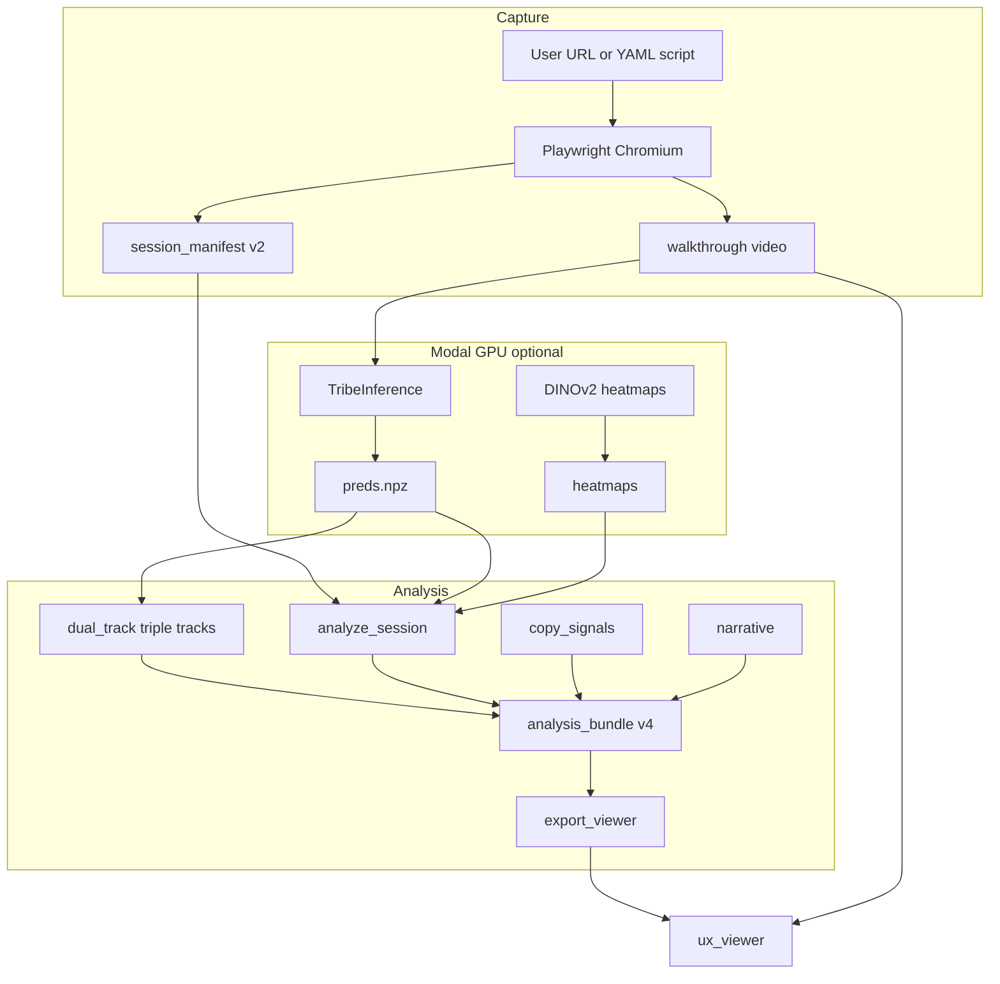

# TribeV2 — Salience

**Salience** is a research and product codebase that turns scripted or autonomous website walkthroughs into **model-assisted UX intelligence**: cortical activation proxies from [Facebook TRIBE v2](https://github.com/facebookresearch/tribev2), spatial UI grounding, section-level reports, copy engagement signals, marketing-oriented scores, and an interactive session viewer.

The repository name **TribeV2** reflects the core brain model; the product direction is **Salience**. Session history and engineering decisions live under [`sessions/`](sessions/INDEX.md) (Ledger Protocol).

---

## Table of contents

1. [What this application is](#what-this-application-is)
2. [What it does for users](#what-it-does-for-users)
3. [Two ways to run it](#two-ways-to-run-it)
4. [End-to-end analysis pipeline](#end-to-end-analysis-pipeline)
5. [Scoring and interpretation layers](#scoring-and-interpretation-layers)
6. [SaaS product architecture](#saas-product-architecture)
7. [Research tracks (archived)](#research-tracks-archived)
8. [Technology stack](#technology-stack)
9. [Data and artifacts](#data-and-artifacts)
10. [Repository layout](#repository-layout)
11. [Getting started](#getting-started)
12. [Documentation index](#documentation-index)
13. [Testing](#testing)
14. [Ethics and limitations](#ethics-and-limitations)

---

## What this application is

Salience connects three ideas:

1. **Browser capture** — Playwright records a walkthrough video and a time-aligned DOM manifest (element geometry, visible text, scroll state) at each repetition time (TR).
2. **Neural proxy** — TRIBE v2 predicts cortical surface activity `preds[T, V]` on **fsaverage5** (~20,484 vertices per TR) from the video.
3. **UX analytics** — Downstream layers parcellate, score engagement/emotion/activation, ground spikes to DOM elements via vision heatmaps, fuse **copy signals** from page text, produce section reports and marketing scores, optionally generate LLM narrative, and export a self-contained viewer.

Outputs are **research prototypes and product hypotheses**, not eye tracking, fMRI ground truth, or clinical diagnostics. Every artifact carries schema versioning and provenance (e.g. placeholder vs Modal heatmaps, synthetic vs empirical norms, `copy_source: heuristic`).

---

## What it does for users

### Product users (SaaS)

Signed-in users submit a **URL** (and optional **site goal**). The system:

- Crawls the site with a **production explore policy** (bounded scroll, role-based locators, same-origin guard).
- Runs the full analysis pipeline in a **worker container**.
- Stores results in **object storage** (Cloudflare R2 in production; MinIO locally).
- Returns a **viewer URL** and scan status in a **Next.js dashboard** (Clerk authentication).

### Researchers and operators (CLI)

Operators run the same analysis spine locally or on Modal via scripts and `services/pipeline/runner.py`:

- Scripted YAML walkthroughs for fixture sites or demos.
- Stage-by-stage control through `scripts/run_website_session.py`.
- Direct inspection with `scripts/inspect_session.py` and the website runbook.

### What each scan produces

| Output | Purpose |
|--------|---------|
| `walkthrough.mp4` / `.webm` | Recorded session video |
| `session_manifest.json` (v2) | Per-TR DOM snapshots, alignment metadata |
| `preds.npz` | TRIBE cortical time series `(T, 20484)` |
| `analysis_bundle.json` (v1–v4) | Parcellation, tracks, events, sections, marketing scores |
| `copy_signals.json` | Per-section clarity, urgency, goal_fit, copy_score |
| `ux_viewer/` | Static HTML viewer synced to video and scores |
| `marketing_narrative` | Template or Gemini-generated prose (optional) |

---

## Two ways to run it

### 1. CLI / research prototype (original spine)

Documented in [`docs/runbooks/website-session.md`](docs/runbooks/website-session.md). Entry point:

```bash
python scripts/run_website_session.py --stage all \
  --script configs/walkthrough_scripts/localhost_demo.yaml \
  --norm-id synthetic_bootstrap_v1 \
  --uniform-heatmap
```

Modal GPU stages (`tribe`, production heatmaps) require a Modal account and HuggingFace secret. See the runbook for baseline recording and alignment checklist.

### 2. SaaS product (Docker local stack or cloud deploy)

Full stack: **Next.js** (Vercel) + **FastAPI** + **Arq worker** (Playwright) + **Redis** + **Postgres** + **R2/MinIO** + **Modal** (GPU only).

Local development from repo root:

```bash
docker compose up --build
cd apps/web && npm install && npm run dev
```

- **API** (`Dockerfile.api`): `POST /v1/scans`, Clerk JWT, SSRF gate, job enqueue.
- **Worker** (`Dockerfile.worker`): runs `services.pipeline.runner.run_scan()` for all eight stages.
- **`FAKE_TRIBE=1`** (default in compose): synthetic zero `preds.npz` and uniform heatmaps — fast smoke tests without Modal GPU. Set `FAKE_TRIBE=0` and provide `MODAL_TOKEN_*` for real TRIBE inference.

Deployment guide: [`tutorials/production-deployment.md`](tutorials/production-deployment.md).

---

## End-to-end analysis pipeline

One TR index `t` ties together `preds[t,:]`, manifest `dom_snapshots[t]`, dual-track scores, heatmaps, copy signals, and the viewer scrubber. Validation lives in `scout_core/session_align.py`.

### Pipeline stages (current)

`services/pipeline/runner.py` and `scripts/run_website_session.py` chain:

| Stage | Role | Primary output |
|-------|------|----------------|
| **capture** | Playwright explore or scripted walkthrough | `session_manifest.json`, video |
| **tribe** | Modal TRIBE inference (or FAKE_TRIBE synthetic) | `preds.npz` |
| **dual_track** | Zero-shot engagement, emotion, activation | merged into bundle |
| **heatmaps** | DINOv2 (Modal) or uniform placeholder | `heatmaps/t_*.npy` |
| **analyze** | Parcellation, thresholds, grounding, sections | `analysis_bundle.json` |
| **copy_signals** | Heuristic copy scoring from DOM text | `copy_signals.json` |
| **narrative** | Template or Gemini session summary | `marketing_narrative` |
| **export_viewer** | Static viewer + R2 upload | `ux_viewer/index.html` |



**Production crawl** uses [`configs/explore_production.yaml`](configs/explore_production.yaml): tighter TR/click budgets, `allow_role_locators: true` (Playwright role/name instead of raw CSS — closes ISSUE-SEC-004), same-origin only.

**Baseline (once):** gray-video reference at `scout_data/baseline/preds_baseline.npz` for engagement Track 1 and activation Track 3 Z-scores.

---

## Scoring and interpretation layers

Interpretation flows bottom-up; LLM prose is last and does not define numeric truth.

```text
Layer 0: TRIBE preds[T,V]
Layer 1: Triple zero-shot tracks (dual_track.py)
Layer 2: Parcellation + thresholds (aggregate, threshold_engine)
Layer 3: Feature isolation — ViT heatmap × DOM → events[]
Layer 4: Copy signals — DOM text heuristics (copy_signals.py)
Layer 5: Section + marketing scores (section_analytics, marketing_scores.py)
Layer 6: LLM narrative (llm_narrative.py — optional)
```

| Track / signal | Key | Meaning |
|----------------|-----|---------|
| **Engagement** | `engagement_track` | VAN − DMN Z vs gray baseline |
| **Emotion** | `emotion_track` | Kragel/LaBar template cosine + session Z |
| **Activation** | `activation_track` | mean(\|preds\|) per TR vs baseline |
| **Copy** | `copy_signals` | clarity, urgency, goal_fit → `copy_score` per section |
| **Marketing** | `marketing_scores` | 0–100 display curve blending neural + novelty + copy |

**Copy signals** (`scout_core/copy_signals.py`): scores visible page text per section (CTA verbs, urgency terms, goal keyword overlap). Fused into marketing scores when `copy_signals.json` is present. `copy_source` is `heuristic` today; LLM-based Tier B is a future extension.

**Grounding:** configurable triggers in `configs/dual_track.yaml` → `find_grounding_triggers` → heatmap + `dom_intersect.py` winner element.

**Parcellation:** Schaefer 2018, 400 parcels, 7 networks on fsaverage5 via [`configs/vertex_regions.csv`](configs/vertex_regions.csv). Provenance in [`configs/parcellation_manifest.yaml`](configs/parcellation_manifest.yaml).

---

## SaaS product architecture

```text
User (Clerk) → Next.js apps/web
                    ↓ POST /v1/scans + JWT
              FastAPI services/api
                    ↓ SSRF validate, Postgres row, Redis enqueue
              Arq worker (Playwright + runner.py)
                    ↓ capture … export_viewer
              Modal (GPU only): predict_brain_npz, frame attention
                    ↓
              R2 / MinIO: scans/{id}/ux_viewer/
                    ↓
              Dashboard polls GET /v1/scans/{id} → viewer_url
```

| Component | Path | Notes |
|-----------|------|-------|
| Pipeline runner | `services/pipeline/runner.py` | Importable `run_scan()`; `on_stage` callbacks |
| Artifacts | `services/pipeline/artifacts.py` | R2 upload, presigned URLs, dev MinIO bucket bootstrap |
| API | `services/api/main.py` | Scans CRUD, rate limit, idempotency |
| SSRF gate | `services/api/ssrf.py` | DNS + private-range block before worker |
| Auth | `services/api/auth.py` | Clerk JWKS JWT validation |
| Jobs | `services/api/jobs.py` | Arq `run_scan_task`; norm bootstrap on worker start |
| Frontend | `apps/web/` | Next.js 14, dashboard, scan progress, embedded viewer |

Durable state: **Postgres** (scan metadata) + **R2** (viewer bundle). Per-job SQLite under `scout_data/` is ephemeral scratch inside the worker.

---

## Research tracks (archived)

These do **not** run in the SaaS worker or default website pipeline. They remain valuable for atlas provenance and future model migration.

### NeuroEmo (`neuroEmoCode/`)

Supervised 5-class emotion on OpenNeuro **NeuroEmo** (ds005700), Schaefer ROI features, experiment matrices, vertex-equivalence proofs. Entry: [`scripts/neuroEmoCode/README.md`](scripts/neuroEmoCode/README.md).

### EEV (`eevCode/`)

Supervised continuous evoked-expression regression on Google's **EEV** dataset using TRIBE network features and Multi-Output SVR. Entry: [`scripts/eevCode/README.md`](scripts/eevCode/README.md).

---

## Technology stack

| Layer | Technologies |
|-------|----------------|
| **Brain model** | TRIBE v2 (`TribeModel.from_pretrained`), LLaMA 3.2 + V-JEPA (upstream) |
| **GPU** | Modal — `tribe.py` (`TribeInference` on A100) |
| **Capture** | Playwright Chromium; explore policy in `scout_core/explore_policy.py` |
| **Vision grounding** | DINOv2 via Modal or uniform placeholder |
| **Neuro** | nilearn, nibabel; fsaverage5 surface mesh |
| **ML / stats** | NumPy, pandas, scikit-learn, scipy, joblib |
| **Schemas** | Pydantic (`scout_core/schemas.py`) |
| **SaaS API** | FastAPI, SQLAlchemy, Alembic, Arq, Redis, boto3 (R2) |
| **SaaS auth** | Clerk (`@clerk/nextjs`, JWT on API) |
| **SaaS UI** | Next.js 14, Tailwind |
| **Containers** | Docker Compose (api, worker, postgres, redis, minio) |
| **CI** | GitHub Actions — unit tests + Docker builds |
| **Tests** | pytest; integration E2E in worker container |

**Python:** 3.11+ in containers; local dev per `requirements.txt`.

---

## Data and artifacts

```text
scout_data/
  activations.sqlite          # Session registry, summaries, peaks (portable paths in Docker)
  baseline/preds_baseline.npz
  sessions/<session_id>/      # Per-scan artifacts (video, preds, bundle, viewer)

scout_norms/<norm_id>/        # ROI/network parquet for Z-scoring

configs/
  vertex_regions.csv          # 20484 vertex → parcel → network
  explore_production.yaml     # SaaS crawl profile
  dual_track.yaml, marketing_scores.yaml, site_sections.yaml
  walkthrough_scripts/*.yaml

services/                     # SaaS pipeline + API
apps/web/                     # Next.js product UI
sessions/                     # Ledger Protocol project memory
```

**Norm bundles:** `scout_norms/synthetic_bootstrap_v1/` is the default for dev; replace with empirical norms before trusting production threshold hits (`meta.json` leakage notes).

**SQLite path portability:** norm paths are stored repo-relative; `resolve_storage_path()` in `scout_core/storage_migrations.py` handles legacy Windows absolute paths in Docker/Linux.

---

## Repository layout

```text
TribeV2/
├── tribe.py                         # Modal app: TRIBE inference, baseline, brain MP4
├── activation_store.py              # NPZ + SQLite persistence
├── scout_core/                      # Shared analysis library
│   ├── dual_track.py, copy_signals.py, marketing_scores.py
│   ├── walkthrough.py, explore_policy.py, session_align.py
│   ├── section_analytics.py, dom_intersect.py, llm_narrative.py
│   └── schemas.py, parcellation.py, …
├── services/
│   ├── pipeline/runner.py           # SaaS + importable full pipeline
│   ├── pipeline/artifacts.py        # R2 / MinIO upload
│   └── api/                         # FastAPI + Arq jobs
├── scripts/                         # CLI stage scripts + orchestrator
├── apps/web/                        # Next.js SaaS frontend
├── configs/                         # YAML, CSV, explore + walkthrough scripts
├── viewer/                          # Static HTML viewer templates
├── scout_data/, scout_norms/        # Runtime artifacts
├── tests/                           # pytest (+ neuroEmoCode archive)
├── docs/                            # Runbooks, architecture plans, atlas setup
├── tutorials/                       # production-deployment.md, env guides
├── sessions/                        # Ledger Protocol (INDEX.md)
├── docker-compose.yml, Dockerfile.*
└── neuroEmoCode/, eevCode/          # Research archives
```

---

## Getting started

### Prerequisites

```bash
pip install -r requirements.txt
playwright install chromium
# Modal CLI + HuggingFace secret for GPU stages
# Docker Desktop for SaaS local stack
```

### CLI demo (fixture site, no GPU)

```bash
python -m http.server 8765 --directory tests/fixtures/walkthrough_site

python scripts/run_website_session.py --stage all \
  --script configs/walkthrough_scripts/localhost_demo.yaml \
  --norm-id synthetic_bootstrap_v1 \
  --uniform-heatmap
```

Open `scout_data/sessions/<id>/ux_viewer/index.html?base=.`

### SaaS local stack

```bash
docker compose up --build
cd apps/web && npm install && npm run dev
```

Configure root `.env` from `.env.example` (Clerk, CORS, R2, Modal). See [`tutorials/production-deployment.md`](tutorials/production-deployment.md).

### Emotion templates (Track 2)

```bash
python scripts/download_emotion_templates.py
```

---

## Documentation index

| Document | Purpose |
|----------|---------|
| [`sessions/INDEX.md`](sessions/INDEX.md) | Ledger Protocol — all engineering sessions |
| [`docs/runbooks/website-session.md`](docs/runbooks/website-session.md) | CLI operator runbook |
| [`tutorials/production-deployment.md`](tutorials/production-deployment.md) | SaaS deploy (Vercel, Railway, Modal, R2, Clerk) |
| [`docs/implementation-plans/salience-architecture-plan.md`](docs/implementation-plans/salience-architecture-plan.md) | Full system architecture |
| [`services/pipeline/ASSETS_REQUIRED.md`](services/pipeline/ASSETS_REQUIRED.md) | Required assets for pipeline runs |
| [`scripts/neuroEmoCode/README.md`](scripts/neuroEmoCode/README.md) | Archived NeuroEmo training |
| [`scripts/eevCode/README.md`](scripts/eevCode/README.md) | Archived EEV regression track |

---

## Testing

| Suite | Command | Notes |
|-------|---------|-------|
| Unit (CI default) | `pytest tests/ -m "not integration"` | Excludes Playwright E2E |
| SSRF / API security | `pytest tests/test_ssrf.py tests/test_api_security.py tests/test_capture_script.py` | URL worker hardening |
| Integration E2E | `pytest tests/test_pipeline_e2e.py -m integration` | Full 8-stage pipeline; run in worker container |
| NeuroEmo archive | `pytest tests/neuroEmoCode/ -v` | Optional; excluded from default CI |

Default `pytest tests/` excludes `tests/neuroEmoCode/` via `tests/conftest.py`.

---

## Ethics and limitations

- Outputs are **model-assisted hypotheses** for product iteration, not literal emotion measurement or clinical use.
- **Marketing scores** (0–100) are session-relative display curves — do not conflate with scientific Z-scores in `engagement_track`.
- **Copy signals** are heuristic; they complement but do not replace neural proxies.
- **FAKE_TRIBE** mode uses synthetic brain outputs — suitable for dev/CI only.
- Replace **synthetic norms** before production threshold claims.
- Heatmaps may be **uniform placeholders** in CI; check `heatmap_provenance.placeholder` in `events[]`.
- TRIBE predicts **cortical surface** vertices; optional **subcortical head** writes `preds_subcortical.npz` (8802 voxels, Harvard-Oxford).
- Track 2 default remains **Kragel template** mode; **Horikawa ridge decoder** (`emotion.mode: decoder`) requires trained bundle in `scout_models/` and UX validation (see `docs/validation/ux-affect-study-protocol.md`).
- Demographic comparison and cluster multiplex features require minimum cluster sizes and suppression rules before any production claims (see architecture plan).

---

## License and upstream

TRIBE v2 weights and code are subject to [facebookresearch/tribev2](https://github.com/facebookresearch/tribev2) licensing. NeuroEmo dataset usage follows OpenNeuro ds005700 terms. Kragel emotion templates are fetched per `scripts/download_emotion_templates.py`.

For session artifact debugging: `python scripts/inspect_session.py --session-id <id>` and the alignment checklist in the website runbook.
