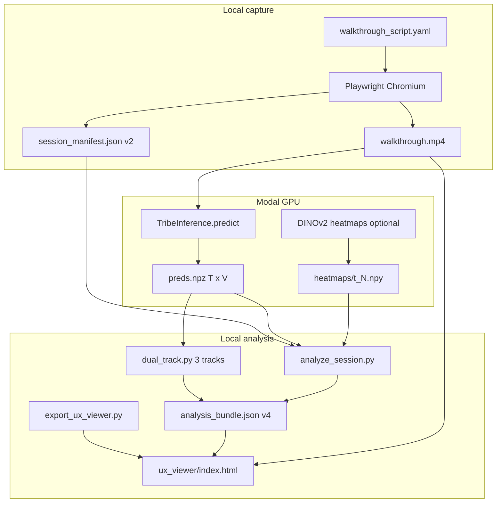

# TribeV2 — Neural-UX Scout

**Neural-UX Scout** is a research prototype that connects **scripted website walkthroughs**, **Facebook TRIBE v2** cortical surface predictions, and **marketing-oriented UX analytics**. A recorded browsing session becomes a time-aligned bundle of neural proxies (engagement, emotion, activation), spatial UI grounding (ViT attention × DOM geometry), section-level reports, and an interactive session viewer.

The repository name **TribeV2** reflects the core model ([facebook/tribev2](https://github.com/facebookresearch/tribev2)); the product direction is documented as **Neural-UX Scout** in [`docs/implementation-plans/neural-ux-scout-architecture-plan.md`](docs/implementation-plans/neural-ux-scout-architecture-plan.md).

---

## Table of contents

1. [What this application does](#what-this-application-does)
2. [Intended users](#intended-users)
3. [How it works](#how-it-works)
4. [Two tracks: mainline vs research](#two-tracks-mainline-vs-research)
5. [Technology stack](#technology-stack)
6. [Data architecture](#data-architecture)
7. [Neural interpretation layers](#neural-interpretation-layers)
8. [Repository layout](#repository-layout)
9. [Quick start](#quick-start)
10. [Documentation index](#documentation-index)
11. [Testing](#testing)
12. [Roadmap and current status](#roadmap-and-current-status)
13. [Ethics and limitations](#ethics-and-limitations)

---

## What this application does

Neural-UX Scout answers a practical question for UX and growth teams:

> *When someone watches a walkthrough of our site, where does modeled cortical activity diverge from baseline, which page sections drive that signal, and which DOM elements best explain spikes on screen?*

Concretely, the **website session pipeline** (mainline):

1. **Captures** a scripted Playwright session: MP4/WebM video + `session_manifest.json` (DOM snapshots interleaved with walkthrough steps, TR-aligned timestamps).
2. **Runs TRIBE v2** on Modal (GPU): video → cortical time series `preds[T, V]` on **fsaverage5** (~20,484 surface vertices per TR).
3. **Scores** three parallel **zero-shot** tracks on `preds.npz` (engagement, Kragel emotion templates, mean activation).
4. **Extracts** sparse per-TR ViT (DINOv2) heatmaps and **grounds** neural spikes to DOM elements via attention density.
5. **Analyzes** sections (hero, pricing, etc.), threshold rules, marketing 0–100 curves, and optional LLM narrative.
6. **Exports** a self-contained UX viewer (`ux_viewer/index.html`) synced to walkthrough video and score curves.

TRIBE output is **not** eye tracking or fMRI ground truth. All downstream layers are **model-assisted hypotheses** for product iteration, with explicit schema versioning and provenance fields (e.g. placeholder vs Modal heatmaps).

---

## Intended users

| Audience | How they use the repo |
|----------|------------------------|
| **UX / product / growth** | Run walkthrough scripts, read `section_report` and `marketing_scores`, open the UX viewer for stakeholder demos. |
| **ML / neuroimaging engineers** | Extend `scout_core`, Modal jobs in `tribe.py`, parcellation, dual-track math, or archived NeuroEmo training under `neuroEmoCode/`. |
| **Pipeline operators** | Follow [`docs/runbooks/website-session.md`](docs/runbooks/website-session.md) or `scripts/run_website_session.py` stage-by-stage. |
| **Researchers (future)** | Demographic multiplex inference, MVPA classifiers, cluster training — planned in architecture docs, not required for the current website spine. |

---

## How it works

### End-to-end flow (mainline)



**Alignment principle:** One **repetition time (TR)** index `t` ties together `preds[t, :]`, manifest `dom_snapshots[t]`, dual-track scores, heatmaps, and viewer scrubber. Validation lives in `scout_core/session_align.py` (`exact` / `tolerated` / `clamped` / `invalid`).

### Orchestrator stages

`scripts/run_website_session.py` chains:

| Stage | Command surface | Primary output |
|-------|-----------------|----------------|
| `capture` | `record_website_session.py` + YAML script | Session folder under `scout_data/sessions/<id>/` |
| `tribe` | `modal run tribe.py::record_session` | `preds.npz` |
| `dual_track` | `run_dual_track.py` | Merged into `analysis_bundle.json` |
| `heatmaps` | `extract_section_heatmaps.py` | `heatmaps/*.npy` + manifest |
| `analyze` | `analyze_session.py --website --ground` | Full bundle + `events[]` grounding |
| `narrative` | `generate_session_narrative.py` | `marketing_narrative` in bundle |
| `export_viewer` | `export_ux_viewer.py` | `ux_viewer/` |
| `all` | Above in sequence | Complete demo folder |

**Baseline (once):** `modal run tribe.py::record_baseline` from `gray background.mp4` → `scout_data/baseline/preds_baseline.npz` for Track 1 (VAN−DMN) and Track 3 (activation Z vs gray).

---

## Two tracks: mainline vs research

### Mainline — website zero-shot pipeline

Production path for Neural-UX Scout. Documented in [`docs/runbooks/website-session.md`](docs/runbooks/website-session.md). Uses:

- Kragel/LaBar **cosine template** emotion (Track 2), not supervised classifiers.
- Schaefer 400 @ fsaverage5 parcellation via [`configs/vertex_regions.csv`](configs/vertex_regions.csv) for **engagement** networks only.
- Feature isolation (ViT + DOM), section analytics, marketing scores.

**Strategic priority (May 2026):** prove this spine end-to-end on real Modal runs before expanding parallel R&D ([`.cursor/plans/two-week-descope_d421477d.plan.md`](.cursor/plans/two-week-descope_d421477d.plan.md), [`coding-sessions/2026-05-28-website-pipeline-consolidated-session.md`](coding-sessions/2026-05-28-website-pipeline-consolidated-session.md)).

### Research archive — NeuroEmo (`neuroEmoCode/`)

Supervised **5-class emotion** models trained on OpenNeuro **NeuroEmo** (ds005700) film-watching fMRI, Schaefer ROI features, experiment matrices, vertex-equivalence proofs.

- **Not** invoked by `run_website_session.py` or `analyze_session.py --website`.
- Entry points: [`scripts/neuroEmoCode/README.md`](scripts/neuroEmoCode/README.md).
- Data: `scout_data/neuroEmoCode/` (when present locally).
- Valuable for atlas provenance and future Track 2 ML migration; frozen during website sprint.

### Research archive — EEV (`eevCode/`)

Supervised **continuous evoked-expression** regression on Google's **EEV** dataset, using TRIBE v2 network features and Multi-Output SVR.

- **Not** invoked by `run_website_session.py`, `run_dual_track.py`, or the UX viewer.
- Parallel to NeuroEmo — does not replace Kragel production emotion scoring.
- Entry points: [`scripts/eevCode/README.md`](scripts/eevCode/README.md).
- Data: `scout_data/eevCode/` (CSV, videos, cached feature NPZs, models).

---

## Technology stack

| Layer | Technologies |
|-------|----------------|
| **Brain model** | [TRIBE v2](https://github.com/facebookresearch/tribev2) (`TribeModel.from_pretrained`), LLaMA 3.2 + V-JEPA encoders (inside upstream package) |
| **GPU hosting** | [Modal](https://modal.com) — `tribe.py` (`TribeInference` on A100, persistent `tribe-weights-vol`) |
| **Browser capture** | Playwright (Chromium), scripted YAML walkthroughs |
| **Vision grounding** | DINOv2 via Modal (`heatmap_extract.py`) or uniform placeholder for CI |
| **Neuro tooling** | nilearn, nibabel; surface mesh **fsaverage5** |
| **ML / stats** | NumPy, pandas, scikit-learn, joblib |
| **Schemas** | Pydantic (`scout_core/schemas.py`) |
| **Config** | YAML + CSV parcellation tables |
| **Persistence** | NPZ arrays, JSON bundles, Parquet norms, SQLite summaries |
| **Viewers** | Static HTML (`viewer/ux_session_viewer.html`, `viewer/brain_viewer.html`) |
| **Tests** | pytest (main suite under `tests/`; NeuroEmo under `tests/neuroEmoCode/`) |

**Python:** 3.12 on Modal; local dev per `requirements.txt` (Modal CLI, Playwright, nilearn, etc.).

---

## Data architecture

### Storage layout

```text
scout_data/
  activations.sqlite          # Session registry + per-TR summaries + top-K peaks
  baseline/
    preds_baseline.npz         # Gray-video reference (41 TRs in dev)
    baseline_manifest.json
  sessions/<session_id>/
    walkthrough.mp4 | .webm
    session_manifest.json     # schema v2
    walkthrough_script.yaml     # copy of capture script
    preds.npz                   # preds[T, V], V ≈ 20484
    analysis_bundle.json        # schema v1–v4 (see below)
    heatmaps/
      t_<N>.npy
      heatmaps_manifest.json
    ux_viewer/                  # exported static viewer
  atlases/                      # CBIG Schaefer .annot (when downloaded)
  neuroEmoCode/                 # Research artifacts (optional)

scout_norms/
  <norm_id>/
    roi_norms.parquet
    network_norms.parquet
    meta.json                   # e.g. synthetic_bootstrap_v1

configs/
  vertex_regions.csv            # 20484 rows: vertex → parcel → Yeo-7 network
  parcellation_manifest.yaml    # Atlas provenance + SHA256 fingerprints
  dual_track.yaml               # VAN/DMN, emotion templates, baseline path
  marketing_scores.yaml         # 0–100 display rubric weights
  site_sections.yaml            # Section assignment rules
  walkthrough_scripts/*.yaml
  emotion_templates/*.npy       # Kragel maps (after download script)
```

### Cortical prediction tensor

| Field | Shape / type | Meaning |
|-------|----------------|---------|
| `preds` | `(T, V)` float32 | TRIBE cortical activation per TR; `V = 20484` on fsaverage5 |
| TR duration | ~1 s default | From manifest `tr_mapping.tr_duration_sec` |
| Mesh | `fsaverage5` | Left then right hemisphere vertex order (`lh_then_rh`) |

Full arrays stay in **NPZ**; SQLite stores **aggregates** and **top-K peaks** per timestep for fast queries (`activation_store.py`).

### `session_manifest.json` (v2)

Written during Playwright capture (`scout_core/walkthrough.py`):

- `video.path`, capture viewport, FPS / TR mapping
- `dom_snapshots[]`: per-TR URL, scroll, element bboxes (`dom_id`, `tag`, `bbox`)
- `alignment` / `preds_validation` blocks after TRIBE run
- Walkthrough `steps[]` schedule (click, scroll, wait) interleaved with snapshots

### `analysis_bundle.json` (evolving schema)

Defined in `scout_core/schemas.py`:

| `schema_version` | Adds |
|------------------|------|
| **1** | Parcellation, `threshold_hits`, norm_id, network/parcel IDs |
| **2** | `events[]` — neural spike grounding (`GroundingEvent`) |
| **3** | `session_capture`, `section_report[]`, `marketing_narrative` |
| **4** | `marketing_scores` — 0–100 display curve + five rubric metrics |

Dual-track blocks (merged by `run_dual_track.py`, `dual_track_schema_version: 3`):

- `engagement_track` — Z(VAN) − Z(DMN) vs gray baseline
- `emotion_track` — Kragel template cosine + session Z per channel
- `activation_track` — mean(|preds|) per TR + baseline/session Z

### Parcellation and atlas provenance

Canonical mapping: **Schaefer 2018, 400 parcels, 7 networks**, native **fsaverage5** surface labels (CBIG `.annot`), exported to [`configs/vertex_regions.csv`](configs/vertex_regions.csv).

[`configs/parcellation_manifest.yaml`](configs/parcellation_manifest.yaml) records:

- Vertex order proof vs TRIBE (`scout_data/neuroEmoCode/vertex_equivalence_report.json`)
- Annot alignment report, mesh fingerprints, artifact SHA256s
- Engagement networks matched by **prefix** (`SalVentAttn`, `Default`) on subnetwork column names

### Norm bundles

`scout_norms/<norm_id>/` holds empirical or **synthetic bootstrap** ROI/network statistics for Z-scoring in `analyze_session.py`. Production use requires replacing synthetic norms with held-out naturalistic clips (`meta.json` `leakage_note`).

### SQLite (`scout_data/activations.sqlite`)

Tables include `sessions`, `timestep_summary`, `activation_peak`, lookup bands for qualitative labels, plus extended neuro schema via `scout_core/storage_migrations.py` (ROI/network timeseries, dual-track traces when populated).

---

## Neural interpretation layers

Interpretation is deliberately **layered** — analytics truth flows bottom-up; LLM prose is last.

```text
Layer 0: TRIBE preds[T,V]           (physics of the demo model)
Layer 1: Triple zero-shot tracks    (dual_track.py)
Layer 2: Parcellation + thresholds  (aggregate.py, threshold_engine.py)
Layer 3: Feature isolation          (heatmap × DOM → events[])
Layer 4: Section + marketing        (section_analytics, marketing_scores.py)
Layer 5: LLM narrative              (llm_narrative.py — template or OpenAI)
```

| Track | Key | Scientific / product meaning |
|-------|-----|------------------------------|
| **1 Engagement** | `engagement_track.scores` | Salience/Ventral Attention minus Default Mode; Z vs **gray baseline** |
| **2 Emotion** | `emotion_track` | Whole-brain cosine to Kragel/LaBar templates; **session-relative Z** for triggers |
| **3 Activation** | `activation_track` | mean(\|preds\|) per TR; marketer “attention magnitude” proxy (ViralAnalyser-style) |
| **Marketing** | `marketing_scores` | Min–max **0–100** compound of engagement Z + preds novelty — **display only** |

Grounding triggers (configurable in `configs/dual_track.yaml`): engagement Z > 2.0, emotion session Z > 1.0 → `find_grounding_triggers` → heatmap + `dom_intersect.py` winner element.

---

## Repository layout

```text
TribeV2/
├── tribe.py                    # Modal app: inference, baseline, brain MP4, vertex verify
├── activation_store.py           # NPZ + SQLite persistence API
├── requirements.txt
├── scout_core/                   # Shared library (imported locally + on Modal)
│   ├── dual_track.py             # Triple-track zero-shot scoring
│   ├── walkthrough.py            # Manifest v2 + Playwright helpers
│   ├── session_align.py          # preds ↔ manifest validation
│   ├── section_analytics.py      # URL/landmark → section assignment
│   ├── section_pipeline.py       # Section report orchestration
│   ├── dom_intersect.py          # Attention density × DOM bboxes
│   ├── heatmap_extract.py        # Modal DINOv2 / placeholder heatmaps
│   ├── feature_engine.py         # CLS → patch grid upscale
│   ├── marketing_scores.py       # 0–100 rubric layer
│   ├── parcellation.py           # Vertex table loader + validation
│   ├── schemas.py                # Pydantic bundle models
│   ├── vertex_equivalence.py     # TRIBE ↔ nilearn mesh proof helpers
│   └── neuroEmoCode/             # Archived ROI feature + Schaefer builders
├── scripts/
│   ├── record_website_session.py
│   ├── run_website_session.py    # Stage orchestrator
│   ├── run_dual_track.py
│   ├── analyze_session.py
│   ├── extract_section_heatmaps.py
│   ├── export_ux_viewer.py
│   ├── generate_session_narrative.py
│   └── neuroEmoCode/             # Training / matrix scripts (research)
├── configs/                      # YAML, CSV, walkthrough scripts, templates
├── viewer/                       # Static HTML viewers
├── scout_data/                   # Runtime artifacts (gitignored in part)
├── scout_norms/                  # Z-score reference tables
├── tests/                        # pytest (website pipeline)
├── docs/
│   ├── runbooks/website-session.md
│   ├── implementation-plans/     # Architecture, phased delivery, feature plans
│   ├── atlas-setup/
│   └── neuroEmoCode/
├── coding-sessions/              # Human session handoffs (changelog style)
├── .cursor/plans/                # Cursor agent plans (merge substantive edits to docs/)
└── archive/                      # Deprecated notes (e.g. SVM pipeline)
```

---

## Quick start

### Prerequisites

```bash
pip install -r requirements.txt
playwright install chromium
# Modal CLI + HuggingFace secret "huggingface-secret" for GPU stages
# Optional: ffmpeg on PATH for frame extraction
```

### Minimal local demo (fixture site, placeholder heatmaps)

```bash
# Terminal 1 — serve walkthrough fixture
python -m http.server 8765 --directory tests/fixtures/walkthrough_site

# Terminal 2 — full pipeline (capture → … → viewer)
python scripts/run_website_session.py --stage all \
  --script configs/walkthrough_scripts/localhost_demo.yaml \
  --norm-id synthetic_bootstrap_v1 \
  --uniform-heatmap
```

After capture, note `session_id` from console output. For production heatmaps and TRIBE preds, run Modal stages per [`docs/runbooks/website-session.md`](docs/runbooks/website-session.md):

```bash
modal run tribe.py::record_baseline
modal run tribe.py::record_session --session-id <session_id>
python scripts/extract_section_heatmaps.py --session-id <session_id> --modal --refresh-sections
```

Open viewer: `scout_data/sessions/<id>/ux_viewer/index.html?base=.`

### Emotion templates (Track 2)

```bash
python scripts/download_emotion_templates.py
```

### Unit tests

```bash
python -m pytest tests/ -v --tb=short
# NeuroEmo archive (optional):
python -m pytest tests/neuroEmoCode/ -v --tb=short
```

---

## Documentation index

| Document | Purpose |
|----------|---------|
| [`docs/runbooks/website-session.md`](docs/runbooks/website-session.md) | Operator runbook — commands, artifacts, alignment checklist |
| [`docs/implementation-plans/neural-ux-scout-architecture-plan.md`](docs/implementation-plans/neural-ux-scout-architecture-plan.md) | Full system architecture (multiplex, MVPA, barriers, training) |
| [`docs/implementation-plans/neural-ux-scout-phased-delivery-plan.md`](docs/implementation-plans/neural-ux-scout-phased-delivery-plan.md) | Phased checkpoints P0–P5, R0 spike |
| [`docs/implementation-plans/feature_isolation.md`](docs/implementation-plans/feature_isolation.md) | ViT + DOM spatial credit assignment |
| [`docs/implementation-plans/ux-emotion-proxy-classification-plan.md`](docs/implementation-plans/ux-emotion-proxy-classification-plan.md) | Emotion proxy / classification direction |
| [`docs/atlas-setup/cbig-schaefer2018-fsaverage5.md`](docs/atlas-setup/cbig-schaefer2018-fsaverage5.md) | Schaefer atlas setup |
| [`coding-sessions/README.md`](coding-sessions/README.md) | Session-by-session engineering handoffs |
| [`.cursor/plans/two-week-descope_d421477d.plan.md`](.cursor/plans/two-week-descope_d421477d.plan.md) | Current sprint scope (website mainline) |
| [`scripts/neuroEmoCode/README.md`](scripts/neuroEmoCode/README.md) | Archived supervised training path |

**Coding session highlights:**

- [2026-05-21 — Feature isolation & website pipeline](coding-sessions/2026-05-21-feature-isolation-playwright-website-pipeline.md)
- [2026-05-25 — Playwright hardening](coding-sessions/2026-05-25-playwright-pipeline-hardening-and-subagent.md)
- [2026-05-28 — Consolidated handoff (triple-track, marketing scores, NeuroEmo archive)](coding-sessions/2026-05-28-website-pipeline-consolidated-session.md)

---

## Testing

| Area | Location |
|------|----------|
| Website capture & alignment | `tests/test_record_website_session.py`, `test_section_analytics.py` |
| Grounding & heatmaps | `tests/test_feature_isolation.py`, `test_heatmap_provenance.py`, `test_analyze_session_spikes.py` |
| Dual-track / marketing | `tests/test_scout_core.py`, `test_marketing_scores.py` |
| Parcellation | `tests/neuroEmoCode/test_build_schaefer_surface_annot.py` (atlas builders) |

Default `pytest tests/` **excludes** `tests/neuroEmoCode/` via `tests/conftest.py` so website CI stays fast.

---

## Roadmap and current status

### Shipped (website mainline)

- [x] Playwright capture + manifest v2 (timeline-correct DOM interleaving)
- [x] Modal TRIBE `record_session` + `preds.npz` alignment validation
- [x] Zero-shot triple-track + gray baseline
- [x] Feature isolation + section report + marketing scores (schema v4)
- [x] UX viewer export + template LLM narrative
- [x] Schaefer 400 surface atlas + vertex equivalence proof (shared with Track 1)

### In progress / planned (architecture plan)

- [ ] Demographic **cluster multiplex** inference (`K` prototypes, micro-batching) — [`demographic-multiplexer-implementation-plan.md`](docs/implementation-plans/demographic-multiplexer-implementation-plan.md)
- [ ] Browser **streaming brain viewer** (Three.js / vtk.js + WS timeline)
- [ ] **Neural barrier** detector (cluster divergence × DOM grounding)
- [ ] Modal **train_clusters.py** on TRIBE v2 dataset (~1,115 h)
- [ ] Optional volumetric / subcortex extension (Phase F)
- [ ] MVPA sklearn probability traces — [`surface-parcellation-mvpa-inference-plan.md`](docs/implementation-plans/surface-parcellation-mvpa-inference-plan.md)

Phased gates: [`neural-ux-scout-phased-delivery-plan.md`](docs/implementation-plans/neural-ux-scout-phased-delivery-plan.md).

---

## Ethics and limitations

- Outputs are **research prototypes**, not clinical diagnostics or literal emotion measurement.
- **Marketing scores** (0–100) are session-relative display curves — do not conflate with `engagement_track` scientific Z-scores.
- Demographic comparison UI requires **minimum cluster sizes** and suppression rules before production (see architecture plan § ethics).
- Heatmaps may be **uniform placeholders** in CI; check `heatmap_provenance.placeholder` in `events[]`.
- Replace **synthetic norms** before trusting threshold hits in production.
- TRIBE predicts **cortical surface** vertices only; subcortical emotion structures are not in the public checkpoint output.

---

## License and upstream

TRIBE v2 weights and code are subject to [facebookresearch/tribev2](https://github.com/facebookresearch/tribev2) licensing. NeuroEmo dataset usage follows OpenNeuro ds005700 terms. Kragel emotion templates are fetched from NeuroVault per `scripts/download_emotion_templates.py`.

For questions about a specific session’s artifacts, start with `python scripts/inspect_session.py --session-id <id>` and the alignment checklist in the website runbook.
