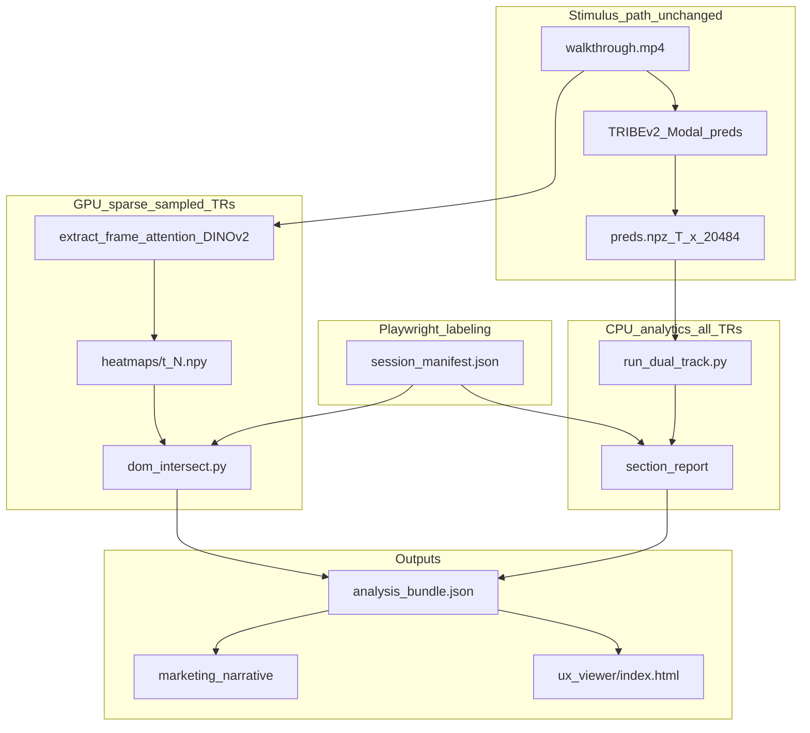
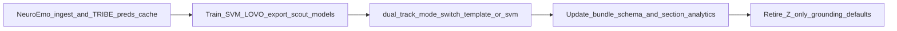

# Coding Session — May 21, 2026

## Feature Isolation, Playwright DOM Capture, Section Analytics & Website Session Pipeline

**Audience:** Project team members who need to understand what changed without reading every diff.  
**Scope:** All work landed in this session around Neural-UX Scout: emotion Z-scoring, spatial credit assignment (feature isolation), Playwright integration, marketing section reports, orchestrated website capture, UX viewer, and LLM narrative layer.

**Do not edit the planning artifact:** The implementation plan lives at `.cursor/plans/website_session_pipeline_*.plan.md` — this document is the human-readable changelog and architecture guide.

---

## Table of contents

1. [Why we made these changes](#1-why-we-made-these-changes)
2. [Big picture: two pipelines](#2-big-picture-two-pipelines)
3. [Session artifact layout](#3-session-artifact-layout)
4. [Track 2: session-relative emotion Z-scoring](#4-track-2-session-relative-emotion-z-scoring)
5. [Feature isolation (ViT heatmaps + DOM intersection)](#5-feature-isolation-vit-heatmaps--dom-intersection)
6. [Playwright: what it does and what it does not do](#6-playwright-what-it-does-and-what-it-does-not-do)
7. [Section-level marketing analytics](#7-section-level-marketing-analytics)
8. [Website session orchestration (new)](#8-website-session-orchestration-new)
9. [UX session viewer](#9-ux-session-viewer)
10. [LLM narrative layer](#10-llm-narrative-layer)
11. [Configuration reference](#11-configuration-reference)
12. [Schema versions (`analysis_bundle.json` & `session_manifest.json`)](#12-schema-versions)
13. [Command cheat sheet](#13-command-cheat-sheet)
14. [New and modified files (inventory)](#14-new-and-modified-files-inventory)
15. [Tests](#15-tests)
16. [Known limitations and next steps](#16-known-limitations-and-next-steps)
17. [Future plans — Track 2 ML migration (NeuroEmo + nilearn + SVM)](#17-future-plans--track-2-ml-migration-neuroemo--nilearn--svm)
18. [Migration checklist — what to change in *this* codebase](#18-migration-checklist--what-to-change-in-this-codebase)

---

## 1. Why we made these changes

### Problem A — “Domain shift” on emotion scores

TRIBEv2 whole-brain **cosine similarity** against Kragel/LaBar emotion templates often produces small absolute values (e.g. ~0.05). Using fixed thresholds like “anger > 0.70” does not generalize across videos and sites.

**Fix:** **Session-relative Z-scoring** per emotion channel over the full session, then trigger grounding and UI flags when **Z > 2** (configurable).

### Problem B — “When” without “what on screen”

Dual-track tells you *when* engagement or emotion spiked at TR index `t`, but not *which UI element* the viewer was likely attending to.

**Fix:** **Feature isolation** — on flagged timesteps, run DINOv2 **single-frame** attention, upscale to capture resolution, intersect with **Playwright DOM bounding boxes**, pick the element with highest **attention density**.

### Problem C — Frame-by-frame video analysis is weak for marketing

Business users care about **page sections** (hero, pricing, checkout), not arbitrary 1 Hz frames.

**Fix:** **Section analytics** — assign every TR to a section (URL + landmarks + manual YAML overrides), aggregate emotion Z and engagement over dwell time, sample a few TRs per section for heatmaps, emit rule-based recommendations.

### Problem D — Capture was fragmented

Video, DOM manifest, and TRIBE preds were recorded separately; alignment was manual.

**Fix:** **`record_website_session.py`** records **walkthrough video + `session_manifest.json` in one Playwright run**, driven by a **scripted YAML** walkthrough. **`run_website_session.py`** chains all stages.

**Critical design choice (unchanged):** **Video remains the stimulus to TRIBEv2.** Playwright does not replace pixels; it labels sections and elements for attribution.

---

## 2. Big picture: two pipelines



| Pipeline | Input | Output | Cost |
|----------|--------|--------|------|
| **A — Brain** | MP4 walkthrough | `preds.npz` | Modal GPU (full video) |
| **B — Credit** | Same MP4 frames + DOM manifest | `heatmaps/`, `top_elements`, `events[]` | Modal GPU (few frames only) |

Pipeline B **never** classifies emotion from HTML alone. Numbers come from Pipeline A; Playwright only maps signals to DOM geometry.

---

## 3. Session artifact layout

After a full website session, expect this under `scout_data/sessions/<session_id>/`:

| File / directory | Purpose |
|------------------|---------|
| `walkthrough.mp4` or `walkthrough.webm` | Stimulus for TRIBEv2; frame source for ViT |
| `session_manifest.json` | Schema v2: DOM snapshots per `t_idx`, capture size, video path, `tr_mapping` |
| `walkthrough_script.yaml` | Copy of scripted walkthrough used at capture |
| `preds.npz` | `preds[T, 20484]` cortical time series |
| `preds_baseline.npz` | Optional; 60s reading baseline for engagement Z (Track 1) |
| `analysis_bundle.json` | Parcellation, dual-track, `section_report`, `events`, `marketing_narrative` |
| `heatmaps/t_<N>.npy` | Float32 `(H, W)` attention maps at Playwright capture resolution |
| `frames/t_<N>.jpg` | Cached ffmpeg extracts for Modal / viewer |
| `ux_viewer/` | Exported `index.html`, `viewer_bundle.json`, PNG heatmap previews |

### Alignment invariants (team must preserve these)

1. **Viewport:** `session_manifest.capture.width/height` = Playwright context = heatmap upscale size (default 1920×1080; localhost demo uses 1280×720).
2. **Timestep:** `t_idx` *n* ↔ video time *n × tr_duration_sec* (default **1 TR per second**). ffmpeg `-ss` and manifest `pts_sec` use the same mapping.
3. **Scroll path:** The YAML script drives scrolling during capture; do not record manifest on a different path than the video.

Validation helper: `scout_core/session_align.py` → `validate_session_dir()` (also written into manifest `alignment.preds_validation` after `tribe.py::record_session`).

---

## 4. Track 2: session-relative emotion Z-scoring

### Math

For each of 7 emotion channels, over all timesteps in the session:

- \(\mu\) = session mean of raw cosine scores  
- \(\sigma\) = session standard deviation  
- \(Z_t = (X_t - \mu) / (\sigma + 10^{-8})\)  
- If \(\sigma < 10^{-7}\) (flat channel), Z is forced to **0** to avoid numerical garbage.

**Dominant emotion at time `t`:** channel with highest **Z** at that timestep (not highest raw cosine).

### Code

| Component | Path |
|-----------|------|
| Core logic | `scout_core/dual_track.py` — `apply_session_z_scores()`, `compute_emotion_track()`, `find_grounding_triggers()`, `dominant_emotion_at_timestep()` |
| CLI | `scripts/run_dual_track.py` |
| Config | `configs/dual_track.yaml` — `emotion.grounding_z_trigger: 2.0` |
| Isolation triggers | `configs/isolation_thresholds.yaml` — `kragel_anger_z_min: 2.0` (replaces deprecated absolute `kragel_anger_min`) |

### `analysis_bundle.json` emotion shape (conceptual)

```json
{
  "emotion_track": {
    "z_scoring": "session_relative",
    "grounding_z_threshold": 2.0,
    "cosine_scores": [[...7 channels per TR...]],
    "z_scores": [[...7 channels per TR...]],
    "session_stats": { "anger": {"mean": 0.04, "std": 0.01}, ... }
  },
  "grounding_triggers": [
    { "t_idx": 12, "trigger_type": "emotion", "channel": "anger", "z_score": 2.4, "raw_cosine": 0.062 }
  ]
}
```

### Track 1 (engagement) — unchanged conceptually

Still VAN/DMN Z-score vs a **baseline** `preds_baseline.npz` (60s reading). Grounding can fire on `engagement_score > 2.0` from `configs/isolation_thresholds.yaml`.

---

## 5. Feature isolation (ViT heatmaps + DOM intersection)

**Spec doc:** `docs/implementation-plans/feature_isolation.md`

### Trigger → Extract → Intersect

1. **Trigger:** After `run_dual_track.py`, read engagement + emotion Z traces. Select spike timesteps `t_spike` (OR logic by default, cooldown, max spikes per session).
2. **Extract:** Decode **one** video frame per spike. Call Modal `TribeInference.extract_frame_attention(frame_bytes, capture_h, capture_w)` in `tribe.py`:
   - Lazy-loads `facebook/dinov2-large` with `output_attentions=True`
   - Takes final-block **[CLS] → patch** attention, mean over heads, reshape grid, bilinear upscale to e.g. 1920×1080
   - Returns `.npy` bytes
3. **Intersect:** `scout_core/dom_intersect.py` scores each DOM element bbox by mean heatmap density; **argmax** wins.

### Modal methods (`tribe.py`)

| Method | Role |
|--------|------|
| `extract_frame_attention` | Heatmap only; cache as `heatmaps/t_<N>.npy` |
| `ground_spike_at_t` | One-shot heatmap + DOM winner on Modal (optional) |

Local analysis prefers **cached** heatmaps + `dom_intersect` in `scripts/analyze_session.py --ground`.

### DOM coordinate convention

Bounding boxes in `session_manifest.json` are in **document coordinates** (page space). The heatmap is in **viewport/image space**. Intersection subtracts `scrollX` / `scrollY` from the snapshot before sampling the heatmap.

### `events[]` in bundle (schema v2+)

Each grounding event:

```json
{
  "type": "neural_spike_grounding",
  "t_spike": 12,
  "triggers": { "engagement_score": 2.1, "kragel_anger_z": 2.3 },
  "grounding": {
    "dom_id": "#pricing",
    "tag": "SECTION",
    "bbox": [0, 800, 1280, 400],
    "attention_density": 0.0412
  }
}
```

If heatmap or manifest is missing, `grounding` is null and `grounding_skip_reason` explains why.

### Sparse heatmaps for sections (not only spikes)

`scripts/extract_section_heatmaps.py`:

- Samples timesteps from `section_report[].sample_t_indices` (first / peak / last per section, capped globally).
- ffmpeg extracts JPG → `--modal` calls DINOv2 → saves `heatmaps/t_<N>.npy`
- `--uniform-heatmap` for offline dev without GPU
- `--refresh-sections` re-runs `run_section_analytics(..., attach_heatmaps=True)` to fill `top_elements`

Wrapper: `scout_core/heatmap_extract.py`

---

## 6. Playwright: what it does and what it does not do

### What Playwright provides

- **DOM snapshots** at each TR: URL, scroll position, list of elements with `dom_id`, `tag`, `role`, `bbox`, viewport intersection flag.
- **Synchronized walkthrough video** when using the orchestrated recorder (Chromium `record_video_dir`).
- **Repeatable scripted UX paths** via YAML (scroll, click, wait).

### What Playwright does **not** provide

- It does **not** feed TRIBEv2 instead of video (no “HTML-only brain”).
- It does **not** capture full computed styles / animation timelines in MVP (layout is visible in the **video**; DOM is structural attribution).
- It is **not** eye-tracking or clinical ground truth — copy should say “model-relative hypothesis.”

### Two scripts (do not confuse them)

| Script | When to use | Outputs |
|--------|-------------|---------|
| **`scripts/record_website_session.py`** | **Primary** for website MVP | `walkthrough.mp4`, `session_manifest.json` v2, `walkthrough_script.yaml` |
| **`scripts/record_session_manifest.py`** | **Repair only** — manifest when video + `preds.npz` already exist | `session_manifest.json` v1/v2 (DOM only) |

### Orchestrated capture flow (`record_website_session.py`)

1. Load `configs/walkthrough_scripts/<name>.yaml`
2. Launch headless Chromium with fixed viewport + video recording
3. `goto` initial URL, run `steps[]` (`wait_ms`, `scroll_to_y`, `click`, `wait_for_selector`)
4. Every `interval_sec` (default 1.0s): run in-page JS (`scout_core/walkthrough.py` → `EXTRACT_DOM_JS`)
5. Close context → move video to `walkthrough.mp4` / `walkthrough.webm`
6. Write manifest schema v2 with `video`, `capture`, `tr_mapping`, `dom_snapshots`

**Example script:** `configs/walkthrough_scripts/localhost_demo.yaml`  
**Fixture site:** `tests/fixtures/walkthrough_site/` (serve with `python -m http.server 8765`)

### DOM extraction JS (shared)

Lives in `scout_core/walkthrough.py` as `EXTRACT_DOM_JS`. Queries semantic nodes (`header`, `nav`, `main`, `section`, `button`, `a`, headings, `[role]`), skips tiny boxes, builds stable-ish `dom_id` from `#id` or `tag.class`.

### Manual section overrides

`configs/site_sections.yaml` — per-host section definitions (`hero`, `pricing`, etc.) matched against `dom_id` / selectors. Used by `scout_core/section_analytics.py` in hybrid assignment.

---

## 7. Section-level marketing analytics

### Tier 1 — CPU, all TRs

`scout_core/section_analytics.py`:

- Assign each timestep to a **section_id** (manual YAML → DOM landmarks → URL path → scroll band fallback).
- Aggregate per section: dwell time, engagement stats, emotion mean/peak Z, flags (`high_arousal`, `positive_valence`).
- `scout_core/section_recommendations.py` — rule-based tips (boredom, friction, positive-but-low-engagement, etc.).

`scout_core/section_pipeline.py` orchestrates build + optional heatmap enrichment + recommendations.

Enabled via:

```bash
python scripts/analyze_session.py --session-id <id> --norm-id <norm> --sections
# or
python scripts/analyze_session.py --session-id <id> --norm-id <norm> --website
```

### Tier 2 — GPU, sparse samples

`scout_core/section_sampling.py` picks up to `max_samples_per_section` (default 3) TRs per section: first, peak (max emotion Z or engagement), last — capped by `max_heatmaps_per_session` (default 20).

After heatmaps exist, `top_elements[]` per section lists DOM nodes with rolled-up attention density.

### Example `section_report[]` row

```json
{
  "section_id": "pricing",
  "dwell_sec": 14.0,
  "tr_indices": [8, 9, 10, 11, 12, 13],
  "engagement": { "mean": 0.8, "pct_boring": 0.2, "pct_engaging": 0.1 },
  "emotion": { "dominant": "fear", "mean_z": { "fear": 1.2, "anger": 0.5 }, "peak_z": { "fear": 2.1 } },
  "flags": ["high_arousal"],
  "recommendations": ["Friction or anxiety proxy detected — simplify the flow..."],
  "sample_t_indices": [8, 11, 13],
  "top_elements": [
    { "dom_id": "#pricing", "tag": "SECTION", "attention_density": 0.038, "sample_t_indices": [8, 11] }
  ]
}
```

---

## 8. Website session orchestration (new)

### `scripts/run_website_session.py`

Stages:

| Stage | Action |
|-------|--------|
| `capture` | `record_website_session.py` |
| `tribe` | `modal run tribe.py::record_session --session-id <id>` |
| `dual_track` | `run_dual_track.py` |
| `heatmaps` | `extract_section_heatmaps.py` (`--modal` or `--uniform-heatmap`) |
| `analyze` | `analyze_session.py --website [--ground]` |
| `narrative` | `generate_session_narrative.py` |
| `export_viewer` | `export_ux_viewer.py` |
| `all` | Runs the full chain |

### `tribe.py::record_session`

New Modal local entrypoint: reads `scout_data/sessions/<id>/walkthrough.mp4` (or path from manifest), writes `preds.npz` into **existing** session directory.

`activation_store.save_cortical_timeseries()` now accepts optional **`session_id`** to update an existing session row instead of always minting a new UUID.

### Runbook

Operational steps: **`docs/runbooks/website-session.md`**

---

## 9. UX session viewer

**Purpose:** Let designers **see** walkthrough video + semi-transparent heatmap + DOM bbox overlays at sampled timesteps — the “does this match what we felt on the page?” check.

| Asset | Path |
|-------|------|
| Template | `viewer/ux_session_viewer.html` |
| Export | `scripts/export_ux_viewer.py` → `scout_data/sessions/<id>/ux_viewer/` |

Export builds `viewer_bundle.json` (sections, sample times, heatmap PNG paths, events) and copies video + normalized heatmap PNGs.

**Open:** `scout_data/sessions/<id>/ux_viewer/index.html?base=.`

Features: timestep slider, section dropdown, highlights `top_elements` bboxes in red.

**Separate from** cortical mesh viewer: `viewer/brain_viewer.html` + `scripts/export_brain_viewer.py` (3D brain only).

---

## 10. LLM narrative layer

**Principle:** LLM is **last-mile prose only**. It must **not** classify emotion or replace dual-track math.

| Piece | Path |
|-------|------|
| Prompt builder | `scout_core/llm_narrative.py` — `build_narrative_payload()` strips DOM trees / heatmaps |
| CLI | `scripts/generate_session_narrative.py` |
| Config | `configs/llm_narrative.yaml` — default `provider: template` (no API key) |

**Input:** `section_report[]`, trigger counts, condensed `events_summary` — **no raw HTML**.

**Output:** `marketing_narrative` on `analysis_bundle.json`:

```json
{
  "executive_summary": "...",
  "sections": [
    { "section_id": "pricing", "narrative": "...", "actions": ["...", "..."] }
  ],
  "provider": "template"
}
```

Set `provider: openai` and `OPENAI_API_KEY` for live generation.

---

## 11. Configuration reference

| File | What it controls |
|------|------------------|
| `configs/dual_track.yaml` | Engagement thresholds, template paths, **`grounding_z_trigger: 2.0`** |
| `configs/isolation_thresholds.yaml` | Spike selection for `--ground`, capture 1920×1080, heatmaps subdir |
| `configs/section_analytics.yaml` | Samples per section, max heatmaps, section Z flag thresholds |
| `configs/site_sections.yaml` | Per-host manual sections + `default_script` |
| `configs/walkthrough_scripts/*.yaml` | Scripted Playwright paths |
| `configs/llm_narrative.yaml` | LLM provider and prompt guardrails |

---

## 12. Schema versions

### `session_manifest.json`

| Version | Fields |
|---------|--------|
| **1** | `initial_url`, `capture`, `dom_snapshots` (legacy recorder) |
| **2** | + `session_id`, `video.path`, `tr_mapping`, `walkthrough_script`, optional `alignment` |

### `analysis_bundle.json`

| Version | Adds |
|---------|------|
| **1** | Parcellation + `threshold_hits` |
| **2** | `events[]` grounding (feature isolation) |
| **3** | `section_report[]`, `session_capture`, `marketing_narrative` (website mode) |

Pydantic models: `scout_core/schemas.py` — `SessionCaptureMeta`, `MarketingNarrative`, `GroundingEvent`, etc.

---

## 13. Command cheat sheet

```bash
# Local fixture server
python -m http.server 8765 --directory tests/fixtures/walkthrough_site

# Full website capture (get session_id from output)
python scripts/record_website_session.py --script configs/walkthrough_scripts/localhost_demo.yaml

# Brain inference (Modal)
modal run tribe.py::record_session --session-id <id>

# Dual-track
python scripts/run_dual_track.py --session-id <id> [--baseline-session-id <bid>]

# Heatmaps (dev)
python scripts/extract_section_heatmaps.py --session-id <id> --uniform-heatmap --refresh-sections

# Heatmaps (prod)
python scripts/extract_section_heatmaps.py --session-id <id> --modal --refresh-sections

# Analyze + sections + optional grounding
python scripts/analyze_session.py --session-id <id> --norm-id <norm> --website --ground

# Viewer + narrative
python scripts/export_ux_viewer.py --session-id <id>
python scripts/generate_session_narrative.py --session-id <id>

# One orchestrator
python scripts/run_website_session.py --stage all --script configs/walkthrough_scripts/localhost_demo.yaml --norm-id <norm> --uniform-heatmap
```

**MrBeast / generic video sessions:** Still valid for Pipeline A only (`modal run tribe.py::record`). Website section/grounding features need manifest + aligned walkthrough.

---

## 14. New and modified files (inventory)

### New modules (`scout_core/`)

| File | Responsibility |
|------|----------------|
| `walkthrough.py` | YAML walkthrough load, Playwright record loop, manifest v2 builder, DOM JS |
| `session_align.py` | preds ↔ manifest validation, `find_walkthrough_video()` |
| `section_analytics.py` | Section assignment + aggregation |
| `section_sampling.py` | Sparse TR sampling per section |
| `section_recommendations.py` | Rule-based marketing tips |
| `section_pipeline.py` | Tier-1 + Tier-2 orchestration |
| `heatmap_extract.py` | Modal heatmap call + capture size from manifest |
| `llm_narrative.py` | Structured prompt + template/OpenAI narrative |

### New scripts (`scripts/`)

| File | Responsibility |
|------|----------------|
| `record_website_session.py` | Orchestrated MP4 + manifest capture |
| `run_website_session.py` | Multi-stage pipeline CLI |
| `extract_section_heatmaps.py` | (extended) Modal, refresh-sections, manifest FPS |
| `export_ux_viewer.py` | UX viewer bundle export |
| `generate_session_narrative.py` | LLM / template narrative |

### Existing scripts (meaningfully extended)

| File | Changes |
|------|---------|
| `run_dual_track.py` | Session Z-scores, grounding triggers with `z_score` / `raw_cosine` |
| `analyze_session.py` | `--sections`, `--website`, `--ground`, `--with-heatmaps`, schema v3 fields |
| `record_session_manifest.py` | Unchanged role; repair-only path documented |

### `tribe.py`

- `extract_frame_attention` — DINOv2 heatmaps  
- `ground_spike_at_t` — combined Modal grounding  
- **`record_session`** — website session preds into existing dir  

### `activation_store.py`

- `save_cortical_timeseries(..., session_id=...)` for in-place website sessions  

### Viewer & docs

| Path | Role |
|------|------|
| `viewer/ux_session_viewer.html` | Heatmap + DOM overlay UI |
| `docs/runbooks/website-session.md` | Operator runbook |
| `docs/implementation-plans/feature_isolation.md` | Updated with website flow |
| `docs/implementation-plans/neural-ux-scout-architecture-plan.md` | Checklist updated for orchestrator |

### Tests added

| File | Covers |
|------|--------|
| `tests/test_record_website_session.py` | Manifest v2, alignment math |
| `tests/test_section_analytics.py` | Sections, sampling, recommendations |
| `tests/test_dom_score_all.py` | `score_all_elements`, section filter |
| `tests/test_llm_narrative.py` | Payload excludes DOM blobs |
| `tests/test_analyze_session_spikes.py` | Z-based anger spike selection |
| `tests/test_dual_track.py` | Z-score math, grounding triggers |

---

## 15. Tests

Run:

```bash
python -m pytest tests/ -q
```

All unit tests should pass without Playwright network or Modal (except any integration you add later).

---

## 16. Known limitations and next steps

| Topic | Status |
|-------|--------|
| Playwright **manual** exploration mode | Not default; scripted YAML only for MVP |
| **Anthropic** provider in `llm_narrative` | Config stub; only `template` and `openai` wired |
| **Cluster multiplex** / demographic barriers | Architecture plan only; not this session |
| **WebSocket brain streaming** | P3 in phased plan; not implemented |
| Heatmap ↔ TRIBE internal attention parity | R0 note in `tribe.py`: separate DINOv2 load vs Tribe encoder |
| Golden site E2E with real Modal | Requires HF secret + ffmpeg + local server for localhost demo |
| **Track 2 SVM on NeuroEmo** | **Archived** under `scripts/neuroEmoCode/`, `scout_data/neuroEmoCode/` — see [§17–§18](#17-future-plans--track-2-ml-migration-neuroemo--nilearn--svm); website E2E keeps Kragel zero-shot templates |

### Suggested reading order for new engineers

1. This document (overview)  
2. `docs/runbooks/website-session.md` (hands-on)  
3. `docs/implementation-plans/feature_isolation.md` (spatial credit assignment detail)  
4. `docs/implementation-plans/ux-emotion-proxy-classification-plan.md` (dual-track theory)  
5. `scout_core/dom_intersect.py` + `scout_core/walkthrough.py` (implementation)

---

## 17. Future plans — Track 2 ML migration (NeuroEmo + nilearn + SVM)

> **Archive note (2026-05):** NeuroEmo training scripts, tests, data, and plans live under `*/neuroEmoCode/` directories. They are **not** invoked by `run_website_session.py` or `analyze_session.py --website`. Resume ML work from `scripts/neuroEmoCode/README.md`.

Today **Track 2** is **zero-shot**: L2-normalised Kragel/PINES templates dotted against whole-brain `preds[T, 20484]`, then **session-relative Z-scores** on those cosines. That path is intentional for MVP (no labeled training corpus, fast iteration, Playwright + feature isolation already wired to Z-thresholds).

The planned upgrade is a **supervised emotion head**: train **`StandardScaler + LinearSVC`** (or calibrated variant) on features derived from TRIBE surface predictions, using **nilearn** surface/MVPA tooling and an **external labeled dataset — NeuroEmo** as the primary training source.

### Target end state

| Layer | Today (zero-shot) | Future (supervised Track 2) |
|-------|-------------------|-----------------------------|
| Features | Unit-norm vertex row × template matrix | Sliding windows over **parcel** (or masked vertex) time series, e.g. flatten `parcel_ts[t-2:t+1, :]` |
| Labels | None (templates imply emotion) | NeuroEmo emotion classes (mapped to product label set) |
| Training | `download_emotion_templates.py` only | Offline LOVO / group CV on NeuroEmo; save `scout_models/<model_id>/model.pkl` |
| Inference | `compute_emotion_track()` cosines + Z | `mvpa_engine` loads pickle → `predict_proba` or `decision_function` per TR |
| Grounding triggers | e.g. `kragel_anger_z_min: 2.0` | Class probability / margin thresholds per emotion (config-driven) |
| Product copy | “Template similarity / session-relative Z” | “Classifier probability (trained on NeuroEmo)” + same non-diagnostic guardrails |

**What should not change:** Video → TRIBEv2 → `preds.npz` stimulus path; Playwright manifest; feature isolation (ViT + DOM); section **dwell/engagement** aggregation; LLM narrative consuming **structured** bundle fields (not HTML).

**Reference archive:** Prior supervised design (LOVO, sliding windows, UX behavioral labels) lives in [`archive/deprecated_svm_pipeline.md`](../archive/deprecated_svm_pipeline.md). NeuroEmo replaces “Option A external datasets” (MAHNOB/DEAP) as the **primary** training corpus for emotion classes, not the deprecated Playwright-proxy labeler — unless you later blend UX-session labels for domain adaptation.

### NeuroEmo-specific engineering notes

Before coding, the team should document (in a new `docs/implementation-plans/neuroemo-mvpa-training-plan.md` or similar):

1. **Label schema** — NeuroEmo class names, per-clip vs per-frame labels, continuous vs discrete; map to `label_map.json` ids used at inference.
2. **Stimulus alignment** — NeuroEmo video FPS/TR rate vs TRIBE `get_events_dataframe` output; resample labels to **1 Hz TR indices** to match `preds` rows and `session_manifest.t_idx`.
3. **Subject/group splits** — LOVO or leave-one-subject-out so windows from the same clip do not leak across train/test.
4. **Domain gap** — NeuroEmo is affective response to media, not browser UX; keep zero-shot templates as **fallback** or **ensemble** until proprietary UI-session labels exist (see archived Option B).

### Planned new components (not in repo yet)

| Component | Purpose |
|-----------|---------|
| `scout_core/mvpa_engine.py` | nilearn `SurfaceMasker` (optional), sliding-window featurizer, sklearn inference |
| `scripts/build_neuroemo_dataset.py` | Batch Modal/`record` on NeuroEmo clips → cache `preds` + aligned `y` |
| `scripts/train_emotion_classifier.py` | Build `X`, `y`, `groups`; LOVO CV; write `scout_models/<id>/` |
| `configs/emotion_classification.yaml` | Window length, C, class weights, CV scheme |
| `scout_models/<model_id>/model.pkl` | Fitted pipeline |
| `scout_models/<model_id>/label_map.json` | Class id ↔ name ↔ bundle column order |
| `scout_models/<model_id>/meta.json` | NeuroEmo version, TRIBE checkpoint, CV metrics, feature spec |

nilearn role: atlas/surface consistency with fsaverage5 (same as templates today), optional **searchlight discriminability** maps per class ([`surface-parcellation-mvpa-inference-plan.md`](../docs/implementation-plans/surface-parcellation-mvpa-inference-plan.md)); not a replacement for sklearn training.

---

## 18. Migration checklist — what to change in *this* codebase

Use this as a file-by-file punch list when switching Track 2 from vector templates to NeuroEmo-trained SVM.

### A. Core emotion logic (highest impact)

| File | Current behavior | Required change |
|------|------------------|-----------------|
| [`scout_core/dual_track.py`](../scout_core/dual_track.py) | `compute_emotion_track()`: `preds_norm @ templates.T` → cosine + `apply_session_z_scores()` | Add `compute_emotion_track_mvpa()` (or branch inside `compute_emotion_track`) that builds windowed features from `parcel_ts`, calls loaded sklearn pipeline, returns **per-TR class probabilities** (+ optional session Z on logit margin). Keep cosine path behind `configs/dual_track.yaml` `emotion.mode: template \| svm` during transition. |
| [`scout_core/dual_track.py`](../scout_core/dual_track.py) | `find_grounding_triggers()` reads `emotion_result["z_scores"]` | Support triggers on **target class probability** or **one-vs-rest margin**; map anger channel to NeuroEmo label id via `label_map.json`. |
| [`scout_core/dual_track.py`](../scout_core/dual_track.py) | `dominant_emotion_at_timestep()` uses max Z over template channels | Dominant = argmax over **predicted probabilities** (or calibrated scores). |
| **New** [`scout_core/mvpa_engine.py`](../scout_core/mvpa_engine.py) | Does not exist | Implement sliding-window flatten, `StandardScaler+LinearSVC` load/save, `predict_proba` batch over `T`. Reuse [`scout_core/aggregate.py`](../scout_core/aggregate.py) `parcel_timeseries()` / `network_timeseries()`. |

### B. Scripts & CLI

| File | Current behavior | Required change |
|------|------------------|-----------------|
| [`scripts/run_dual_track.py`](../scripts/run_dual_track.py) | Loads `.npy` templates from `configs/emotion_templates/` | Load `model.pkl` + `label_map.json` when `emotion.mode: svm`; pass `model_id` from config. |
| [`scripts/download_emotion_templates.py`](../scripts/download_emotion_templates.py) | NeuroVault → templates | Keep for **zero-shot fallback** and comparison; not deleted until SVM validated. |
| **New** `scripts/build_neuroemo_dataset.py` | — | NeuroEmo ingest: video paths, labels, batch TRIBE inference, write training manifest parquet/JSONL. |
| **New** `scripts/train_emotion_classifier.py` | — | Train/evaluate SVM; export `scout_models/<model_id>/`. |
| [`scripts/analyze_session.py`](../scripts/analyze_session.py) | `_select_spikes()` uses `kragel_anger_z` from bundle | Read spike rules from config keyed by **class name** (e.g. `anger_prob_min`) when SVM mode; deprecate hard-coded Kragel naming in logs/UI. |

### C. Configuration

| File | Current behavior | Required change |
|------|------------------|-----------------|
| [`configs/dual_track.yaml`](../configs/dual_track.yaml) | `template_dir`, `template_names`, `grounding_z_trigger` | Add `emotion.mode`, `model_id`, `window_trs: 3`, `feature_source: parcel \| network`, retain template block for fallback. |
| [`configs/isolation_thresholds.yaml`](../configs/isolation_thresholds.yaml) | `kragel_anger_z_min: 2.0` | Add `emotion_class_thresholds: { anger: 0.7, fear: 0.65 }` or margin rules; document that Z-thresholds apply only in template mode. |
| **New** `configs/emotion_classification.yaml` | — | Training hyperparams, CV type, NeuroEmo paths, label mapping table. |
| **New** `configs/mvpa_models.yaml` | — | Registry of production `model_id` → paths, version, enabled classes. |

### D. `analysis_bundle.json` contract (downstream consumers)

| Field / consumer | Current | Future |
|------------------|---------|--------|
| `emotion_track.cosine_scores` | `(T, 7)` Kragel channels | Optional; omit or keep as `diagnostic.template_cosine` |
| `emotion_track.z_scores` | Session Z on cosines | Replace or supplement with `probabilities[T, C]` and/or `session_z_on_logits` |
| `emotion_track.z_scoring` | `"session_relative"` | `"session_relative"` on margins **or** `"classifier_probability"` |
| `emotion_track.template_names` | Kragel list | `class_names` from `label_map.json` |
| `grounding_triggers[]` | `channel`, `z_score`, `raw_cosine` | `class_id`, `probability`, `margin` |
| [`scout_core/section_analytics.py`](../scout_core/section_analytics.py) | Aggregates `emotion_track.z_scores` per section | Aggregate **probabilities** or session-Z on logits; update `dominant`, `mean_z` field names to `mean_prob` / `peak_prob` for clarity |
| [`scout_core/section_sampling.py`](../scout_core/section_sampling.py) | Peak selection uses emotion Z | Peak on target class probability or engagement |
| [`scout_core/llm_narrative.py`](../scout_core/llm_narrative.py) | Prompt includes `mean_z`, `peak_z` | Include class probabilities; prompt text must say “classifier-trained on NeuroEmo” |
| This coding-session doc §4 | Documents cosine + Z | Update after migration (this section is the staging plan) |

Bump `analysis_bundle` schema to **v4** when SVM fields ship; keep v3 readers tolerant via `emotion_track.mode`.

### E. Tests

| File | Required change |
|------|-----------------|
| [`tests/test_dual_track.py`](../tests/test_dual_track.py) | Keep template tests; add fixture `model.pkl` tiny SVM + synthetic `parcel_ts` windows |
| [`tests/test_analyze_session_spikes.py`](../tests/test_analyze_session_spikes.py) | Spike selection tests for probability thresholds |
| [`tests/test_section_analytics.py`](../tests/test_section_analytics.py) | Section aggregation with probability vectors |
| **New** `tests/test_mvpa_engine.py` | Window shape, LOVO group integrity, prob sum ≈ 1 |

### F. Documentation & product copy

| Doc | Action |
|-----|--------|
| [`docs/implementation-plans/ux-emotion-proxy-classification-plan.md`](../docs/implementation-plans/ux-emotion-proxy-classification-plan.md) | Add “Track 2b: NeuroEmo SVM” section; clarify zero-shot remains default until model gating passes |
| [`docs/implementation-plans/surface-parcellation-mvpa-inference-plan.md`](../docs/implementation-plans/surface-parcellation-mvpa-inference-plan.md) | Wire `train_mvpa_model.py` to NeuroEmo builder (currently listed but not implemented) |
| [`archive/deprecated_svm_pipeline.md`](../archive/deprecated_svm_pipeline.md) | Cross-link as pattern reference; note UX-proxy labels are separate from NeuroEmo |
| [`docs/runbooks/website-session.md`](../docs/runbooks/website-session.md) | No change to capture flow; only `run_dual_track` / bundle interpretation steps |
| This coding-session doc | Update §4 and §11 when migration lands |

### G. What stays unchanged (do not break during migration)

- [`tribe.py`](../tribe.py) `predict_brain` / `record_session` — still produces `preds[T, 20484]`.
- Playwright: [`scout_core/walkthrough.py`](../scout_core/walkthrough.py), [`scripts/record_website_session.py`](../scripts/record_website_session.py), `session_manifest` v2.
- Feature isolation: [`tribe.py`](../tribe.py) `extract_frame_attention`, [`scout_core/dom_intersect.py`](../scout_core/dom_intersect.py), heatmap scripts — triggers change **source field** only.
- Track 1 engagement: [`compute_engagement_track()`](../scout_core/dual_track.py) + baseline `preds_baseline.npz`.
- Parcellation for norms/rules: [`scout_core/parcellation.py`](../scout_core/parcellation.py), [`scripts/analyze_session.py`](../scripts/analyze_session.py) threshold engine.

### H. Suggested migration phases



1. **P0 — Dataset:** NeuroEmo videos → cached `preds` + label table aligned to TR index (no production code switch).
2. **P1 — Train:** `train_emotion_classifier.py` + nilearn/atlas validation; store CV metrics in `meta.json`.
3. **P2 — Dual mode:** `run_dual_track.py --emotion-mode svm|template`; default `template` until metrics sign-off.
4. **P3 — Consumers:** section report, LLM payload, isolation thresholds, tests.
5. **P4 — Default SVM:** Flip config default; keep templates as diagnostic overlay for one release cycle.

### I. Dependencies

Already in [`requirements.txt`](../requirements.txt) / Modal image: `nilearn`, `scikit-learn`. Confirm versions support `SurfaceMasker` on fsaverage5. Add explicit `joblib` if model persistence uses it (see archived pipeline).

---

## Questions?

If something breaks alignment first check:

1. `session_manifest.alignment.preds_validation` or run `validate_session_dir` mentally: `T` preds vs snapshot count.  
2. `capture.width/height` vs heatmap `.npy` shape.  
3. Whether `run_dual_track.py` ran before `--sections` / `--ground`.  
4. Whether heatmaps exist before expecting `top_elements` or grounded `events[]`.

---

*Document generated for the May 21, 2026 coding session. For PR review, pair this with `git log` / your branch diff since the last main merge.*
