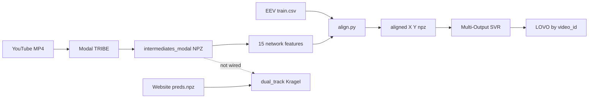

# Coding Session — June 2, 2026

## EEV emotion pipeline: brainstorming, isolation policy, implementation, and failed Modal pilot

**Scope:** Parallel research track for Google **EEV** (Evoked Expressions in Video) — TRIBE v2 network features → continuous expression regression. Does **not** replace production Kragel emotion or NeuroEmo archive.

**Source chat:** [8187e6f6-3e3f-4c7e-b2eb-ad53bc18fd6b](../.cursor/plans/eev_emotion_pipeline_548a635b.plan.md) (plan); parent transcript `8187e6f6-3e3f-4c7e-b2eb-ad53bc18fd6b`.

**Operational debrief (commands, ignore list):** [`scripts/eevCode/EEV_PILOT_DEBRIEF.md`](../scripts/eevCode/EEV_PILOT_DEBRIEF.md)

---

## 1. Executive summary

| Topic | Outcome |
|-------|---------|
| Strategic pivot | **EEV research track** added alongside NeuroEmo — not a replacement |
| Production | **Unchanged:** `dual_track.py`, viewer, LLM, `run_website_session.py` |
| Code | Full `eevCode/` scaffold: core lib, scripts, config, 8 tests |
| Data | EEV CSVs on disk; **0 valid Modal feature NPZs** |
| Pilot | Downloads partial (42/50); Modal runs canceled or crashed before save |
| Verdict (audit) | Library OK; **orchestration needs revision** before trusting metrics |

---

## 2. Brainstorming arc (what we debated)

### Starting point

Earlier in the same multi-day thread we ran **NeuroEmo high-leverage experiments** (temporal reducers, hierarchical decoding). Best 5-class gain ~+2 pp with `static_dynamic`; no validated published TRIBE→discrete-emotion model exists in literature — only heuristics and small eval sets (~20–33% accuracy).

### Pivot to EEV

User shifted from “replace NeuroEmo with EEV” to:

> **EEV is a second parallel research track**, like NeuroEmo — cached Modal TRIBE features, temporal alignment to EEV labels, **Multi-Output SVR**, offline evaluation only.

### Key design debates (plan vs codebase)

| Topic | Initial idea | Decision |
|-------|--------------|----------|
| Classifier | “SVM” on emotions | **Multi-Output SVR** — targets are continuous 0–1 |
| Temporal rate | 1 s windows with sub-TR phases | **1 Hz native TR**; early/late = TR t−1 vs t |
| EEV label rate | Align at 6 Hz | **Downsample labels to 1 Hz** for training |
| Networks | Primary/Secondary Visual, etc. | **`Vis`, `SalVentAttn`, `DorsAttn`** (prefix match like dual_track) |
| NeuroEmo | Superseded? | **Kept** — three layers: Kragel (prod), NeuroEmo, EEV |
| Production hook | Wire into dual_track | **Explicitly out of scope** — separate promotion plan later |
| Cost control | Re-run TRIBE during tuning | **One-time Modal + cached `{video_id}_features.npz`** |

---

## 3. Architectural decision log

### ADR-E1: Mirror NeuroEmo layout under `eevCode/`

**Decision:** `scripts/eevCode/`, `scout_core/eevCode/`, `scout_data/eevCode/`, `tests/eevCode/`.

**Rationale:** Proven isolation pattern; default `pytest tests/` skips both research tracks via `tests/conftest.py` (explicit path still runs them).

---

### ADR-E2: FeatureContract v1 — 15 network features at 1 Hz

**Decision:** Collapse TRIBE `(T, 20484)` → `(T, 15)` before storage/training.

**Features:** 3 amplitudes + 3 derivatives + 3 early + 3 late + 3 rolling coherences over `Vis` / `SalVentAttn` / `DorsAttn`.

**Module:** `scout_core/eevCode/features.py` — shared by `generate_features.py` and offline `inference.py`.

---

### ADR-E3: Five regression targets (subset of EEV 15 expressions)

**Targets:** `confusion`, `concentration`, `interest`, `awe`, `contentment` — clipped `[0, 1]`.

**Not used:** remaining EEV expression columns (reference only in `constants.py`).

---

### ADR-E4: Separate Modal cache directory

**Decision:** `scout_data/eevCode/intermediates_modal/` for real GPU runs; `intermediates/` holds synthetic dev NPZs.

**Rationale:** Avoid training on random synthetic features while believing Modal completed.

---

### ADR-E5: LOVO evaluation only

**Decision:** `LeaveOneGroupOut` grouped by `video_id` — never random k-fold on TR rows.

**Rationale:** Thousands of 1 Hz rows per video are temporally dependent; k-fold leaks stimulus identity.

---

### ADR-E6: No production wiring in this session

**Explicitly not created/changed:** `mvpa_engine.py`, `dual_track.yaml` mode switch, viewer, `llm_narrative.py`, `analyze_session.py` production paths.

---

## 4. Code implemented

### Core library (`scout_core/eevCode/`)

| Module | Role |
|--------|------|
| `constants.py` | Labels, `FEATURE_NAMES_V1`, network names |
| `networks.py` | Schaefer vertex masks via `dual_track._network_name_mask` |
| `features.py` | `build_feature_matrix`, `save_features_npz`, `load_features_npz` |
| `align.py` | CSV parse (`YouTube ID`, ms timestamps), 1 Hz grid, lag shift |
| `inference.py` | Offline `predict_eev_scores` (research only) |

### Scripts (`scripts/eevCode/`)

| Script | Purpose |
|--------|---------|
| `download_videos.py` | yt-dlp, `pilot_50.json`, `full_split.json` (3816 IDs) |
| `generate_features.py` | Modal batch, `TribeModalBatch`, process file lock |
| `build_aligned_dataset.py` | Align + optional lag search |
| `train_svr.py` | StandardScaler + MultiOutputRegressor(SVR) |
| `evaluate_svr.py` | LOVO / val / session sidecar eval |
| `run_pilot_*.ps1` | Download, Modal, align+train orchestration |
| `README.md` | Track entry points |
| `EEV_PILOT_DEBRIEF.md` | Session teardown handoff |

### Other edits

| File | Change |
|------|--------|
| `tribe.py` | `predict_brain_npz()`; timeout 3600s; **`import numpy as np` fix** |
| `configs/eevCode.yaml` | Paths, lag grid, SVR defaults, yt-dlp format |
| `tests/eevCode/` | 8 tests (features, align, inference) |
| `tests/conftest.py` | Skip `eevCode` / `neuroEmoCode` unless explicit path |
| `README.md` | Additive “Research archive — EEV” section |
| `requirements.txt` | `yt-dlp>=2024.1` |

---

## 5. Mental model (codebase-teacher)

**Short answer:** EEV learns to predict five continuous “viewer expression” scores from TRIBE cortical dynamics summarized over three Yeo networks. It is **not** wired into the website pipeline. Production emotion remains **zero-shot Kragel** in `dual_track.py`.

### Two emotion systems in TribeV2

| Track | Input | Labels | Model | Production? |
|-------|--------|--------|--------|-------------|
| **Kragel / dual_track** | Session `preds[T, 20484]` | None | Template cosine + Z | Yes |
| **EEV research** | YouTube video TRIBE preds | EEV CSV @ ~6 Hz → 1 Hz | Multi-Output SVR | No |

### Step-by-step flow

```text
EEV CSV + pilot_50.json
  → download_videos.py (yt-dlp → videos/{id}.mp4)
  → generate_features.py (Modal TRIBE → intermediates_modal/{id}_features.npz)
  → build_aligned_dataset.py (X, Y, video_id, t_sec → aligned/*.npz)
  → train_svr.py (joblib pipeline)
  → evaluate_svr.py (LOVO by video_id)
```



### Repo anchors

- Config: `configs/eevCode.yaml`
- Feature contract: `scout_core/eevCode/features.py`
- Alignment: `scout_core/eevCode/align.py`
- Training: `scripts/eevCode/train_svr.py`
- Tests: `python -m pytest tests/eevCode/ -v`

### Gotchas (teacher + session learnings)

- **SVR, not SVC** — continuous targets, not discrete classes.
- **LOVO, not k-fold** — group = `video_id`.
- **`intermediates_modal/` vs `intermediates/`** — synthetic vs real Modal; do not mix in align without `--intermediates-dir`.
- **EEV labels are estimated facial expressions** — noisy ceiling on Pearson r.
- **~12–20 min Modal GPU per video** is expected for TRIBE encoding — not a hung job.
- **`Successfully canceled input`** = local client disconnected (kill/restart/duplicate worker), not a TRIBE science failure.

---

## 6. Audit findings (code-auditor)

**Overall risk:** High for pilot orchestration; Medium for library code in isolation.

**Verdict:** **Needs revision** before trusting research metrics.

### Critical

| Finding | Impact |
|---------|--------|
| E2E scripts continue after step failure | False “finished” logs; train on stale aligned NPZ |
| Stale `eev_aligned_train_v1.npz` after align fail | LOVO r ≈ −0.002 reported while pipeline “completed” |
| `pilot_modal.done` written with exit=-1 and 0 NPZs | Downstream align/train triggered on empty features |

### High

| Finding | Impact |
|---------|--------|
| Duplicate `generate_features.py` workers | Modal **cancels in-flight inputs** — wasted credits |
| yt-dlp merge format without ffmpeg | 0/50 usable mp4s initially; `.f140.m4a` fragments |
| `intermediates/` (70 synthetic NPZs) vs empty `intermediates_modal/` | Easy to align wrong cache |

### Medium

| Finding | Impact |
|---------|--------|
| Lag search uses feature–label proxy, not SVR LOVO | Suboptimal `lag_s` label |
| No integration test for download/Modal path | ffmpeg/duplicate-worker failures undetected |

### Usage checklist (before next run)

1. `python -m pytest tests/eevCode/ -v`
2. Quarantine or ignore `intermediates/`, `eev_svr_v1.*`, `eev_aligned_train_v1.npz`
3. Re-download pilot mp4s with `best[ext=mp4]/best`
4. **One** Modal worker; wait for first NPZ before scaling
5. Confirm `predict_brain_npz` numpy import deployed on Modal (`tribe.py`)

---

## 7. Current issues (end of session)

| Issue | Status |
|-------|--------|
| Valid Modal feature NPZs | **None** (`intermediates_modal/` empty) |
| `predict_brain_npz` NameError | **Fixed locally** (`import numpy as np`); needs one clean Modal run |
| Pilot downloads | 42/50 ok; many dirs still `.f140.m4a` only — re-download mp4s |
| Modal cancellations | Caused by restarts + duplicate workers (2× `generate_features.py` observed) |
| False training metrics | `eev_svr_v1` trained on **synthetic** aligned data — **invalid** |
| Single-video trial | TRIBE reached 262/300 segments then crashed on NPZ save |
| Processes | **All killed**; locks cleared at session end |

---

## 8. Artifact state on disk

```
scout_data/eevCode/
  csv/train.csv, val.csv     ✅ (~813 MB + ~211 MB)
  manifests/pilot_50.json    ✅ 50 video IDs
  manifests/trial_1.json     ✅ single-video trial list
  videos/                    ⚠️ mostly audio fragments; re-download mp4s
  intermediates/             ⚠️ 70 SYNTHETIC NPZs — ignore
  intermediates_modal/       ❌ empty
  aligned/eev_aligned_train_v1.npz  ⚠️ synthetic — ignore
  models/eev_svr_v1.*         ⚠️ synthetic — ignore
```

---

## 9. Future work

### Immediate (next session)

1. **One video end-to-end** — `-01d8S_0AHs` only; no restarts; verify NPZ + aligned shapes.
2. **Fix remaining orchestration** — abort on step failure; gate `pilot_modal.done` on NPZ count (partially done).
3. **Re-download pilot mp4s** with fixed yt-dlp format.

### Pilot scale (after 1-video gate)

4. Modal batch on `pilot_50.json` → `intermediates_modal/` with `--skip-existing`.
5. `build_aligned_dataset.py --search-lag` → `eev_aligned_pilot_modal_v1.npz`.
6. `train_svr.py` + LOVO eval; sanity gate: mean r > 0.05–0.15 on ≥3/5 targets.

### Research / accuracy

7. Nested LOVO grid for `C`, `epsilon`, `gamma` (not in `train_svr.py` yet).
8. Val-held-out eval (`evaluate_svr.py --mode val`).
9. Feature ablation: amplitudes-only vs full 15-dim contract.

### Optional promotion (separate plan)

10. Wire EEV into `dual_track` / viewer only if offline metrics beat Kragel on exploratory website session comparisons.

---

## 10. Commands reference (minimal)

```powershell
# Unit tests
python -m pytest tests/eevCode/ -v --tb=short

# Single-video trial (see EEV_PILOT_DEBRIEF.md for full steps)
python scripts/eevCode/generate_features.py `
  --video-ids-file scout_data/eevCode/manifests/trial_1.json `
  --output-dir scout_data/eevCode/intermediates_modal `
  --execute-tribe --skip-existing
```

**Do not** start a second `generate_features.py --execute-tribe` while one is running.

---

## 11. Related docs

| Document | Purpose |
|----------|---------|
| [`.cursor/plans/eev_emotion_pipeline_548a635b.plan.md`](../.cursor/plans/eev_emotion_pipeline_548a635b.plan.md) | Full implementation plan |
| [`scripts/eevCode/README.md`](../scripts/eevCode/README.md) | Track quick start |
| [`scripts/eevCode/EEV_PILOT_DEBRIEF.md`](../scripts/eevCode/EEV_PILOT_DEBRIEF.md) | Teardown handoff |
| [2026-05-28 website consolidated session](./2026-05-28-website-pipeline-consolidated-session.md) | Production spine context |

---

*Session closed with all Modal/pilot processes killed. No further GPU runs scheduled.*
