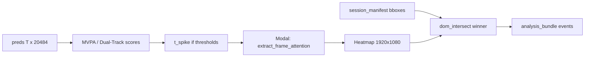

# Feature Isolation — Spatial Credit Assignment (Neural-UX Scout)

Companion doc for **[neural-ux-scout-architecture-plan.md](neural-ux-scout-architecture-plan.md)** (P4 grounding), **[surface-parcellation-mvpa-inference-plan.md](surface-parcellation-mvpa-inference-plan.md)** (MVPA / `[T, 20484]`), and **[ux-emotion-proxy-classification-plan.md](ux-emotion-proxy-classification-plan.md)** (Playwright telemetry).

**Phase placement:** Extends **P4 — Neural barriers & grounding** in [neural-ux-scout-phased-delivery-plan.md](neural-ux-scout-phased-delivery-plan.md). Runs **after** `preds.npz` exists and Dual-Track / MVPA scalar traces are available.

---

## Intent

The Neural-UX Scout **Dual-Track** system produces global, frame-level cognitive scores from MVPA and probability traces over the cortical stream **`preds[T, 20484]`** (fsaverage5 surface, `V = 20484`). That stack answers **when** a state spiked and **how strongly**, but not **what on screen** the user was likely attending to at that moment—the **Spatial Credit Assignment Problem**.

This plan closes that gap by:

1. **Triggering** on Dual-Track spikes (Engagement Score, Kragel Anger) while monitoring the `[T, 20484]` stream via the Nilearn MVPA layer.
2. **Extracting** spatial attention from TRIBE v2’s vision backbone: a **secondary, single-frame** forward through the **DINOv2** Vision Transformer (HuggingFace path inside tribev2; see `facebook/dinov2-large` in the released `config.yaml`) with **`output_attentions=True`**, using **[CLS] → patch** attention from the **final Transformer block**.
3. **Intersecting** the upsampled **Heatmap Matrix** with Playwright DOM bounding boxes from **`session_manifest.json`**, selecting the element with highest normalized attention density.

**Outcome:** Grounded UI hypotheses (`dom_id`, `tag`, `bbox`, `attention_density`) appended to [`analysis_bundle.json`](../../scout_core/schemas.py) for the React dashboard and agent consumers.

Product copy guardrail: outputs are **model-relative hypotheses** (attention proxy, not eye-tracking or clinical truth), consistent with the main architecture plan.



---

## Core Pipeline — Trigger-Extract-Intersect

### The Trigger (Nilearn MVPA layer)

**Input:** Offline or streaming cortical predictions **`preds[T, 20484]`** from [`tribe.py`](../../tribe.py) (`predict_brain` / `record`) stored at `scout_data/sessions/<id>/preds.npz`.

**Monitor:** Dual-Track scalar traces derived from the MVPA / probability layer (exact formulas live upstream; thresholds are config-driven):

| Metric | Condition | Action |
|--------|-----------|--------|
| **Engagement Score** | `> 2.0` | Flag timestep `t_spike` |
| **Kragel Anger (session-relative Z)** | `> 2.0` | Flag timestep `t_spike` |

Either condition is sufficient to trigger (logical **OR** unless overridden in YAML). Emotion triggers use session-relative Z-scores from Track 2, not absolute cosine similarity.

**Source of truth:** [`configs/isolation_thresholds.yaml`](../../configs/isolation_thresholds.yaml) — `engagement_score_min`, `kragel_anger_z_min`, optional `max_spikes_per_session`, `cooldown_trs`.

**Integration hook:** Extend or wrap the post-inference path in [`scripts/analyze_session.py`](../../scripts/analyze_session.py), which today writes [`AnalysisBundle`](../../scout_core/schemas.py) with `threshold_hits` only. After spike detection, optionally invoke Modal for attention extraction and merge grounding into `analysis_bundle.json`.

**Temporal alignment:** `t_spike` indexes rows of `preds` (TRIBE TR ≈ 1 s by default). Map `t_spike` → video PTS via `session_manifest.json` before frame extraction.

---

### Attention Extraction (Modal GPU)

Executed **only** for flagged `t_spike` values—not for every TR.

| Step | Description |
|------|-------------|
| 1 | Map `t_spike` → frame index / PTS using `session_manifest.json` (FPS, `frame_index`, or `pts_sec`). |
| 2 | Decode **one** video frame; build tensor **`[1, C, H, W]`** (ViT input size, e.g. 224×224). **Never** run attention on full-video tensor `[T, C, H, W]`. |
| 3 | Call Modal method on [`tribe.py`](../../tribe.py): `extract_frame_attention(frame_tensor)` with HuggingFace **`output_attentions=True`** on the DINOv2 ViT stack. |
| 4 | From **final block** attentions, take **[CLS] token** row over patch tokens; **mean across heads** → 1D patch vector (e.g. length **256** for 16×16 patches). |
| 5 | Reshape to 2D grid (e.g. 16×16). Use **`torch.nn.functional.interpolate`** (bilinear) to **1920×1080** → **Heatmap Matrix** `H[y, x]`. |

Helpers (reshape, head mean, upscale) live in [`scout_core/feature_engine.py`](../../scout_core/feature_engine.py).

**R0 spike (integration):** Current [`tribe.py`](../../tribe.py) wraps `TribeModel.predict(events=df)`; tribev2’s public path uses cached multimodal extractors. Before shipping, verify the **same DINOv2 module** used at inference can be called with `output_attentions=True` without re-running the full fMRI encoder head, and without breaking `predict_brain` parity.

---

### DOM Intersection

**Input:** Heatmap `H` at capture resolution; DOM snapshot at `t_spike` from `session_manifest.json`.

For each candidate element with bounding box **`[X, Y, W, H]`** (viewport or document space per manifest convention):

\[
\text{attention\_density}(box) = \frac{\sum_{(x,y) \in box} H[y, x]}{W \times H}
\]

**Winner:** `argmax` over eligible candidates → grounding record written to `analysis_bundle.json`.

Implementation: [`scout_core/dom_intersect.py`](../../scout_core/dom_intersect.py) — bbox clipping to image bounds, scroll offset, viewport / z-index filters.

---

## Directory Structure

```text
TribeV2/
  docs/implementation-plans/
    feature_isolation.md              # this document
  tribe.py                            # modified: extract_frame_attention, spike Modal methods
  scout_core/
    feature_engine.py                 # new: ViT patch reshape, head average, interpolate
    dom_intersect.py                  # new: bbox density, scrollY, occlusion filters
    schemas.py                        # extend: GroundingEvent, AnalysisBundle.events
  configs/
    isolation_thresholds.yaml         # new: engagement / Kragel thresholds, spike caps
  scripts/
    analyze_session.py                # extend: trigger → ground → merge bundle
  tests/
    test_feature_isolation.py         # new: unit tests for engine + intersect math
```

| Path | Role |
|------|------|
| [`tribe.py`](../../tribe.py) | Modal GPU: `extract_frame_attention`; optional `ground_spike_at_t` orchestration |
| [`scout_core/feature_engine.py`](../../scout_core/feature_engine.py) | CLS attention → patch grid → upscale to capture resolution |
| [`scout_core/dom_intersect.py`](../../scout_core/dom_intersect.py) | Normalized attention density per bbox; winner selection |
| [`configs/isolation_thresholds.yaml`](../../configs/isolation_thresholds.yaml) | Thresholds and session-level spike policy |

---

## Data Contracts

### Modal API — `tribe.py`

```python
def extract_frame_attention(self, frame_tensor: torch.Tensor) -> np.ndarray:
    """
  Run DINOv2 ViT with output_attentions=True on a single frame.

  Args:
      frame_tensor: float tensor [1, C, H, W] on model device (ViT input size, e.g. 224).

  Returns:
      heatmap: float32 ndarray shape (capture_height, capture_width),
               e.g. (1080, 1920), values >= 0, not necessarily normalized to 1.
  """
```

**Companion method (recommended):**

```python
def ground_spike_at_t(
    self,
    t_spike: int,
    frame_bytes: bytes,
    manifest: dict,
) -> dict:
    """Decode frame, extract heatmap, run dom_intersect; return grounding payload."""
```

Local CPU path: [`scout_core/dom_intersect.py`](../../scout_core/dom_intersect.py) may run outside Modal if heatmap is persisted to `scout_data/sessions/<id>/heatmaps/t_spike.npy`.

---

### `analysis_bundle.json` (schema v2)

Extend [`AnalysisBundle`](../../scout_core/schemas.py); bump `schema_version` to **2** (keep v1 fields for backward compatibility). Writer: [`scripts/analyze_session.py`](../../scripts/analyze_session.py) via [`analysis_bundle_path`](../../scout_core/schemas.py).

```json
{
  "schema_version": 2,
  "session_id": "abc123",
  "events": [
    {
      "type": "neural_spike_grounding",
      "t_spike": 42,
      "triggers": {
        "engagement_score": 2.31,
        "kragel_anger_z": 2.31
      },
      "grounding": {
        "dom_id": "#checkout-btn",
        "tag": "BUTTON",
        "bbox": [640, 520, 180, 48],
        "attention_density": 0.087
      }
    }
  ]
}
```

| Field | Type | Meaning |
|-------|------|---------|
| `type` | string | Always `neural_spike_grounding` for this pipeline |
| `t_spike` | int | Row index into `preds[T, 20484]` |
| `triggers` | object | Scalar values that fired thresholds at `t_spike` |
| `grounding.dom_id` | string | Playwright selector / stable element id |
| `grounding.tag` | string | HTML tag name (e.g. `BUTTON`) |
| `grounding.bbox` | `[X, Y, W, H]` | Pixel rect in **capture** coordinates (1920×1080) |
| `grounding.attention_density` | float | Normalized sum of heatmap inside bbox |

---

### `session_manifest.json` (consumer contract)

Required for intersection (recorder: Playwright explorer per architecture plan; schema may be v0 stub until P0 ships).

```json
{
  "schema_version": 1,
  "capture": { "width": 1920, "height": 1080, "fps": 30.0 },
  "dom_snapshots": [
    {
      "t_idx": 42,
      "pts_sec": 42.0,
      "scrollY": 1200,
      "scrollX": 0,
      "elements": [
        {
          "dom_id": "#checkout-btn",
          "tag": "BUTTON",
          "bbox": [640, 520, 180, 48],
          "z_index": 10,
          "is_intersecting_viewport": true
        }
      ]
    }
  ]
}
```

**Alignment rules:**

- `dom_snapshots[].t_idx` must align with `preds` row index (or document explicit `tr_to_frame` map).
- `bbox` must be expressed in the same coordinate system as the upsampled heatmap after scroll correction.

---

## Risks and Guardrails

| Guardrail | Requirement |
|-----------|-------------|
| **VRAM exhaustion** | Never extract attention on full-video tensor `[T, C, H, W]`. Only `[1, C, H, W]` per `t_spike`. Cap spikes per session in `isolation_thresholds.yaml`. Log `torch.cuda.max_memory_allocated()` on Modal dry-run. |
| **Scrolling offsets** | Apply Playwright `scrollY` / `scrollX` when mapping DOM boxes to heatmap pixels so off-viewport document coordinates do not mis-score. |
| **Occlusions** | Exclude elements where `is_intersecting_viewport` is false, or where a higher `z_index` modal covers the candidate. Do not flag hidden background nodes when a dialog is open. |
| **Resolution mismatch** | Upsample heatmap to **Playwright capture resolution** (e.g. 1920×1080), not ViT input (e.g. 224×224). If the frame is letterboxed for ViT, document and invert the same transform when sampling `H` inside bboxes. |
| **Attention ≠ gaze** | UI and agent copy: heatmap reflects **model attention**, not measured eye gaze. |
| **TRIBE hook risk** | R0: confirm DINOv2 module path in tribev2; CLS attention from final block is reachable without breaking [`predict_brain`](../../tribe.py) parity. |

---

## Definition of Done

1. **Trigger:** For a session with `scout_data/sessions/<id>/preds.npz`, an offline job flags at least one `t_spike` when **Engagement Score > 2.0** or **Kragel Anger session-relative Z > 2.0** per [`configs/isolation_thresholds.yaml`](../../configs/isolation_thresholds.yaml).
2. **Extract:** Modal `extract_frame_attention` returns a **`(1080, 1920)`** float32 heatmap for that frame on A100 without OOM.
3. **Intersect:** [`scout_core/dom_intersect.py`](../../scout_core/dom_intersect.py) selects a single winner `dom_id` with a documented `attention_density` score.
4. **Persist:** `scout_data/sessions/<id>/analysis_bundle.json` includes an `events[]` entry whose `grounding` object matches the contract above.
5. **Dashboard:** The React viewer (`viz_web/`, planned in [neural-ux-scout-architecture-plan.md](neural-ux-scout-architecture-plan.md)) highlights the winning HTML tag at `t_spike` on the timeline (bbox overlay or selector chip synced to the walkthrough video).

---

## Section-level marketing analytics (implemented)

Tier 1 (CPU, all TRs): [`scout_core/section_analytics.py`](../../scout_core/section_analytics.py) assigns each timestep to a hybrid section (URL + DOM landmarks + [`configs/site_sections.yaml`](../../configs/site_sections.yaml)) and aggregates full-session `emotion_track` / `engagement_track` into `section_report[]`.

Tier 2 (sparse GPU): [`scout_core/section_sampling.py`](../../scout_core/section_sampling.py) picks ≤3 TRs per section; [`scripts/extract_section_heatmaps.py`](../../scripts/extract_section_heatmaps.py) extracts frames / placeholder heatmaps; [`scout_core/dom_intersect.py`](../../scout_core/dom_intersect.py) `score_all_elements` + `rollup_section_elements` fill `top_elements`.

**Website session (orchestrated):** `python scripts/record_website_session.py --script configs/walkthrough_scripts/….yaml` → `modal run tribe.py::record_session` → `extract_section_heatmaps.py --modal --refresh-sections` → `analyze_session.py --website`. See [`docs/runbooks/website-session.md`](../runbooks/website-session.md).

CLI: `python scripts/analyze_session.py --session-id X --norm-id Y --sections` (after `run_dual_track.py`). Repair-only manifest: `python scripts/record_session_manifest.py --session-id X --url …`.

## Out of scope

- `viz_web` section timeline UI (dashboard).
- Defining closed-form formulas for Engagement Score and Kragel Anger (owned by Dual-Track / MVPA upstream; thresholds only in YAML).
- Volumetric (MNI) grounding or eye-tracker fusion.

---

## Related artifacts

| Artifact | Role |
|----------|------|
| `scout_data/sessions/<id>/preds.npz` | `preds` array `(T, 20484)` — trigger input |
| `scout_data/sessions/<id>/analysis_bundle.json` | Grounding `events[]` output |
| `session_manifest.json` | DOM bboxes and scroll state at `t_spike` |
| [`configs/parcellation_manifest.yaml`](../../configs/parcellation_manifest.yaml) | Confirms `n_vertices_expected: 20484` |
