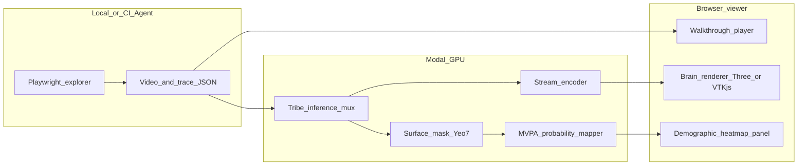
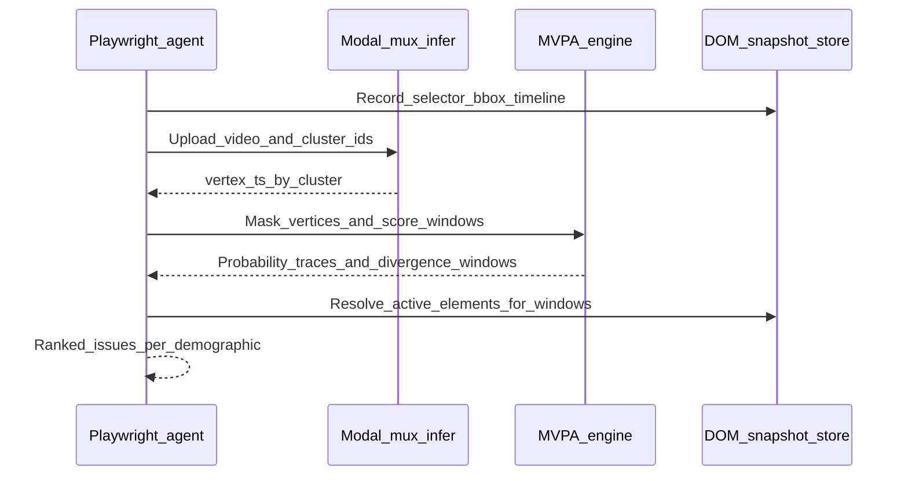

# Salience — Implementation Plan & Code Architecture

**Architecture choices captured:** cluster-centroid sub-agents, browser streaming visualization.

This doc aligns with the existing Modal scaffold in [`tribe.py`](../../tribe.py) (`TribeInference`, `TribeModel.from_pretrained`, `predict` ? `(n_timesteps, n_vertices)`).

**Important reality check (terminology):** Tribe’s public demo path predicts **cortical surface time series** on **fsaverage5** (`PlotBrain(mesh="fsaverage5")`), typically **~20k vertices total**, not **70k volumetric voxels**. The architecture treats “70k voxels” as an optional **Phase B** (volume reconstruction / subcortex), while MVP ships **surface vertex activation** as the primary signal—still mappable to Yeo-7 via surface parcellations and consistent with nilearn workflows.

---

## Implementation checklist (from planning session)

- [ ] Vendor/pin tribev2; locate Stage-5 subject injection; spike single-GPU K-way multiplex forward + peak VRAM curve
- [x] Website session orchestrator: `record_website_session.py` (MP4 + manifest v2); `run_website_session.py` runbook in `docs/runbooks/website-session.md`
- [x] Define `session_manifest.json` v2 + `analysis_bundle.json` v3 (section_report, session_capture, marketing_narrative); legacy `record_session_manifest.py` for repair-only
- [x] Implement vertex?Yeo7 surface masks + Zero-Shot Dual-Track scores (engagement Z-score + emotion cosine similarity) — `scout_core/dual_track.py`, `scripts/run_dual_track.py`, `scripts/download_emotion_templates.py`
- [ ] Modal `inference_mux`: micro-batch clusters, return chunked `vertex_ts`; add streaming encoder module
- [ ] `viz_web`: three.js/vtk.js viewer + WS timeline sync with walkthrough video
- [ ] Barrier detector: pairwise cluster divergence + DOM timeline intersection + ranked UX issues
- [ ] Data prep scripts: subject metadata join, constrained clustering, cluster artifact export
- [ ] Modal `train_clusters.py`: frozen encoders, trainable cluster embeddings, checkpoint to Volume

---

## Goals & non-goals

| Goal | MVP scope |
|------|-----------|
| Multiplex many demographics | **Cluster embeddings** (prototypes): train/report ~10–50 clusters; optionally maintain **many fine-grained tags** offline while inference uses batched prototypes |
| Real-time brain viz | **Browser**: stream **compressed per-frame vertex colors + mesh topology once**, or **tile-encoded MP4/WebRTC** of server-rendered views |
| Emotion / cognition layer | **Zero-Shot Dual-Track**: VAN/DMN engagement Z-score + Kragel/PINES cosine similarity templates; LLM is narrative-only |
| Agent understands failing UI | Ground divergence events to **DOM selectors / bounding boxes** from Playwright + screenshot timestamps |

**Non-goals for MVP:** Training full LLaMA/V-JEPA from scratch; claiming clinical diagnostic validity; true simultaneous “700 voxel grid” without defining the volumetric forward model.

---

## High-level system diagram



---

## 1. Subject multiplexer (batch many demographics without OOM)

### Design principle

With **cluster-centroid/prototype embeddings**, the inference batch dimension is **K = number of prototype clusters** in the forward (e.g. K ? [16, 64]), not “720 subjects × redundant duplicates.” This already slashes memory versus naive subject-ID broadcasting.

### Recommended pattern

1. **Freeze** multimodal encoders (~32GB combined — load once per container lifecycle via `@modal.enter()`, identical to current [`tribe.py`](../../tribe.py)).
2. **Replace / extend** the Stage-5 subject pathway with:
   - `subject_embedding_matrix`: shape `[K, D]` on GPU (learnable or fixed after training).
   - Forward pass: **either**
     - **Sequential micro-batch over K** if Tribe internals don’t expose clean broadcasting; or
     - **Single fused forward** if the subject conditioning is injectable as a batch dimension early (preferred once validated against Tribe source).

3. **OOM controls**
   - **Micro-batch clusters**: process clusters in chunks `K_chunk` (e.g. 8–16) sharing the same video latent; concatenate outputs along cluster axis.
   - **AMP / bf16** on A100/H100.
   - **Gradient checkpointing** (training only) inside subject-conditioned blocks.
   - **No duplicate encoder compute**: encode video/stimulus **once**; only replicate lightweight tensors that depend on subject embedding.

4. **API contract**

```text
infer_mux(video_bytes | stimulus_uri, cluster_ids: list[int]) -> {
  vertex_ts: float32[K, T, V],   # or chunked streaming T
  meta: { fps, T, mesh_name, cluster_labels }
}
```

### Integration touchpoint

Fork or vendor **`facebookresearch/tribev2`** as a pinned submodule/image layer (you already `pip install -e` from GitHub in [`tribe.py`](../../tribe.py)). The multiplex work lands as a **small patch module** (e.g. `tribev2_mux.py`) that wraps `TribeModel.predict` after locating where subject IDs feed Stage 5.

---

## 2. Spatiotemporal visualization (web stream + video alignment)

### Time alignment

- Playwright emits **`session_manifest.json`**: wall-clock, **video PTS**, DOM mutation log, navigation URLs, **screenshot keyframes** (optional).
- Inference emits **`brain_timeseries.npz`** (or chunked binary): `T` aligned to the **same FPS** as preprocessing (`get_events_dataframe`), with explicit `frame_index ? vertex_vector`.

### Browser rendering strategies (pick one as MVP; others Phase B)

| Strategy | Pros | Cons |
|---------|------|------|
| **A. Server-render tiles ? HLS/WebRTC** | Matches Tribe’s PyVista path; consistent colors | Bandwidth; slightly higher latency |
| **B. Send mesh once + per-frame vertex colors (gzip/binary)** | Lower server movie encode cost; interactive camera | Need careful compression (quantize uint8, differential encoding) |
| **C. Precomputed MP4 brain movie + UI mux** | Simplest | Less “interactive 3D” |

Given your choice (**web stream**), recommended MVP is **B for interaction**, with **A as fallback** if vertex payloads exceed practical WS throughput.

### Front-end stack

- **`three.js`** or **`vtk.js`** loading **fsaverage5** inflated mesh (precomputed `.glb` / `.vtk`).
- **Demographic panel**: small multiples or stacked heatmaps over **MVPA probability traces** per cluster; highlight divergence gaps.

### Sync UX

- Single **transport timeline**: `currentTime` drives both video and brain frame index.
- If stream lags: buffer **2–3 s** of brain frames or degrade to **Yeo-7 curves only** until mesh catches up.

---

## 3. Neural-to-emotion mapping (MVPA logic layer)

### Pipeline

1. **Vertex ? network mask**: Map each fsaverage5 vertex to **Yeo-7** labels using [`configs/vertex_regions.csv`](../../configs/vertex_regions.csv). Use `nilearn.maskers.SurfaceMasker` to isolate a target network, such as Frontoparietal, while preserving the full vertex pattern inside that mask.
2. **No vertex averaging**: Do not collapse vertices into network means. Averaging destroys the spatial “barcode” that MVPA needs to distinguish cognitive states.
3. **Spatiotemporal feature extraction**: For each cluster `k` and timestep `t`, take masked rows `[t-2, t-1, t]` from `vertex_ts[k, T, V]` and flatten the resulting `3 × P_network` matrix into one feature vector.
4. **Scikit-learn inference**: Load a pre-trained `sklearn` `.pkl` pipeline, for example `StandardScaler + LinearSVC` wrapped with calibration, and run `predict_proba` or `decision_function` converted to probabilities.
5. **Probability trace output**: Emit `probability_trace[k, t, class]` aligned to the walkthrough timeline. Downstream analytics consume continuous probabilities rather than YAML rule hits.
6. **Optional narrative**: Feed structured JSON (probability peaks/slopes + DOM context + screenshot crops) to a **small LLM** for UX copy — keep the trained MVPA model as the source of truth for product analytics.

### Guardrails

- Emit **`confidence`** from classifier probability, calibration quality, and temporal persistence.
- Never claim emotion **measurement**; phrase as **model-assisted hypotheses** tied to UX stimuli.

---

## 4. Agentic loop (“Neural Barrier” ? UI elements)



**Barrier definition:** For time window `W`, cluster pair `(A,B)` exhibits **large divergence** in MVPA probability traces (e.g. probability delta, slope, or area-under-curve gap crosses the model’s chosen operating point) for a target state/network. The agent does not wait for a `rule engine fires` event; it watches the continuous probability array for peaks, sustained elevation, or cluster-specific divergence.

**Grounding:** For each `W`, intersect DOM timeline ? candidate nodes ? screenshot snippets ? optional CV segmentation later.

---

## 5. Directory structure (clean modular layout)

```text
salience/
  agent/
    explorer.py              # Playwright policy + manifest writer
    dom_trace.py
    upload_modal.py
  modal_app/
    image_defs.py            # Tribe + ffmpeg + CUDA deps
    inference_mux.py         # @modal.cls multiplex inference + streaming hooks
    train_clusters.py        # distributed training job
    stream_protocol.py       # WS framing, quantization helpers
  scout_core/
    parcellation.py          # vertex ? Yeo7
    mvpa_engine.py           # SurfaceMasker + sliding windows + sklearn probability traces
    barriers.py              # divergence + ranking
    schemas.py               # pydantic models for manifests
  viz_web/
    package.json
    src/
      BrainViewer.tsx
      Timeline.tsx
      ClusterLegend.tsx
  configs/
    clusters.yaml            # cluster IDs ? demographics metadata
    mvpa_models.yaml         # model IDs, mask definitions, probability labels
  scripts/
    slice_dataset.py         # offline demographic slicing utilities
  tests/
    ...
```

Existing repo root can keep [`tribe.py`](../../tribe.py) as **legacy demo** or migrate into `modal_app/inference_mux.py`.

---

## 6. Data prep — slicing the ~1,115 h TRIBE v2 dataset

### Steps

1. **Inventory metadata**: Build a table keyed by `subject_id` with **Race, Gender, Age band, Neurotype** (and missingness flags).
2. **Privacy / ethics**: Aggregate reporting floors (suppress clusters below `n` subjects); document consent scope if applicable.
3. **Clustering objective**: Choose **stratified K-means / hierarchical** clustering in **subject embedding space** (Stage-5 embeddings if accessible from checkpoints) **constrained** by demographic quotas — avoids purely geometric clusters that don’t respect your archetypes.
4. **Train/val/test**: Group-wise splits so **no subject leakage** across splits.
5. **Artifacts**: Save `cluster_members.parquet`, `cluster_centroid_vectors.pt`, `cluster_demographics.json`.

---

## 7. Modal distributed training loop (frozen encoders, learnable cluster weights)

### Pattern

- **Job**: `modal.Function` or **`modal.Cls`** with `gpu="A100"` / `"H100"`; optionally **`modal.parallel`** map over shards.
- **Data loader**: Stream TFRecords / WebDataset shards from **Modal Volume** or **R2/S3** mount.
- **Model**: Load frozen **LLaMA 3.2** + **V-JEPA** (BF16); cast frozen weights to **requires_grad=False**.
- **Trainable**: `cluster_embedding_table`, thin adapters (LoRA) **only if license/architecture permits** — default to **subject/cluster embedding table + small MLP** first.
- **Optimizer**: AdamW, cosine schedule; **strong WD on embeddings only**.
- **Checkpointing**: `modal.Volume` + periodic `torch.save` sharded by rank if multi-GPU.
- **Evaluation**: Hold-out video clips ? **cluster-wise prediction loss** vs held-out subject averages.

### Memory note

32 GB frozen weights + activations: use **gradient checkpointing**, **micro-batch**, and **freeze batchnorm stats** as applicable; validate peak residency with `torch.cuda.max_memory_allocated()` in a dry-run `@modal.enter`.

---

## 8. Inference & analysis — nilearn + Yeo-7 + barriers

- Use **nilearn** for **SurfaceMasker** and surface plotting helpers; surface MVP relies on native fsaverage5 vertices plus [`configs/vertex_regions.csv`](../../configs/vertex_regions.csv).
- Publish **`analysis_bundle.json`** per session: `{barriers, probability_traces, mvpa_model_meta}` consumable by agent and dashboard.

---

## 9. Phased rollout

| Phase | Deliverable |
|-------|-------------|
| **P0** | Manifest + single-cluster inference parity with current [`tribe.py`](../../tribe.py) |
| **P1** | Multiplex `K` clusters + micro-batch + `analysis_bundle` |
| **P2** | Browser viewer + WS stream + synced video |
| **P3** | Barrier detector + Playwright grounding |
| **P4** | Modal training job for cluster embeddings |
| **P5** | Optional volumetric / subcortex extension |

---

## 10. Canonical copy in this repository

This file is the **project-root reference copy** for Salience planning. When iterating in Cursor, you may also have a generated plan under `.cursor/plans/`; merge substantive edits here when you want the repo to remain the source of truth.

---

## Open technical validations (early spikes)

1. Inspect **TRIBE v2** forward to find exact **subject injection point** and tensor shapes.
2. Benchmark **WS payload** for `V×T×K` with quantization — set `K_chunk` accordingly.
3. Confirm **Yeo-7 labeling** path on **fsaverage5** vertices matches your scientific narrative.
