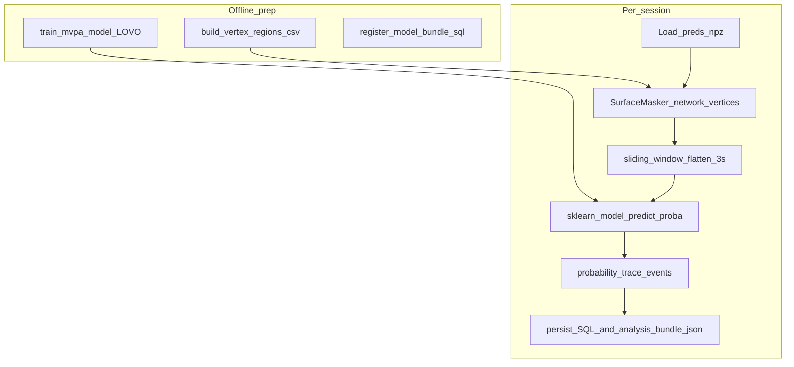

# Microplan: atlas-backed surface masks and MVPA inference

Companion doc for **[neural-ux-scout-architecture-plan.md](neural-ux-scout-architecture-plan.md)** and **[neural-ux-scout-phased-delivery-plan.md](neural-ux-scout-phased-delivery-plan.md)**. Execution blueprint for the **strong neuroscience-facing layer** on top of scaffolding in [`activation_store.py`](../../activation_store.py) (within-session percentiles + coarse `vertex_fraction` bins).

---

## Goal

Turn dense **`preds[T, V]`** into:

1. **Anatomically meaningful surface masks** via a versioned vertex→parcel/network mapping (replacing mesh-index proxies).
2. **MVPA features** that preserve the spatial activation pattern inside each network, rather than averaging vertices.
3. **Continuous classifier traces** from pre-trained `scikit-learn` models (e.g. `LinearSVC` calibrated to probabilities), producing model-relative cognitive-state likelihoods—not hardcoded YAML rule hits.

Guardrail (product copy): output language remains **model-relative hypotheses**, aligned with Neural-UX Scout §3 in the main implementation plan.

---

## Current integration points (do not break)

| Artifact | Role |
|----------|------|
| `scout_data/sessions/<id>/preds.npz` | Source of truth matrix `preds` `(T, V)` |
| [`configs/vertex_regions.csv`](../../configs/vertex_regions.csv) | Optional legacy two-column form or extended atlas-backed columns |
| [`scout_data/activations.sqlite`](../../scout_data/activations.sqlite) | Append neuro tables; keep existing `sessions`, `activation_peak`, lookup bands |

---

## Data artifacts (versioned, reproducible)

### A. `configs/parcellation_manifest.yaml`

Single source of truth for reproducibility:

```yaml
mesh: fsaverage5
tribe_vertex_order: facebook/tribev2  # confirm against Tribev2 plotting mesh
atlas_id: schaefer2018_400_fsaverage5  # example
yeo7_map_version: 7Networks_Labels_v1   # example
artifact_sha256:
  labels_gii_lh: "<hex>"
  labels_gii_rh: "<hex>"
```

### B. `configs/vertex_regions.csv` (extended columns)

Minimum columns after upgrade:

| Column | Type | Purpose |
|--------|------|---------|
| `vertex_index` | int | 0..V-1, Tribev2 order |
| `parcel_id` | int | Stable atlas parcel id |
| `parcel_label` | string | Human label (e.g. Schaefer name) |
| `yeo_network_id` | int (nullable) | 1–7 or NULL if unknown |
| `yeo_network_name` | string | e.g. `SomMot`, `SalVentAttn` |
| `hemisphere` | `lh`/`rh` | From atlas |

**Generation path (offline script, not hand-edited):**

- Input: FreeSurfer/fsaverage5-compatible label GIFTI (lh/rh) **or** nilearn-fetchable volumetric labels projected to surface (document chosen path).
- Script: [`scripts/build_vertex_regions_csv.py`](../../scripts/build_vertex_regions_csv.py)
  - Validate `len(unique(vertex_index)) == V` and contiguous `0..V-1`.
  - Emit CSV + update manifest counts/shas.

### C. MVPA model bundle `scout_models/<model_id>/`

| File | Contents |
|------|----------|
| `model.pkl` | Pre-trained `scikit-learn` classifier or calibrated pipeline |
| `label_map.json` | Class ids/names and probability columns |
| `meta.json` | `model_id`, TRIBE checkpoint id, training corpus id, mesh, mask definition, window length, CV metrics |

**How models are built (offline; document in meta):**

- Run Tribev2 on labeled clips; keep `preds[T, V]` in native fsaverage5 vertex order.
- Apply each target network mask without averaging, build 3-second sliding-window vectors, and train/evaluate with Leave-One-Video-Out cross-validation.
- Persist the trained `sklearn.pipeline.Pipeline` using `joblib.dump()`.

---

## Low-level code layout

New package directory:

```text
scout_core/
  __init__.py
  parcellation.py       # load vertex_regions.csv → dense parcel_id[V]
  mvpa_engine.py        # SurfaceMasker/network masks → windows → sklearn probability traces
  schemas.py            # pydantic models
  storage_migrations.py # neuro SQLite DDL + inserts

scripts/
  build_vertex_regions_csv.py   # atlas → CSV
  train_mvpa_model.py           # labeled corpus preds.npz → scout_models/<model_id>/model.pkl
  analyze_session.py            # session id → SQLite augment + analysis_bundle.json
```

Deprecated/deleted modules:

- [`scout_core/aggregate.py`](../../scout_core/aggregate.py) — delete or keep only as a legacy helper. Averaging vertices into parcel/network means destroys the spatial “barcode” MVPA needs to detect cognitive states.
- [`scout_core/threshold_engine.py`](../../scout_core/threshold_engine.py) — delete/deprecate. The inference output is a probability trace from a trained model, not a rules engine event.
- [`configs/calibrated_rules.yaml`](../../configs/calibrated_rules.yaml) — delete/deprecate. YAML thresholds should not be the source of truth for cognitive-state detection.

---

## Core functions (signatures-level contract)

**[`scout_core/parcellation.py`](../../scout_core/parcellation.py)**

```python
def load_vertex_table(path: Path) -> VertexParcellationTable: ...
def dense_parcel_labels(table: VertexParcellationTable, n_vertices: int) -> np.ndarray: ...  # shape (V,)
def parcel_to_network_map(table: VertexParcellationTable) -> dict[int, int]: ...  # parcel_id -> yeo_network_id
```

**[`scout_core/mvpa_engine.py`](../../scout_core/mvpa_engine.py)**

```python
def build_surface_masker(vertex_table: VertexParcellationTable, *, network_name: str) -> SurfaceMasker: ...
def mask_network_vertices(preds: np.ndarray, masker: SurfaceMasker) -> np.ndarray: ...  # shape (T, P_network)
def sliding_window_features(masked_ts: np.ndarray, *, window_seconds: int = 3) -> np.ndarray: ...  # shape (T-2, 3 * P_network)
def load_mvpa_model(model_path: Path) -> sklearn.pipeline.Pipeline: ...
def predict_probability_trace(model, X: np.ndarray) -> np.ndarray: ...  # shape (T-2, n_classes)
```

---

## MVPA inference

[`scout_core/mvpa_engine.py`](../../scout_core/mvpa_engine.py) owns inference:

1. Load live `preds[T, V]`.
2. Use `nilearn.maskers.SurfaceMasker` plus [`configs/vertex_regions.csv`](../../configs/vertex_regions.csv) to isolate the target vertices, such as Yeo-7 Frontoparietal, without reducing them to a mean.
3. For each timestep `t`, take rows `[t-2, t-1, t]` from the masked matrix and flatten to a 1D vector of length `3 * P_network`.
4. Pass the feature matrix into a pre-trained `scikit-learn` `.pkl` model, for example a calibrated `LinearSVC`.
5. Emit `probability_trace[T-2, n_classes]`, optionally with timestamps aligned back to the source video.

---

## SQLite extensions (neuro tables)

- **`mvpa_model_bundle`** — `model_id`, model path, `label_map_json`, `meta_json`, `created_at`
- **`session_masked_feature_meta`** — network mask id, selected vertex count, window size, timestep alignment
- **`mvpa_probability_trace`** — per timestep class probabilities + model id + network mask metadata

DDL lives in [`scout_core/storage_migrations.py`](../../scout_core/storage_migrations.py); [`activation_store.py`](../../activation_store.py) calls `ensure_neuro_schema()` on connect.

---

## Execution pipeline



---

## Integration with `modal run tribe.py::record`

- **Modal / GPU**: inference unchanged; writes `preds.npz` + SQLite peaks (UX scaffolding).
- **Local CPU post-step**: `python scripts/analyze_session.py --session-id … --model-id …` reads `preds.npz`, computes MVPA probability traces, fills neuro tables + **`scout_data/sessions/<id>/analysis_bundle.json`**.

---

## Validation checklist

- **Parcellation**: every `vertex_index` in `[0, V-1]` appears exactly once; `V` matches `preds.shape[1]`.
- **Masking**: target network masks select the expected vertices and do not average or reorder them.
- **Windowing**: 3-second flattened windows have shape `(T-2, 3 * P_network)` with deterministic handling of the first two timesteps.
- **Model**: `.pkl` bundle exposes probability output, directly or through calibration.
- **Leakage**: model training/evaluation uses Leave-One-Video-Out splits.

---

## Dependencies (local)

See [`requirements.txt`](../../requirements.txt): `numpy`, `pandas`, `pydantic`, `pyarrow`, `nibabel`, `nilearn`, `scikit-learn`, `joblib`, `pytest`, plus `modal` as needed.

---

## Estimated effort ordering

1. Parcellation CSV builder + manifest.
2. `mvpa_engine.py` network masking + 3-second sliding-window tests.
3. `train_mvpa_model.py` + LOVO validation + `model.pkl` bundle.
4. MVPA SQLite migrations + inserts.
5. `analyze_session.py` probability trace integration.
6. `analysis_bundle.json` + dashboard/agent consumers.
