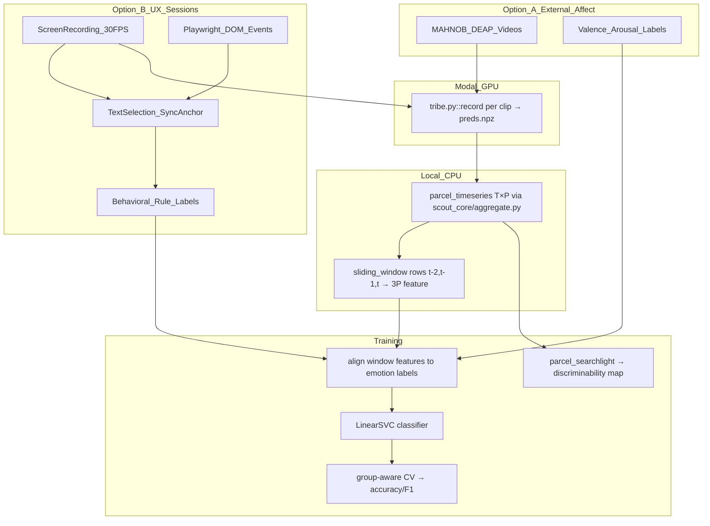

# MVPA Spatiotemporal Emotion Classification Plan

## Why not use CorrMVPA directly

[CorrMVPA](https://github.com/shobrook/mvpa) requires volumetric NIfTI input (Haxby 2001 searchlight on voxel grids). Tribe outputs **fsaverage5 cortical surface predictions** `preds[T, V]` where V=20484. Projecting surface→volume introduces interpolation artifacts and throws away the parcellation structure already built in [`scout_core/`](scout_core/). The better approach is a **surface-parcel MVPA**: same correlation-based discriminability logic, but searchlight neighborhoods are defined by Yeo-network membership over the 400 parcels already in [`configs/vertex_regions.csv`](configs/vertex_regions.csv).

## Dataset strategy options

Neural-UX Scout has two possible data strategies. The external affect-video route is useful for a sanity check, but the recommended product path is a proprietary UI/UX session dataset because the target states are action-dependent: confusion during navigation, frustration during dark patterns, and overload during dense interaction tasks.

### Option A: external affect-video datasets

**MAHNOB-HCI** and **DEAP** remain valid secondary baselines. They provide video stimuli with continuous valence/arousal annotations, physiology, and in some cases eye-tracking. Tribe can run directly on their video clips, then labels can be binned into discrete classes for a `LinearSVC` experiment.

However, these datasets are domain-mismatched for the main product:

- They measure mostly passive affective response to media, not browser interaction.
- They do not include DOM state, click intent, scroll behavior, task success, or UI element context.
- Their labels are not grounded in user actions that drive UX friction.
- Their video stimuli do not represent feature appeal, navigational uncertainty, or dark-pattern resistance.

Use this option only for generic valence/arousal sanity checks, not as the primary Neural-UX Scout training source.

### Option B: proprietary UI/UX session dataset (recommended)

Build a small, controlled dataset of browser-session recordings aligned with behavioral proxy labels. This creates `(X, y)` examples where:

- `X` comes from frozen TRIBE predictions over the screen-recorded UI session: `preds[T, 20484]`.
- `y` comes from Playwright telemetry rules: baseline, frustration, overload, or future cognitive-state labels.

This route better matches the product because the labels are generated from actual interaction patterns: clicks, scrolls, mouse movement, dwell, repeated failed actions, and DOM context.

## Data flow



## New files

- [`scripts/build_emotion_dataset.py`](scripts/build_emotion_dataset.py) — batch-run Tribe inference on labeled clips, collect sliding-window features + labels into `scout_data/emotion_dataset.npz`
- [`scripts/record_ux_session.py`](scripts/record_ux_session.py) — Playwright wrapper for browser telemetry capture during user walkthroughs
- [`scripts/sync_ux_capture.py`](scripts/sync_ux_capture.py) — align screen-recording time to Playwright event time using the text-selection visual anchor
- [`scripts/label_ux_events.py`](scripts/label_ux_events.py) — convert telemetry windows into baseline/frustration/overload labels
- [`scripts/build_ux_mvpa_dataset.py`](scripts/build_ux_mvpa_dataset.py) — join TRIBE predictions, synced telemetry labels, and sliding-window features
- [`scout_core/mvpa.py`](scout_core/mvpa.py) — `parcel_searchlight()`, `sliding_window_features()`, `fit_classifier()`, `discriminability_map()`
- [`scripts/train_emotion_classifier.py`](scripts/train_emotion_classifier.py) — CLI: load dataset, run LOVO CV, save classifier + discriminability parquet
- [`configs/emotion_classification.yaml`](configs/emotion_classification.yaml) — window length, classifier hyperparams, CV scheme
- [`configs/ux_label_rules.yaml`](configs/ux_label_rules.yaml) — thresholds for rage clicks, scroll thrashing, dwell, and baseline reading labels
- [`tests/test_mvpa.py`](tests/test_mvpa.py) — unit tests for sliding-window features, searchlight, classifier shapes
- [`tests/test_ux_label_rules.py`](tests/test_ux_label_rules.py) — unit tests for telemetry-derived labels and synchronization offsets

## Proprietary UI/UX capture protocol

### Objective

Construct a domain-specific proof-of-concept dataset of synthetic cortical surface topography and behavioral proxy labels:

```text
X: TRIBE surface prediction windows from browser session video
y: rule-derived UX cognitive-state labels from synchronized Playwright telemetry
```

This is "synthetic fMRI" in the project sense: the cortical tensor is generated by frozen TRIBE v2 from the recorded UI session, not measured from an MRI scanner.

### Subject cohort

Target `N = 5-10` for the first proof-of-concept.

- **Group A: Power Users** — highly technical users with high digital literacy and fast navigation patterns.
- **Group B: General Users** — non-technical users who provide variance in reading pace, search behavior, and navigational confidence.

The cohort is intentionally small and constrained. It is not sufficient for population-level claims; it is enough to validate capture, labeling, feature generation, and classifier plumbing.

### Capture stack

Two synchronized streams are required:

1. **Visual capture**: OBS Studio, QuickTime, or equivalent screen recording locked to strict 30 FPS.
2. **Telemetry capture**: Playwright-controlled browser event logging.

Telemetry should include:

- `event_type`: `mousemove`, `mousedown`, `mouseup`, `click`, `scroll`, `keydown`, `navigation`, `dom_snapshot`
- `timestamp_ms`: high-resolution monotonic timestamp
- `x`, `y`: viewport coordinates when applicable
- `scroll_x`, `scroll_y`
- `button`, `key`, and modifier state when applicable
- active URL
- target selector when resolvable
- target bounding box and visible text hash when safe
- DOM density features for the current viewport, such as text length, link count, button count, and input count

### Synchronization anchor

OBS/QuickTime and Playwright use different clocks. Enforce a visual anchor at the beginning of every run:

1. Start screen recording.
2. Start Playwright telemetry.
3. Instruct the user to highlight a predetermined word on the page.
4. In post-processing, find the first video frame where the text turns blue: `t_video_anchor`.
5. Match it to the corresponding Playwright `mousedown` or `selectionchange` event: `t_log_anchor`.
6. Shift telemetry timestamps:

```text
aligned_event_time_s = (event_timestamp_ms - t_log_anchor_ms) / 1000 + t_video_anchor_s
```

After this shift, labels can be binned onto the same 1 Hz timeline as TRIBE output.

### Three-task gauntlet

Each session should stay under roughly three minutes so the capture is repeatable.

#### Task 0: biological baseline

- **Stimulus**: plain-text article, such as a Wikipedia article with normal typography.
- **Task**: read at normal pace for 60 seconds.
- **Purpose**: estimate per-user baseline navigation and reading behavior. This supports z-scoring and reduces false positives during later tasks.

#### Task 1: dark pattern

- **Stimulus**: hostile UI, such as aggressive cookie consent, obscure cancellation flow, or confusing booking portal.
- **Task**: opt out, cancel, or locate a hidden negative-choice action.
- **Purpose**: elicit frustration, salience, repeated clicks, backtracking, and rapid interaction changes.

#### Task 2: data swamp

- **Stimulus**: dense configuration or pricing UI, such as AWS Pricing Calculator.
- **Task**: calculate a specific monthly cost or configure a particular resource.
- **Purpose**: elicit sustained cognitive load, slow reading, scanning, and high-effort decision behavior.

## Algorithmic label generation

The labeler converts synchronized Playwright events into a per-second label vector. The first implementation should produce either a multiclass state:

```text
0 = baseline
1 = frustration
2 = overload
```

or separate binary one-vs-rest labels:

```text
y_frustration[T]
y_overload[T]
y_baseline[T]
```

The multiclass path is simpler for `LinearSVC`; the binary path is useful if states overlap.

### Rule 1: frustration flag

Set `y_frustration = 1` for a timestep window when either condition holds.

**Rage clicks**

```text
count(clicks within radius_r of same coordinate) > 3 over 2.0 seconds
```

Suggested defaults:

```text
radius_r = 20 px
window_s = 2.0
min_clicks = 4
```

**Scroll thrashing**

```text
directional_changes(scrollY) > 4 over 5.0 seconds
and no sustained pause
```

Suggested defaults:

```text
window_s = 5.0
min_reversals = 5
pause_threshold_s = 1.0
```

### Rule 2: cognitive overload flag

Set `y_overload = 1` when the user appears stuck in a dense viewport:

```text
mouse velocity remains low
and total path distance remains high
and viewport DOM/text density is high
and no click occurs for > 15 seconds
```

Suggested defaults:

```text
window_s = 15.0
max_mean_velocity_px_s = 80
min_total_distance_px = 600
min_text_chars_in_viewport = 1500
max_click_count = 0
```

### Rule 3: baseline normal

Set `y_baseline = 1` only when no frustration or overload rule fires and the session is in the baseline task or the behavior resembles steady reading:

```text
steady downward scrollY velocity
low click count
no repeated coordinate clicks
no scroll thrashing
```

Suggested defaults:

```text
scroll_direction_consistency >= 0.8
click_count_per_10s <= 1
```

## Feature design

From `preds[T, V]`:

1. Apply `parcel_timeseries(preds, vp)` → `parcel_ts[T, P]` (P=400) — already in [`scout_core/aggregate.py`](scout_core/aggregate.py)
2. Apply `network_timeseries(parcel_ts, ...)` → `net_ts[T, 7]`
3. Build **spatiotemporal sliding windows** over `parcel_ts`:
   - To predict timestep `t`, extract rows `[t-2, t-1, t]` from the masked matrix.
   - Flatten the `3 × P` window into a 1D feature vector.
   - With P parcel vertices/features, each timestep sample has feature length `3 * P`.
   - Drop the first two timesteps per video, or left-pad only if every video uses the same padding rule.

For the UI/UX session path, labels must be aligned to the TRIBE timeline before windowing:

1. Convert Playwright event timestamps to video-relative seconds with the synchronization anchor.
2. Generate dense per-second labels at 1 Hz.
3. Run `tribe.py::record` on the synchronized screen recording to produce `preds[T, 20484]`.
4. Aggregate to parcels: `parcel_ts[T, P]`.
5. Build sliding windows: `X[i] = flatten(parcel_ts[i:i+3, :])`.
6. Assign each window the label at its right edge, majority label over the window, or max-severity label over the window. Use one policy globally and record it in `configs/emotion_classification.yaml`.

If the implementation uses the 400-parcel mapping, the 3-second feature dimension is `3 * 400 = 1200`. A `3600` feature vector only applies if using 1200 parcel/network-derived features per second. Keep the dimensionality explicit in config and tests.

## Model

**LinearSVC** as primary classifier (fast, regularized, interpretable weights over parcel-time features):

```python
from sklearn.model_selection import LeaveOneGroupOut, cross_validate
from sklearn.pipeline import make_pipeline
from sklearn.preprocessing import StandardScaler
from sklearn.svm import LinearSVC

model = make_pipeline(
    StandardScaler(),
    LinearSVC(C=1.0, class_weight="balanced", max_iter=10_000),
)

# X: shape (n_timestep_samples, 3 * P)
# y: shape (n_timestep_samples,)  — emotion class label
# groups: shape (n_timestep_samples,)  — video_id for LOVO splitting
cv = LeaveOneGroupOut()
scores = cross_validate(
    model,
    X,
    y,
    groups=groups,
    cv=cv,
    scoring=["accuracy", "f1_macro"],
)
```

Cross-validation depends on the data source:

- **Option A external datasets**: use **Leave-One-Video-Out (LOVO)** to avoid temporal autocorrelation leakage between windows from the same source video.
- **Option B UX sessions**: use **group-aware splits** that hold out entire sessions, subjects, or tasks. The strictest proof is leave-one-subject-out; the practical first pass is leave-one-session-out.

Report accuracy and macro-F1. For imbalanced binary labels, also report precision, recall, and event-level false positives per minute.

If the labels remain continuous valence/arousal rather than discrete emotion classes, bin them into predefined classes before `LinearSVC`, or run a separate regression experiment. Do not use `mean_pool`, `pls_pool`, `MultiOutputRidge`, or RBF `SVR` as the primary feature/model path because pooled clip features discard the temporal BOLD slope.

For the proprietary UI/UX path, labels are behavioral proxy classes rather than ground-truth emotions. Prefer class names such as `frustration_proxy`, `overload_proxy`, and `baseline_proxy` in saved artifacts.

## Surface-parcel searchlight (MVPA discriminability map)

Mirrors Haxby 2001 / CorrMVPA logic, adapted to parcels:

- For each parcel p, define a **neighborhood** = {p} + parcels sharing its Yeo network (from `parcel_to_network_map` in [`scout_core/parcellation.py`](scout_core/parcellation.py))
- Split clips into even/odd halves → compute within- vs between-condition correlations across the neighborhood feature vectors
- Produces `discriminability[P]` — one score per parcel, writeable to `scout_norms/<norm_id>/discriminability.parquet` for visualization

## Integration with existing pipeline

The classifier can consume `session_roi_timeseries` rows already written to SQLite by `analyze_session.py`. The `parcel_ts` matrix can be reconstructed from:

```sql
SELECT t_idx, parcel_id, value FROM session_roi_timeseries
WHERE session_id = ? AND norm_id = ?
ORDER BY t_idx, parcel_id
```

For UX session training, persist a session-level training artifact so labels and synchronization metadata remain auditable:

```text
scout_data/ux_sessions/<session_id>/
  screen_recording.mp4
  telemetry_raw.jsonl
  sync_anchor.json
  labels_1hz.parquet
  preds.npz
  mvpa_features.npz
```

No new SQLite schema is required for the first classifier. Add tables only after the file-backed pipeline stabilizes.

## Risks and validation guardrails

- **Proxy label limitation**: rage clicks and scroll thrashing are behavioral proxies. They are not clinical or emotional ground truth.
- **Small cohort risk**: `N=5-10` is only enough to validate instrumentation and modeling mechanics. Do not claim demographic generality.
- **Leakage risk**: windows from the same session are highly autocorrelated. Never randomly split windows. Split by `session_id`, `subject_id`, or `task_id`.
- **Task shortcut risk**: the classifier may learn "dark pattern page" instead of frustration. Include multiple UIs per task type as soon as possible.
- **User identity shortcut risk**: with a small cohort, the classifier may learn person-specific motor behavior. Use leave-one-subject-out once enough sessions exist.
- **Synchronization risk**: bad anchor detection corrupts labels. Store `sync_anchor.json` and manually review a sample of every session.
- **TRIBE limitation**: TRIBE predictions are model-relative cortical hypotheses from video, not measured fMRI.
- **Copy guardrail**: report outputs as "frustration proxy" or "overload proxy" unless validated against self-report or external ground truth.

## Recommended implementation order

1. Implement `scripts/record_ux_session.py` to capture Playwright telemetry while the user records the screen.
2. Implement `scripts/sync_ux_capture.py` and manually validate the text-selection anchor.
3. Implement `configs/ux_label_rules.yaml` and `scripts/label_ux_events.py`.
4. Run `tribe.py::record` on each screen recording.
5. Implement `scripts/build_ux_mvpa_dataset.py` to generate `X`, `y`, and `groups`.
6. Extend `scout_core/mvpa.py` with `sliding_window_features()` and classifier helpers.
7. Train with group-aware CV and inspect event-level false positives before adding dashboard visualizations.

## Dependencies to add to requirements.txt

- `scikit-learn>=1.4` (`LinearSVC`, `LeaveOneGroupOut`, `cross_validate`, `StandardScaler`)
- `joblib>=1.3` (parallel searchlight)
- `playwright>=1.40` (UX telemetry capture)

`scikit-learn` and `joblib` are pure-Python friendly. `playwright` requires a browser install step such as `python -m playwright install chromium`.
