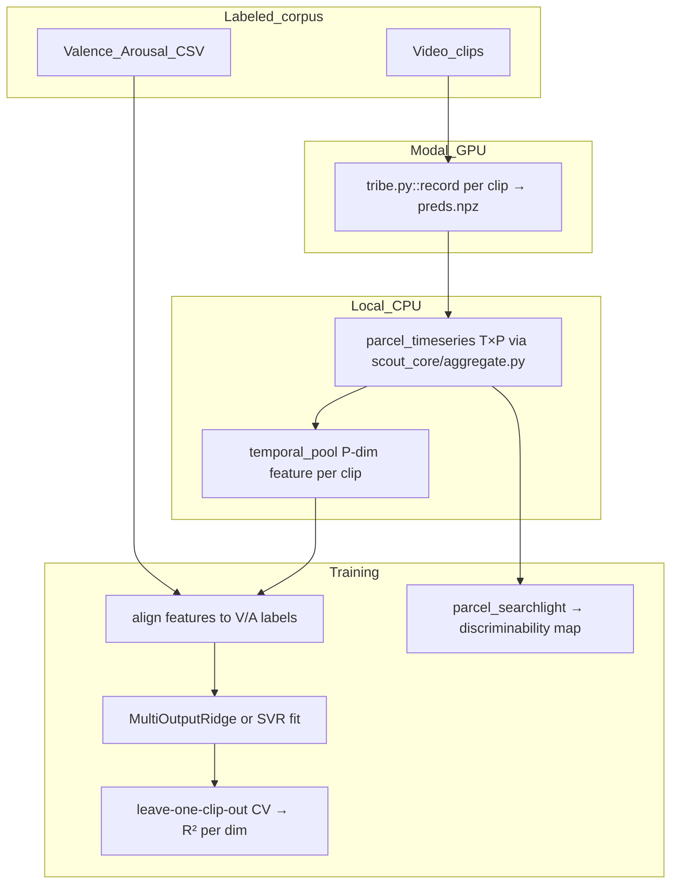

# MVPA Dimensional Emotion Regression Plan

## Why not use CorrMVPA directly

[CorrMVPA](https://github.com/shobrook/mvpa) requires volumetric NIfTI input (Haxby 2001 searchlight on voxel grids). Tribe outputs **fsaverage5 cortical surface predictions** `preds[T, V]` where V=20484. Projecting surface→volume introduces interpolation artifacts and throws away the parcellation structure already built in [`scout_core/`](scout_core/). The better approach is a **surface-parcel MVPA**: same correlation-based discriminability logic, but searchlight neighborhoods are defined by Yeo-network membership over the 400 parcels already in [`configs/vertex_regions.csv`](configs/vertex_regions.csv).

## External dataset recommendation

**MAHNOB-HCI** (preferred) — video clips rated with continuous valence/arousal, physiology, and eye tracking. Tribe runs on video directly.

**DEAP** — 40 music video clips with per-clip V/A ratings. Simpler to start with but lower temporal resolution of labels.

Both are academic-use datasets. Download links require institutional registration. The plan assumes you have obtained the video stimuli and their per-clip (or per-segment) V/A annotation CSVs.

## Data flow



## New files

- [`scripts/build_emotion_dataset.py`](scripts/build_emotion_dataset.py) — batch-run Tribe inference on labeled clips, collect features + labels into `scout_data/emotion_dataset.npz`
- [`scout_core/mvpa.py`](scout_core/mvpa.py) — `parcel_searchlight()`, `temporal_pool()`, `fit_regression()`, `discriminability_map()`
- [`scripts/train_emotion_regression.py`](scripts/train_emotion_regression.py) — CLI: load dataset, run CV, save model + discriminability parquet
- [`configs/emotion_regression.yaml`](configs/emotion_regression.yaml) — pooling strategy, model hyperparams, CV scheme
- [`tests/test_mvpa.py`](tests/test_mvpa.py) — unit tests for pooling, searchlight, regression shapes

## Feature design

From `preds[T, V]`:

1. Apply `parcel_timeseries(preds, vp)` → `parcel_ts[T, P]` (P=400) — already in [`scout_core/aggregate.py`](scout_core/aggregate.py)
2. Apply `network_timeseries(parcel_ts, ...)` → `net_ts[T, 7]`
3. **Temporal pooling** (configurable):
   - `mean_pool`: mean over T → P-dim vector (fast baseline)
   - `mean_std_pool`: concat mean+std → 2P-dim
   - `pls_pool`: PLS-based projection aligned to V/A labels (most principled for dimensional regression)

## Model

**Multi-output Ridge regression** as primary (fast, regularized, interpretable weights per parcel):

```python
from sklearn.linear_model import RidgeCV
from sklearn.multioutput import MultiOutputRegressor

model = RidgeCV(alphas=[0.01, 0.1, 1, 10, 100])
# X: shape (n_clips, P) or (n_clips, 2P)
# y: shape (n_clips, 2)  — [valence, arousal]
```

Cross-validation: **leave-one-clip-out** (LOCO-CV) to avoid temporal autocorrelation leakage between clips. Report R² and Pearson r separately for valence and arousal.

**Optional follow-on**: SVR with RBF kernel via `sklearn.svm.SVR` if Ridge underfits on non-linear patterns.

## Surface-parcel searchlight (MVPA discriminability map)

Mirrors Haxby 2001 / CorrMVPA logic, adapted to parcels:

- For each parcel p, define a **neighborhood** = {p} + parcels sharing its Yeo network (from `parcel_to_network_map` in [`scout_core/parcellation.py`](scout_core/parcellation.py))
- Split clips into even/odd halves → compute within- vs between-condition correlations across the neighborhood feature vectors
- Produces `discriminability[P]` — one score per parcel, writeable to `scout_norms/<norm_id>/discriminability.parquet` for visualization

## Integration with existing pipeline

The regression model consumes `session_roi_timeseries` rows already written to SQLite by `analyze_session.py`. The `parcel_ts` matrix can be reconstructed from:

```sql
SELECT t_idx, parcel_id, value FROM session_roi_timeseries
WHERE session_id = ? AND norm_id = ?
ORDER BY t_idx, parcel_id
```

No new data storage schema required.

## Dependencies to add to requirements.txt

- `scikit-learn>=1.4` (Ridge, SVR, MultiOutputRegressor, cross_val_score)
- `joblib>=1.3` (parallel searchlight)

Both are pure-Python and install cleanly into the existing `.venv`.
