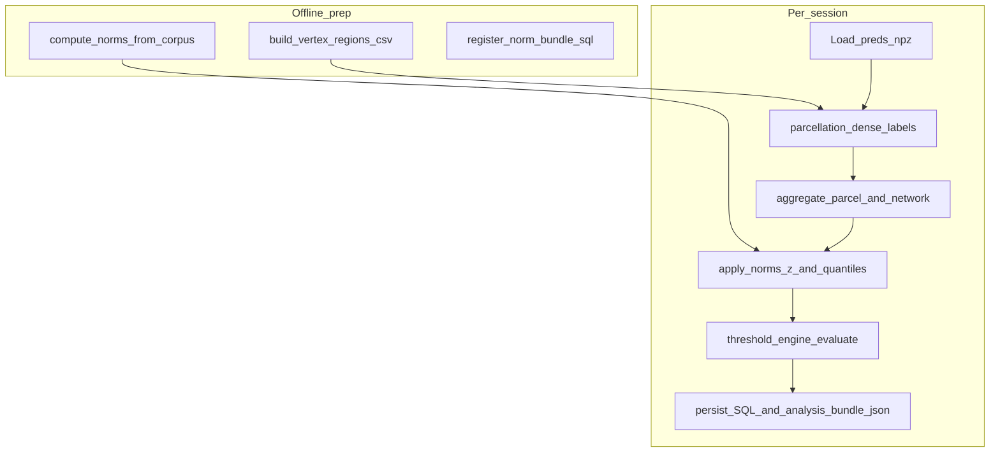

# Microplan: atlas-backed regions, normative comparison, calibrated thresholds

Companion doc for **[NEURAL_UX_SCOUT_IMPLEMENTATION_PLAN.md](NEURAL_UX_SCOUT_IMPLEMENTATION_PLAN.md)** and **[phases.md](phases.md)**. Execution blueprint for the **strong neuroscience-facing layer** on top of scaffolding in [`activation_store.py`](activation_store.py) (within-session percentiles + coarse `vertex_fraction` bins).

---

## Goal

Turn dense **`preds[T, V]`** into:

1. **Anatomically meaningful regions** via a versioned vertex→parcel mapping (replacing mesh-index proxies).
2. **Normative comparison**: each ROI aggregate compared to a **reference distribution** (mean/SD or empirical quantiles) per ROI.
3. **Calibrated thresholds**: declarative rules (YAML) using **z-scores or excess-over-quantile**, producing auditable flags + confidence—not raw “emotion labels.”

Guardrail (product copy): output language remains **model-relative hypotheses**, aligned with Neural-UX Scout §3 in the main implementation plan.

---

## Current integration points (do not break)

| Artifact | Role |
|----------|------|
| `scout_data/sessions/<id>/preds.npz` | Source of truth matrix `preds` `(T, V)` |
| [`configs/vertex_regions.csv`](configs/vertex_regions.csv) | Optional legacy two-column form or extended atlas-backed columns |
| [`scout_data/activations.sqlite`](scout_data/activations.sqlite) | Append neuro tables; keep existing `sessions`, `activation_peak`, lookup bands |

---

## Data artifacts (versioned, reproducible)

### A. `configs/parcellation_manifest.yaml`

Single source of truth for reproducibility:

```yaml
mesh: fsaverage5
tribe_vertex_order: facebook/tribev2  # confirm against Tribev2 plotting mesh
atlas_id: schaefer2018_400_fsaverage5  # example
yeo7_map_version: 7Networks_Labels_v1   # example
artifact_sha256:
  labels_gii_lh: "<hex>"
  labels_gii_rh: "<hex>"
```

### B. `configs/vertex_regions.csv` (extended columns)

Minimum columns after upgrade:

| Column | Type | Purpose |
|--------|------|---------|
| `vertex_index` | int | 0..V-1, Tribev2 order |
| `parcel_id` | int | Stable atlas parcel id |
| `parcel_label` | string | Human label (e.g. Schaefer name) |
| `yeo_network_id` | int (nullable) | 1–7 or NULL if unknown |
| `yeo_network_name` | string | e.g. `SomMot`, `SalVentAttn` |
| `hemisphere` | `lh`/`rh` | From atlas |

**Generation path (offline script, not hand-edited):**

- Input: FreeSurfer/fsaverage5-compatible label GIFTI (lh/rh) **or** nilearn-fetchable volumetric labels projected to surface (document chosen path).
- Script: [`scripts/build_vertex_regions_csv.py`](scripts/build_vertex_regions_csv.py)
  - Validate `len(unique(vertex_index)) == V` and contiguous `0..V-1`.
  - Emit CSV + update manifest counts/shas.

### C. Normative reference bundle `scout_norms/<norm_id>/`

| File | Contents |
|------|----------|
| `roi_norms.parquet` | One row per `parcel_id`: `mean`, `std`, `n_samples`, optional `q05,q50,q95` |
| `network_norms.parquet` | One row per `yeo_network_id`: same stats **after** vertex→parcel aggregation policy |
| `meta.json` | `norm_id`, TRIBE checkpoint id, clip corpus id, date, exclusion rules |

**How norms are built (pick one in implementation; document in meta):**

- **Internal empirical**: run Tribev2 on **N** held-out naturalistic clips (not the evaluated ad); aggregate ROI means per timestep; pool across time×clips for stable moments—store robust stats (median/MAD optional columns).
- **External / literature**: only if you obtain compatible Tribev2-native statistics (usually **not** available); prefer internal empirical for calibration consistency.

---

## Low-level code layout

New package directory:

```text
scout_core/
  __init__.py
  parcellation.py       # load vertex_regions.csv → dense parcel_id[V]
  aggregate.py          # preds[T,V] + mapping → parcel_ts[T,P], network_ts[T,Nnets]
  norms.py              # load roi_norms / network_norms; z-score + quantile excess
  threshold_engine.py   # calibrated_rules.yaml → ThresholdHit list
  schemas.py            # pydantic models
  storage_migrations.py # neuro SQLite DDL + inserts

scripts/
  build_vertex_regions_csv.py   # atlas → CSV
  compute_norms.py              # corpus preds.npz → scout_norms/<norm_id>/
  analyze_session.py            # session id → SQLite augment + analysis_bundle.json
```

---

## Core functions (signatures-level contract)

**[`scout_core/parcellation.py`](scout_core/parcellation.py)**

```python
def load_vertex_table(path: Path) -> VertexParcellationTable: ...
def dense_parcel_labels(table: VertexParcellationTable, n_vertices: int) -> np.ndarray: ...  # shape (V,)
def parcel_to_network_map(table: VertexParcellationTable) -> dict[int, int]: ...  # parcel_id -> yeo_network_id
```

**[`scout_core/aggregate.py`](scout_core/aggregate.py)**

```python
def parcel_timeseries(preds, vertex_parcel, *, reducer: str = "mean") -> tuple[np.ndarray, np.ndarray]: ...
def network_timeseries(parcel_ts, parcel_ids, parcel_to_net, *, reducer: str = "mean") -> tuple[np.ndarray, list[int]]: ...
```

Reducer policy must be **fixed and documented** (mean vs median vs mean_abs).

**[`scout_core/norms.py`](scout_core/norms.py)**

```python
def zscore_roi(parcel_ts, norms, parcel_ids) -> np.ndarray: ...
def quantile_flags(parcel_ts, norms, parcel_ids, *, hi_q: float = 0.95) -> np.ndarray: ...
```

**[`scout_core/threshold_engine.py`](scout_core/threshold_engine.py)**

```python
def evaluate_rules(ctx: ThresholdContext, rules_path: Path, insight_catalog_path: Path) -> list[ThresholdHit]: ...
```

---

## Calibrated rules

[`configs/calibrated_rules.yaml`](configs/calibrated_rules.yaml) — structured thresholds on **`network`** names matching [`scout_core/constants.py`](scout_core/constants.py) Yeo-style labels.

Human-readable strings: [`configs/insight_catalog.yaml`](configs/insight_catalog.yaml) keyed by `insight_key`.

---

## SQLite extensions (neuro tables)

- **`norm_bundle`** — `norm_id`, parquet paths, `meta_json`, `created_at`
- **`session_roi_timeseries`** — per timestep parcel values + `z_vs_norm`
- **`session_network_timeseries`** — per timestep network values + `z_vs_norm`
- **`threshold_hit`** — rule firings + evidence JSON

DDL lives in [`scout_core/storage_migrations.py`](scout_core/storage_migrations.py); [`activation_store.py`](activation_store.py) calls `ensure_neuro_schema()` on connect.

---

## Execution pipeline



---

## Integration with `modal run tribe.py::record`

- **Modal / GPU**: inference unchanged; writes `preds.npz` + SQLite peaks (UX scaffolding).
- **Local CPU post-step**: `python scripts/analyze_session.py --session-id … --norm-id …` reads `preds.npz`, fills neuro tables + **`scout_data/sessions/<id>/analysis_bundle.json`**.

---

## Validation checklist

- **Parcellation**: every `vertex_index` in `[0, V-1]` appears exactly once; `V` matches `preds.shape[1]`.
- **Aggregation**: vertex counts per parcel sane for chosen reducer.
- **Norms**: every aggregated `parcel_id` / network id has a norm row or explicit fallback policy.
- **Rules**: unit tests with synthetic `z_network` (see [`tests/test_scout_core.py`](tests/test_scout_core.py)).
- **Leakage**: norm corpus disjoint from evaluated clips.

---

## Dependencies (local)

See [`requirements.txt`](requirements.txt): `numpy`, `pandas`, `pydantic`, `pyarrow`, `pyyaml`, `nibabel`, `pytest`, plus `modal` as needed.

---

## Estimated effort ordering

1. Parcellation CSV builder + manifest.
2. `aggregate.py` + tests.
3. `compute_norms.py` + parquet bundles.
4. `norms.py` + neuro SQLite migrations + inserts.
5. `threshold_engine.py` + YAML + insight catalog.
6. `analyze_session.py` + `analysis_bundle.json`.
