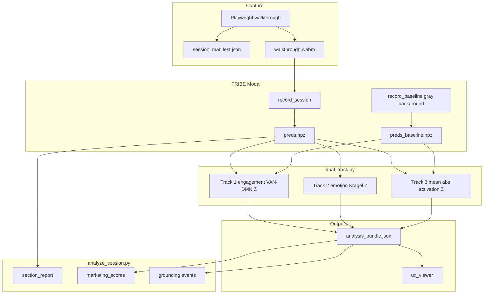

# Coding Session — May 28, 2026 (consolidated)

**Session ID:** `CS-20260528-WEBSITE-CONSOLIDATED`  
**Agent signature:** `Historical Cursor coding agent`  
**Context contract:** Future agents may cite this session ID when asking about the May 25-28 website-pipeline handoff, ViralAnalyser learnings, marketing scores, triple-track scoring, NeuroEmo archiving, Schaefer atlas fixes, and Aurora E2E ladder.  
**Metadata normalized by:** `GPT-5.5, 2026-06-07`

## Website pipeline focus: ViralAnalyser learnings, triple-track scoring, NeuroEmo archive, and E2E validation

**Scope:** Consolidates work from five Cursor agent chats on May 25–28, 2026. This is the handoff doc for teammates who were not in those sessions.

**Source chats (parent transcript IDs):**

| Chat focus | Transcript |
|------------|------------|
| ViralAnalyser analysis, marketing score layer, NeuroEmo archive, Track 3 activation, gray baseline, E2E grounding | [09106e81-dc59-4bf8-a006-894baa48398e](09106e81-dc59-4bf8-a006-894baa48398e) |
| NeuroEmo training specialist subagent creation | [99e4441d-bb0d-452e-aae5-2aec999d839d](99e4441d-bb0d-452e-aae5-2aec999d839d) |
| Vertex equivalence review, dataset install, specialist agent | [d94e8781-c78e-4ab7-b2e2-64ad7daaf2a1](d94e8781-c78e-4ab7-b2e2-64ad7daaf2a1) |
| Two-week descope, E2E testing ladder, Aurora fixture, subcortical research | [8187e6f6-3e3f-4c7e-b2eb-ad53bc18fd6b](8187e6f6-3e3f-4c7e-b2eb-ad53bc18fd6b) |
| NeuroEmo high-leverage phases 1–6 matrix execution | [5abbe1bb-ebde-444f-824c-984296820204](5abbe1bb-ebde-444f-824c-984296820204) |

---

## 1. Executive summary — what changed strategically

### Priority shift (most important for the team)

| Before (implicit) | After (explicit, May 28) |
|-------------------|---------------------------|
| Parallel NeuroEmo R&D + website pipeline treated as one “product” | **Website E2E spine is mainline**; NeuroEmo is **archived research** |
| Engagement = only neural “attention” signal | **Three parallel tracks** on `preds.npz`: VAN−DMN engagement, Kragel emotion, **mean \|preds\| activation** |
| Baseline for engagement ad hoc / missing | **Shared gray-background baseline** at `scout_data/baseline/preds_baseline.npz` |
| Marketer-facing 0–100 scores = future idea | **`marketing_scores`** layer on `analysis_bundle.json` (schema v4) |
| Yeo network names assumed to match CSV exactly | **Schaefer 400 @ fsaverage5** with **prefix-matched** coarse networks (`SalVentAttn`, `Default`) |

NeuroEmo supervised training (film-watching fMRI → 5-class classifiers) is **not removed** — it lives under `neuroEmoCode/` and remains valuable for later — but it **does not run** in `run_website_session.py` or `analyze_session.py --website` today.

### What “done” means for the prototype spine

```text
Playwright capture → Modal TRIBE (preds.npz) → dual_track (3 tracks)
  → heatmaps → analyze_session (--website --ground) → marketing_scores + events[]
  → export_ux_viewer
```

**Proven in code:** Layer 0 unit tests (142 tests after May 28 changes).  
**Proven on real session:** Aurora session `e6f04960ad5f40c4805f3e6c65b850e3` — dual-track + grounding + marketing scores (see §6).

---

## 2. Architectural decision log

### ADR-1: Keep TRIBE inference unchanged; add read-only layers on top

**Decision:** Marketing scores and activation analysis are **transforms** of existing `preds.npz` and dual-track outputs — no re-run of TRIBE, no replacement of `engagement_track` Z-scores.

**Rationale:** ViralAnalyser’s useful patterns are **display and rubric** layers, not better neuroscience. TribeV2 already has DOM grounding and section analytics they lack.

**Deferred:** Multi-session A/B comparison with floor weighting (`0.48×early + 0.34×avg + 0.18×floor`) — documented in `configs/marketing_scores.yaml` comments only.

---

### ADR-2: Archive NeuroEmo into `neuroEmoCode/` per directory

**Decision:** Move scripts, tests, docs, plans, agents, and `scout_data/neuroemo` → `scout_data/neuroEmoCode/` into parallel `neuroEmoCode/` folders; stub main E2E docs to Kragel zero-shot only.

**Rationale:** Repo had become hard to navigate; website pipeline work was blocked by atlas/training noise in every search. ML emotion classification is explicitly “later.”

**Still shared with mainline:** `configs/vertex_regions.csv`, `configs/parcellation_manifest.yaml`, `scout_core/vertex_equivalence.py` (Schaefer atlas supports **Track 1 VAN/DMN**, not NeuroEmo inference).

**Pointers:** `.cursor/agents/neuroemo-training-specialist.md` → archived copy under `.cursor/agents/neuroEmoCode/`.

---

### ADR-3: Schaefer atlas for Track 1 (not bare Yeo string match)

**Decision:** Engagement Track 1 uses **verified** `configs/vertex_regions.csv` (Schaefer 2018 400 parcels, 7 networks, fsaverage5). `load_network_indices()` matches **coarse** keys from `configs/dual_track.yaml` (`SalVentAttn`, `Default`) as **prefixes** on subnetwork labels (`SalVentAttn_ParOper`, `Default_PFC`, …).

**Bug fixed:** Exact match `yeo_network_name == "SalVentAttn"` matched **zero** vertices after Schaefer migration → all engagement scores were `null` with `no_vertex_map`.

**Does not change:** Track 2 emotion templates (whole-brain Kragel maps, cosine on normalized `preds` rows).

---

### ADR-4: Track 3 — mean vertex activation (ViralAnalyser-style)

**Decision:** Add `activation_track` = `mean(abs(preds[t, :]))` per TR, with **baseline-relative Z** vs gray-background `preds_baseline.npz` when available.

**Why separate from Track 1:** Track 1 is **network-contrast** (VAN−DMN vs baseline). Track 3 is **global cortical magnitude** — closer to ViralAnalyser’s `activation[t] = mean(|preds|)` for marketer “attention” curves.

**Analysis integration (May 28 follow-up):** Track 3 is not only in `run_dual_track.py`; it now flows into:

- `section_report[].activation`
- `marketing_scores.activation_analysis` (0–100 display curve + per-section ranks)
- UX viewer second curve (gold polyline)

---

### ADR-5: Gray `gray background.mp4` as canonical baseline

**Decision:** `modal run tribe.py::record_baseline` writes `scout_data/baseline/preds_baseline.npz` (41 TRs in dev run). `run_dual_track.py` auto-loads this path unless `--baseline-session-id` / `--baseline-preds` overrides.

**Used by:** Track 1 (VAN/DMN Z) and Track 3 (activation Z).

---

### ADR-6: Do not train subcortical TRIBE for website zero-shot (May 28 research)

**Decision:** Keep **pretrained cortical** TRIBE for website sessions; defer subcortical `MaskProjector` training.

**Rationale (from [8187e6f6](8187e6f6-3e3f-4c7e-b2eb-ad53bc18fd6b)):** Public checkpoint outputs **20,484 cortical vertices** only. Subcortical predictions require a **different training recipe**. Limbic structures are emotion-relevant but not emotion-specific; Kragel templates on cortex are already a coarse proxy.

**Next move if revisiting:** Validation-first ablation (limbic-restricted templates), not a full pipeline swap.

---

## 3. External reference: tribeV2_ViralAnalyser

Cloned to `_external/tribeV2_ViralAnalyser` during [09106e81](09106e81-dc59-4bf8-a006-894baa48398e).

| Their mode | Engine | TribeV2 equivalent |
|------------|--------|------------------|
| Website URL | OpenCV saliency + fold strips | **Not used** — we use TRIBE + Playwright + DOM |
| Video upload | TRIBE + `review_engine.py` | `preds.npz` + dual-track + marketing layer |

**Patterns we adopted (a–g from planning):**

| Pattern | Adopted? | TribeV2 location |
|---------|----------|----------------|
| (a) Activation + novelty decomposition | Yes | `engagement_track` + `preds` L2 diff in `marketing_scores` |
| (b) Min–max display curve 0–100 | Yes | `marketing_scores.display_curve`, `activation_analysis.display_curve` |
| (c) Five-metric rubric | Yes | `marketing_scores.session_metrics` |
| (d) Dual-threshold drop moments | Yes | `marketing_scores.drop_moments` (separate from `grounding_triggers`) |
| (e) Edge/tail TR masking | Yes | `valid_tr_indices()` in `marketing_scores.py` |
| (f) Comparison floor weighting | **Deferred** | Comment in YAML only |
| (g) Canonical curve → editorial markers | Yes | `focus_windows`, LLM payload, viewer curve |

---

## 4. What shipped — by workstream

### A. Marketing score layer ([09106e81](09106e81-dc59-4bf8-a006-894baa48398e))

| Artifact | Path |
|----------|------|
| Core math | `scout_core/marketing_scores.py` |
| Config | `configs/marketing_scores.yaml` |
| Writer | `scripts/analyze_session.py` (`--website` / `--sections`, `--no-marketing-scores`) |
| Passthrough | `_DUAL_TRACK_PASSTHROUGH_KEYS` includes `marketing_scores` |
| Schema doc | `scout_core/schemas.py` (v4 when `marketing_scores` present) |
| Narrative | `scout_core/llm_narrative.py` |
| Viewer | `viewer/ux_session_viewer.html`, `scripts/export_ux_viewer.py` |
| Tests | `tests/test_marketing_scores.py` |
| Runbook | `docs/runbooks/website-session.md` |

`analysis_bundle.json` gains optional:

```json
{
  "schema_version": 4,
  "marketing_scores": { "display_curve", "session_metrics", "overall_score", "drop_moments", "activation_analysis", ... },
  "dual_track_schema_version": 3
}
```

---

### B. Triple-track dual engine ([09106e81](09106e81-dc59-4bf8-a006-894baa48398e))

| Track | Key | Metric |
|-------|-----|--------|
| 1 | `engagement_track` | Z(VAN) − Z(DMN) vs gray baseline |
| 2 | `emotion_track` | Kragel cosine + session-relative Z |
| 3 | `activation_track` | mean(\|preds\|) per TR; baseline Z or session Z |

| File | Change |
|------|--------|
| `scout_core/dual_track.py` | `compute_activation_track`, `_network_name_mask`, Schaefer prefix match |
| `configs/dual_track.yaml` | `activation`, `baseline` sections |
| `scripts/run_dual_track.py` | Track 3 wiring, auto baseline path, schema v3 |
| `tribe.py` | `record_baseline` entrypoint |
| `tests/test_dual_track.py` | Network + activation tests |

---

### C. NeuroEmo archive ([09106e81](09106e81-dc59-4bf8-a006-894baa48398e))

Moved into `neuroEmoCode/` under:

- `scripts/`, `scout_core/`, `tests/`, `docs/`, `coding-sessions/`, `.cursor/plans/`, `.cursor/agents/`, `scout_data/`

Mainline updates:

- `tests/conftest.py` — skips `tests/neuroEmoCode/` in default pytest
- `scout_core/vertex_equivalence.py`, `tribe.py`, `configs/parcellation_manifest.yaml` — paths → `neuroEmoCode`
- `.gitignore` — `scout_data/neuroEmoCode`
- Playwright pipeline agent/docs — zero-shot emotion only

**Zero-shot emotion path unchanged:** `run_dual_track.py` → NeuroVault templates in `configs/emotion_templates/` — **no** NeuroEmo `.joblib` models.

---

### D. Playwright / E2E testing ladder ([8187e6f6](8187e6f6-3e3f-4c7e-b2eb-ad53bc18fd6b))

Updated `.cursor/plans/two-week-descope_d421477d.plan.md`:

- Freeze NeuroEmo on mainline until website E2E proven
- Four-layer test ladder (unit → capture → dual-track → full analyze/ground)

**Aurora showcase fixture** (`tests/fixtures/walkthrough_site/index.html`):

- Scroll-driven visuals, semantic sections (`#hero`, `#pricing`, …)
- Script: `configs/walkthrough_scripts/aurora_showcase.yaml` (~14 TRs vs 5 for localhost demo)
- Purpose: richer emotion/engagement signal for zero-shot tests

| Layer | Status (May 28) |
|-------|-------------------|
| **0** Unit/regression | **142 passed** (after Track 3 + marketing) |
| **1** Playwright capture | Passed — Aurora → `e6f04960ad5f40c4805f3e6c65b850e3` |
| **2** Dual-track | Ran on Aurora session with gray baseline |
| **3–4** Heatmaps + analyze + ground | Ran; 6 grounding events; see caveats §6 |

---

### E. NeuroEmo R&D (parallel, archived) — [d94e8781](d94e8781-c78e-4ab7-b2e2-64ad7daaf2a1), [5abbe1bb](5abbe1bb-ebde-444f-824c-984296820204)

**Vertex equivalence ([d94e8781](d94e8781-c78e-4ab7-b2e2-64ad7daaf2a1)):**

- Conclusion: May 25 work hardened **contracts** (20484 vertices, `lh_then_rh`, manifest hashes) but did not originally prove **numeric TRIBE vs NeuroEmo equivalence**
- Plan: `.cursor/plans/neuroEmoCode/vertex_equivalence_proof_eb9fafb6.plan.md` (archived path)
- Later: `projection_equivalence_verified` in reports ([5abbe1bb](5abbe1bb-ebde-444f-824c-984296820204))

**NeuroEmo matrix phases 1–6 ([5abbe1bb](5abbe1bb-ebde-444f-824c-984296820204)):**

- Phase 1: proof status docs/tests
- Phase 2: surface postfix matrix under `scout_data/neuroEmoCode/models/2026-05-27_surface_annot_matrix/`
- Phases 3–6: timing/dynamic/preproc/hierarchical experiments
- Fixed training script `sys.path` imports for matrix runner

**Agent:** `.cursor/agents/neuroEmoCode/neuroemo-training-specialist.md` (archived from project root).

---

## 5. Pipeline diagram (current mainline)



---

## 6. Validation snapshot — Aurora session `e6f04960ad5f40c4805f3e6c65b850e3`

After gray baseline + E2E script (May 28):

| Check | Result |
|-------|--------|
| Engagement Track 1 | 19/19 TRs scored, `baseline_flag=null` |
| Activation Track 3 | `baseline_relative`, mean \|preds\| ~0.12–0.17 |
| Emotion Track 2 | 7 templates, 19 grounding triggers |
| Grounding `--ground` | 6 events (5 DOM-grounded; t=14 missing heatmap) |
| Marketing scores | `overall_score=24`, schema v4 |
| `section_report[].activation` | Per-section mean_raw / mean_z |

**Caveats:**

- `analyze_session.py` had a Windows `UnicodeEncodeError` on `→` in print statements — fixed to ASCII `->`
- Session `061cd43c2d0a41fe8ce43b695c564ae8` has manifest but **no `preds.npz`** until `modal run tribe.py::record_session` is run
- E2E helper: `scripts/e2e_dual_track_grounding.ps1` (log: `scout_data/e2e_dual_track_grounding.log`)

---

## 7. Key findings for teammates

### Zero-shot vs NeuroEmo (common confusion)

| Question | Answer |
|----------|--------|
| Did NeuroEmo replace website emotion? | **No.** Website uses Kragel templates + session Z. |
| Where is NeuroEmo used? | Training/eval under `scripts/neuroEmoCode/`, data under `scout_data/neuroEmoCode/`. |
| Why keep Schaefer CSV in mainline? | Track 1 VAN/DMN vertex masks — not NeuroEmo classifiers. |

### Two “attention” metrics

| Metric | Source | Use |
|--------|--------|-----|
| `engagement_track.scores` | VAN−DMN vs baseline | Scientific engagement contrast |
| `activation_track.raw_scores` | mean(\|preds\|) | ViralAnalyser-style global attention |
| `marketing_scores.display_curve` | 0.7×engagement + 0.3×novelty (min-max) | Marketer-facing compound chart |

### Grounding vs marketing drops

- **`grounding_triggers`** — drive heatmap/DOM pipeline (`configs/isolation_thresholds.yaml`)
- **`marketing_scores.drop_moments`** — editorial 0–100 curve dips (additive, not a replacement)

---

## 8. File map (quick reference)

| Concern | Primary paths |
|---------|----------------|
| Triple-track | `scout_core/dual_track.py`, `scripts/run_dual_track.py`, `configs/dual_track.yaml` |
| Baseline | `gray background.mp4`, `scout_data/baseline/preds_baseline.npz`, `tribe.py::record_baseline` |
| Marketing | `scout_core/marketing_scores.py`, `configs/marketing_scores.yaml` |
| Sections + activation | `scout_core/section_analytics.py` |
| Grounding | `scripts/analyze_session.py --ground`, `scout_core/dom_intersect.py` |
| Atlas | `configs/vertex_regions.csv`, `configs/parcellation_manifest.yaml` |
| E2E orchestration | `scripts/run_website_session.py`, `docs/runbooks/website-session.md` |
| NeuroEmo archive | `**/neuroEmoCode/**` |
| ViralAnalyser reference | `_external/tribeV2_ViralAnalyser/` |
| Plans (archived / active) | `.cursor/plans/neuroEmoCode/`, `.cursor/plans/marketing_score_layer_e789bc4f.plan.md`, `.cursor/plans/two-week-descope_d421477d.plan.md` |

---

## 9. Open items / priority queue

| Priority | Item | Owner hint |
|----------|------|------------|
| P0 | Run **Modal** `record_session` on any session missing `preds.npz` | Ops |
| P0 | Generate baseline once per env: `modal run tribe.py::record_baseline` | Ops |
| P1 | Layer 3–4 E2E with **Modal heatmaps** (not only `--uniform-heatmap`) | Pipeline |
| P1 | Fill missing `heatmaps/t_14.npy` or accept ungrounded spikes in report | Pipeline |
| P2 | Multi-session marketing comparison CLI (floor weighting) | Product |
| P3 | Resume NeuroEmo from `neuroEmoCode/` when website spine is demo-ready | Research |
| P3 | Subcortical / limbic ablation study (do not block website) | Research |

---

## 10. How to run (copy-paste)

### One-time baseline

```bash
modal run tribe.py::record_baseline
```

### Full website session (after capture)

```bash
# 1. Capture (Aurora or localhost)
python -m http.server 8765 --directory tests/fixtures/walkthrough_site
python scripts/record_website_session.py --script configs/walkthrough_scripts/aurora_showcase.yaml

# 2. TRIBE preds (Modal)
modal run tribe.py::record_session --session-id <SESSION_ID>

# 3. Triple-track (auto baseline)
python scripts/run_dual_track.py --session-id <SESSION_ID>

# 4. Heatmaps (dev placeholder or Modal)
python scripts/extract_section_heatmaps.py --session-id <SESSION_ID> --uniform-heatmap --refresh-sections

# 5. Analyze + sections + marketing + grounding
python scripts/analyze_session.py --session-id <SESSION_ID> --norm-id synthetic_bootstrap_v1 --website --ground --with-heatmaps

# 6. Viewer
python scripts/export_ux_viewer.py --session-id <SESSION_ID>
```

### Tests

```bash
.venv\Scripts\python.exe -m pytest tests/ -q
# NeuroEmo-only tests (archived):
.venv\Scripts\python.exe -m pytest tests/neuroEmoCode/ -q
```

### E2E script (Windows)

```powershell
powershell -NoProfile -ExecutionPolicy Bypass -File scripts/e2e_dual_track_grounding.ps1
```

---

## 11. Related session docs

| Doc | Topics |
|-----|--------|
| [2026-05-21-feature-isolation-playwright-website-pipeline.md](./2026-05-21-feature-isolation-playwright-website-pipeline.md) | Original Playwright + grounding design |
| [2026-05-25-playwright-pipeline-hardening-and-subagent.md](./2026-05-25-playwright-pipeline-hardening-and-subagent.md) | Timeline capture, alignment, heatmap provenance |
| [neuroEmoCode/](./neuroEmoCode/) | All NeuroEmo training/atlas session notes (archived) |

---

## 12. Glossary

| Term | Meaning in this repo |
|------|----------------------|
| TR | One TRIBE timestep (~1 s default) |
| `preds.npz` | `(T, 20484)` cortical predictions |
| Dual-track schema v3 | Bundle includes `activation_track` |
| Analysis schema v4 | Bundle includes `marketing_scores` |
| Zero-shot emotion | Kragel templates, not trained classifiers |
| `neuroEmoCode/` | Archived supervised emotion research tree |

---

*Last updated: 2026-05-28 — consolidates agent work from May 25–28 transcripts listed in § header.*
